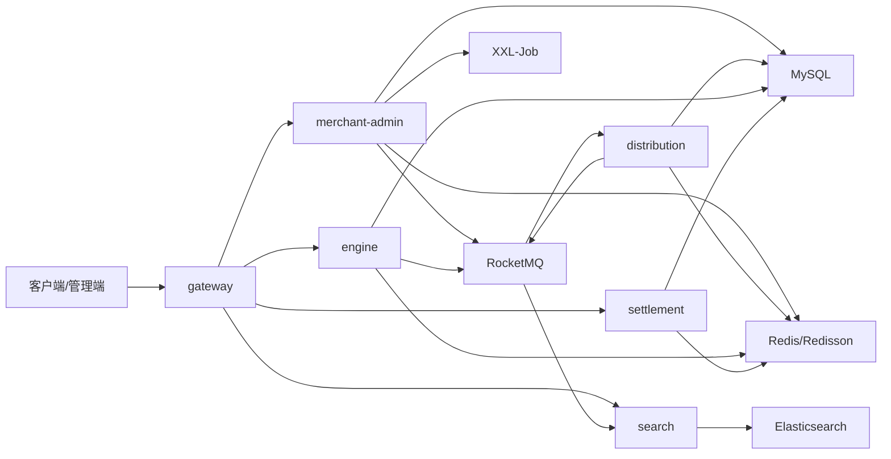

# oneCoupon 项目整体架构

## 新手先读

如果你第一次接触微服务项目，不要一上来就试图把所有模块、中间件和源码细节都记住。先把 oneCoupon 理解成一条业务链路：商家创建优惠券模板，系统批量发券或用户主动领券，用户下单时查询可用券并计算优惠，最后订单侧锁定、核销或退还优惠券。

读这篇文档时先抓三件事：每个模块负责什么、一次优惠券从创建到使用会经过哪些服务、Redis/MySQL/RocketMQ 这些中间件分别解决什么问题。至于具体注解、配置和源码实现，后面小节会逐步展开。

## 1. 项目定位

oneCoupon 是一个优惠券系统学习项目，核心业务围绕优惠券模板创建、优惠券批量分发、用户领取/兑换、预约提醒、锁定核销退还、订单结算和搜索查询展开。

从最终代码结构看，它不是单体应用，而是按业务边界拆成多个 Maven 模块和服务。学习时不要只盯着某个 Controller，要从“业务动作跨服务如何流转”的角度理解。

## 2. Maven 多模块结构

根工程：`D:\study\java\oneCoupon\code\onecoupon\pom.xml`

| 模块 | artifactId | 职责 |
| --- | --- | --- |
| `framework` | `onecoupon-framework` | 公共基础能力，包括统一返回、异常、Web 自动配置、Redis 配置、幂等组件等 |
| `gateway` | `onecoupon-gateway` | Spring Cloud Gateway 网关，负责服务路由和统一入口 |
| `merchant-admin` | `onecoupon-merchant-admin` | 商家后台服务，负责优惠券模板管理、任务创建、任务调度等 |
| `distribution` | `onecoupon-distribution` | 分发服务，负责批量发券、失败记录、消息通知等 |
| `engine` | `onecoupon-engine` | 优惠券引擎服务，负责用户查询、领取/兑换、预约提醒、锁定核销退还等 |
| `settlement` | `onecoupon-settlement` | 结算服务，负责可用券筛选和优惠金额计算 |
| `search` | `onecoupon-search` | 搜索服务，负责优惠券模板索引与搜索 |
| `resources` | 无 Maven 模块 | 项目资源、脚本或辅助材料 |

## 3. 技术栈总览

| 技术 | 项目中的用途 |
| --- | --- |
| Java 17 | 项目编译运行版本 |
| Spring Boot 3.0.7 | 各业务服务的基础框架 |
| Spring Cloud 2022.0.3 | 微服务治理基础 |
| Spring Cloud Alibaba | Nacos 服务注册发现 |
| Spring Cloud Gateway | 网关路由 |
| OpenFeign | 服务间 HTTP 调用 |
| MyBatis-Plus | ORM 与 Mapper 简化 |
| ShardingSphere-JDBC | 分库分表路由 |
| MySQL | 业务数据持久化 |
| Redis/Redisson | 缓存、分布式锁、布隆过滤器、库存和状态控制 |
| RocketMQ | 延迟消息、异步任务、事件驱动 |
| EasyExcel | 大批量 Excel 读取 |
| XXL-Job | 定时任务调度 |
| Elasticsearch | 优惠券搜索 |
| Knife4j/OpenAPI | 接口文档 |
| BizLog | 操作日志 |
| Spotless | 代码格式和版权头检查 |

## 4. 服务调用视角



这个图表达的是主干关系，不代表所有调用都直接存在。具体接口需要在每一节里根据代码确认。

## 5. 核心业务流程

### 5.1 创建优惠券模板

入口通常在 `merchant-admin`：

```text
CouponTemplateController
  -> CouponTemplateService
  -> 参数校验/责任链
  -> CouponTemplateMapper
  -> MySQL
  -> Redis/RocketMQ 维护缓存或延时状态
```

学习重点：

- 为什么模板创建需要责任链校验。
- 优惠券模板表如何分库分表。
- 模板状态如何结束、增加发行量。
- 操作日志和防重复提交如何增强接口可靠性。

### 5.2 创建批量发券任务

入口在 `merchant-admin`，执行落到任务和消息：

```text
上传/创建发券任务
  -> EasyExcel 读取或统计数据
  -> CouponTaskDO 落库
  -> 线程池/延时队列优化响应
  -> RocketMQ 发送任务执行消息
  -> XXL-Job 定时触发任务
```

学习重点：

- 百万 Excel 为什么不能一次性加载进内存。
- 接口为什么要异步化。
- 任务状态如何流转。
- RocketMQ 生产者为什么适合抽象成模板方法。

### 5.3 批量分发用户优惠券

入口主要在 `distribution`：

```text
RocketMQ 消费发券任务
  -> 读取任务数据
  -> 生成 UserCouponDO
  -> 写入用户券表
  -> 记录失败数据
  -> 发送站内信/短信/应用消息等通知
```

学习重点：

- 分发失败如何记录。
- 深分页为什么慢，如何优化。
- 消息重复消费如何通过幂等组件处理。

### 5.4 用户领取/秒杀优惠券

入口主要在 `engine`：

```text
用户请求领取
  -> 查询模板状态
  -> Redis 校验库存/时间/用户限制
  -> 分布式锁或 Lua 原子扣减
  -> RocketMQ 异步落库
  -> UserCouponDO 生成
```

学习重点：

- 秒杀场景下数据库不能作为第一道库存校验。
- Redis 扣减要考虑原子性、重复领取和库存回滚。
- MQ 异步落库要考虑最终一致性和幂等。

### 5.5 预约提醒

入口主要在 `engine`：

```text
用户预约提醒
  -> 保存提醒记录
  -> 计算提醒时间
  -> RocketMQ 延迟消息
  -> Bitmap/Redis 记录提醒状态
  -> 到点消费并发送提醒
```

学习重点：

- 为什么不用简单定时扫描。
- 延迟消息与 Redis Bitmap 分别解决什么问题。
- 查询和取消预约如何保证状态一致。

### 5.6 锁定、核销、退还

入口主要在 `engine`：

```text
订单使用优惠券
  -> 锁定用户券
  -> 支付成功后核销
  -> 支付失败或超时后退还
  -> 更新用户券状态
```

学习重点：

- 用户券状态机。
- 锁定状态为什么必要。
- 超时退还如何通过消息或任务兜底。

### 5.7 结算优惠金额

入口主要在 `settlement`：

```text
订单金额 + 用户券列表
  -> 查询用户可用券
  -> 按优惠券类型计算优惠
  -> 返回可用/不可用原因
  -> 并发优化查询或计算
```

学习重点：

- 满减、折扣、立减等优惠规则如何抽象。
- 策略模式如何让不同券类型独立扩展。
- 为什么结算服务对性能敏感。

## 6. 模块代码结构

### 6.1 通用结构

多数业务模块遵循类似结构：

```text
src/main/java/com/nageoffer/onecoupon/模块名
  ├─ common      常量、枚举、上下文
  ├─ config      配置类
  ├─ controller  HTTP 接口入口
  ├─ dao         DO、Mapper、分片算法
  ├─ dto         请求/响应对象
  ├─ mq          MQ 事件、生产者、消费者
  ├─ service     业务接口、实现、策略、处理器
  └─ job         定时任务
```

### 6.2 `framework`

关键职责：

- `config`：Web、Redis、幂等组件配置。
- `result`：统一响应对象。
- `exception`：异常体系。
- `idempotent`：防重复提交和消息幂等。
- `web`：Web 层增强。

学习时重点看公共组件如何通过依赖引入到业务模块，而不是只看某个工具类。

### 6.3 `merchant-admin`

关键职责：

- 优惠券模板管理。
- 优惠券任务创建。
- 分库分表。
- 操作日志。
- RocketMQ 延迟消息。
- EasyExcel 和 XXL-Job。

典型入口：

```text
merchant-admin/src/main/java/com/nageoffer/onecoupon/merchant/admin/controller/CouponTemplateController.java
merchant-admin/src/main/java/com/nageoffer/onecoupon/merchant/admin/controller/CouponTaskController.java
```

### 6.4 `distribution`

关键职责：

- 消费发券任务消息。
- 批量写入用户券。
- 记录失败数据。
- 多渠道消息通知。

典型入口：

```text
distribution/src/main/java/com/nageoffer/onecoupon/distribution/mq/consumer/CouponTaskExecuteConsumer.java
distribution/src/main/java/com/nageoffer/onecoupon/distribution/service/basics/DistributionExecuteStrategy.java
```

### 6.5 `engine`

关键职责：

- 用户优惠券查询。
- 用户领取/秒杀。
- 预约提醒。
- 锁定、核销、退还。

典型入口：

```text
engine/src/main/java/com/nageoffer/onecoupon/engine/controller/CouponTemplateController.java
engine/src/main/java/com/nageoffer/onecoupon/engine/controller/UserCouponController.java
engine/src/main/java/com/nageoffer/onecoupon/engine/controller/CouponTemplateRemindController.java
```

### 6.6 `settlement`

关键职责：

- 查询用户可用/不可用优惠券。
- 计算优惠金额。
- 用策略模式承载不同优惠类型。

典型入口：

```text
settlement/src/main/java/com/nageoffer/onecoupon/settlement/controller/CouponQueryController.java
settlement/src/main/java/com/nageoffer/onecoupon/settlement/service/strategy/DiscountCalculationStrategy.java
```

### 6.7 `search`

关键职责：

- 同步优惠券模板变更。
- 建立 Elasticsearch 文档。
- 提供搜索查询能力。

典型入口：

```text
search/src/main/java/com/nageoffer/onecoupon/search/controller/CouponTemplateController.java
search/src/main/java/com/nageoffer/onecoupon/search/mq/consumer/CanalBinlogSyncCouponTemplateConsumer.java
```

### 6.8 `gateway`

关键职责：

- 微服务统一入口。
- 路由到后端服务。
- 配合 Nacos 做服务发现。

典型入口：

```text
gateway/src/main/java/com/nageoffer/onecoupon/gateway/GatewayApplication.java
gateway/src/main/resources/application.yaml
```

## 7. 新手常见术语速查

这些词会在后续 30 多篇文档中反复出现，先有一个最小理解即可：

- `DTO`：接口层传输对象，例如请求参数和响应结果，不直接代表数据库表。
- `DO`：数据库实体对象，通常和一张表结构对应。
- `Mapper`：MyBatis-Plus 的数据库访问接口，负责增删改查。
- `Controller`：HTTP 接口入口，负责接收请求和返回结果。
- `Service`：业务逻辑层，负责把校验、数据库、缓存、消息等动作编排起来。
- `Consumer`：消息消费者，从 RocketMQ 等消息队列中接收消息并处理。
- `Producer`：消息生产者，把业务事件发送到消息队列。
- `Topic`：消息主题，可以理解成消息分类。
- `Redis Key`：Redis 中存储数据的名字，项目会用固定前缀区分不同业务数据。
- `Lua 脚本`：交给 Redis 一次性执行的一段脚本，用来保证多个 Redis 操作原子执行。
- `幂等`：同一个请求或同一条消息重复执行多次，最终结果仍然和执行一次一样。
- `分片键`：分库分表时用来决定数据落到哪个库、哪张表的字段。
- `延时消息`：发送后不会马上被消费，而是在指定时间后再投递给消费者。

读源码时，先根据这些后缀和术语判断职责，再深入看方法内部实现。

## 8. 阅读项目的推荐顺序

1. 先读根 `pom.xml`，了解模块和技术版本。
2. 再读 `framework`，理解统一结果、异常、Redis、幂等等公共能力。
3. 进入 `merchant-admin`，学习模板创建和任务创建。
4. 进入 `distribution`，学习批量分发和消息消费。
5. 进入 `engine`，学习查询、秒杀、预约、核销。
6. 进入 `settlement`，学习优惠计算和策略模式。
7. 最后读 `search` 和 `gateway`，理解外围能力。

## 9. 后续文档如何展开

后续每一节文档应固定回答：

- 本节解决什么业务问题。
- 对应教程路径和 Git 分支。
- 分支相比前置分支改了哪些文件。
- 核心代码入口在哪里。
- 新概念是什么。
- 请求链路或消息链路如何流转。
- 这一节有哪些面试点。

## 10. 新手自测方式

读完总览后，不要求你能写出任何业务代码，但应该能用自己的话回答：

1. `merchant-admin`、`distribution`、`engine`、`settlement` 分别负责什么。
2. MySQL、Redis、RocketMQ 在项目里分别解决什么问题。
3. 一张优惠券从“模板创建”到“用户下单使用”大概经过哪些步骤。
4. 后续阅读某一节文档时，应该先找业务入口、再看核心代码、最后看中间件交互。

如果这四点还说不清，建议先不要进入复杂小节，先回到第 01-04 小节建立全局印象。
