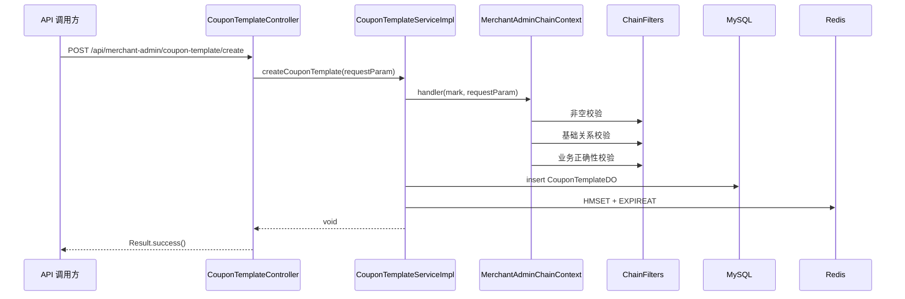

# 第 06 小节：基于责任链模式创建优惠券模板

## 新手先读

本节第一次进入核心业务代码，内容会比较多。阅读时先按请求链路走：前端请求进入 Controller，Service 编排创建模板，责任链负责校验，Mapper 负责写数据库，Redis 负责缓存模板信息。

责任链模式可以先理解成“把一长串校验拆成多个小检查员”。不要一开始就纠结泛型和 Spring 注入细节，先看每个处理器检查了什么，以及抛异常后为什么能阻止后续创建。

## 1. 本节目标

本节开始进入第一个真实业务：商家创建优惠券模板。

你需要掌握：

- 优惠券模板的业务含义和表结构。
- 为什么创建接口需要复杂参数校验。
- 责任链模式如何组织多段校验逻辑。
- Controller、Service、Mapper、DO、DTO 如何协作。
- 创建模板后为什么要预热 Redis 缓存。

教程路径：

```text
D:\study\java\oneCoupon\第②章节：后台管理服务\《牛券oneCoupon优惠券系统设计》第06小节：基于责任链模式创建优惠券模板.html
```

对应分支：

```text
目标分支：origin/20240814_dev_create-template_chain_ding.ma
前置分支：origin/20240708_init-code_ding.ma
```

完整 diff 附录：

```text
D:\study\java\oneCoupon\notes\diffs\06-基于责任链模式创建优惠券模板.diff
```

## 2. 教程核心内容提炼

教程主要包含：

- 优惠券模板创建业务。
- 平台券和店铺券的区别。
- `t_coupon_template` 表结构。
- 领取规则和消耗规则为什么用 JSON。
- Knife4j/OpenAPI 接口文档配置。
- 创建接口的前置逻辑。
- 责任链模式拆分参数校验。
- 创建模板后的数据库写入和 Redis 缓存预热。

## 3. 分支变更总览

执行：

```bash
git diff --stat origin/20240708_init-code_ding.ma..origin/20240814_dev_create-template_chain_ding.ma
```

结果概要：

```text
27 files changed, 2065 insertions(+)
```

主要变化：

```text
framework/pom.xml
merchant-admin/pom.xml
merchant-admin/src/main/java/.../MerchantAdminApplication.java
merchant-admin/src/main/java/.../controller/CouponTemplateController.java
merchant-admin/src/main/java/.../service/CouponTemplateService.java
merchant-admin/src/main/java/.../service/impl/CouponTemplateServiceImpl.java
merchant-admin/src/main/java/.../service/basics/chain/MerchantAdminChainContext.java
merchant-admin/src/main/java/.../service/basics/chain/MerchantAdminAbstractChainHandler.java
merchant-admin/src/main/java/.../service/handler/filter/*
merchant-admin/src/main/java/.../dao/entity/CouponTemplateDO.java
merchant-admin/src/main/java/.../dao/mapper/CouponTemplateMapper.java
merchant-admin/src/main/java/.../dto/req/CouponTemplateSaveReqDTO.java
merchant-admin/src/main/java/.../dto/resp/CouponTemplateQueryRespDTO.java
merchant-admin/src/main/resources/application.yaml
```

这说明本节几乎完整搭起了 `merchant-admin` 的第一条业务链路。

## 4. 业务背景

优惠券分为：

- 平台券：平台运营创建，通常需要审批，成本可能由平台和商家共同承担。
- 店铺券：商家自己在后台创建，通常不需要平台审批，成本由商家承担。

本节实现的是商家后台创建优惠券模板。

优惠券模板不是用户手中的券，而是券的定义：

```text
名称：满 10 减 3
来源：店铺券
对象：全店通用
类型：满减券
有效期：2024-07-08 12:00:00 到 2025-07-08 12:00:00
库存：200
领取规则：每人限领 1 张
消耗规则：满 10 可用，最多优惠 3
```

后续用户领取或分发时，才会生成用户维度的优惠券记录。

## 5. 数据库表设计

教程中创建数据库：

```sql
CREATE DATABASE IF NOT EXISTS one_coupon_rebuild;
```

核心表：`t_coupon_template`。

关键字段：

| 字段 | 含义 |
| --- | --- |
| `id` | 模板 ID |
| `name` | 优惠券名称 |
| `shop_number` | 店铺编号 |
| `source` | 优惠券来源：店铺券/平台券 |
| `target` | 优惠对象：商品专属/全店通用 |
| `goods` | 商品编码 |
| `type` | 优惠类型：立减/满减/折扣 |
| `valid_start_time` | 有效期开始时间 |
| `valid_end_time` | 有效期结束时间 |
| `stock` | 库存 |
| `receive_rule` | 领取规则 JSON |
| `consume_rule` | 消耗规则 JSON |
| `status` | 模板状态 |
| `create_time` | 创建时间 |
| `update_time` | 修改时间 |
| `del_flag` | 逻辑删除标识 |

`receive_rule` 和 `consume_rule` 使用 JSON 的原因是规则经常变化。如果把每个规则都设计成独立字段，后续每新增一种规则都要改表。

示例领取规则：

```json
{
  "limitPerPerson": 1,
  "usageInstructions": "每人限领一张"
}
```

示例消耗规则：

```json
{
  "termsOfUse": 10,
  "maximumDiscountAmount": 3,
  "explanationOfUnmetConditions": "未满 10 元不可用",
  "validityPeriod": 48
}
```

## 6. 请求入口

核心入口：

```text
merchant-admin/src/main/java/com/nageoffer/onecoupon/merchant/admin/controller/CouponTemplateController.java
```

关键代码：

```java
@RestController
@RequiredArgsConstructor
@Tag(name = "优惠券模板管理")
public class CouponTemplateController {

    private final CouponTemplateService couponTemplateService;

    @Operation(summary = "商家创建优惠券模板")
    @PostMapping("/api/merchant-admin/coupon-template/create")
    public Result<Void> createCouponTemplate(@RequestBody CouponTemplateSaveReqDTO requestParam) {
        couponTemplateService.createCouponTemplate(requestParam);
        return Results.success();
    }
}
```

解释：

- `@RestController`：声明 HTTP 控制器。
- `@RequiredArgsConstructor`：Lombok 自动生成构造器，注入 `final` 字段。
- `@Tag`、`@Operation`：Knife4j/OpenAPI 文档注解。
- `@RequestBody`：请求体 JSON 反序列化为 DTO。
- `Results.success()`：使用第 05 小节的统一返回构造器。

请求链路从这里进入，但真正业务逻辑在 Service。

## 7. 请求 DTO

核心文件：

```text
merchant-admin/src/main/java/com/nageoffer/onecoupon/merchant/admin/dto/req/CouponTemplateSaveReqDTO.java
```

关键字段：

```java
@Data
@Schema(description = "优惠券模板新增参数")
public class CouponTemplateSaveReqDTO {

    private String name;
    private Integer source;
    private Integer target;
    private String goods;
    private Integer type;

    @JsonFormat(pattern = "yyyy-MM-dd HH:mm:ss", timezone = "GMT+8")
    private Date validStartTime;

    @JsonFormat(pattern = "yyyy-MM-dd HH:mm:ss", timezone = "GMT+8")
    private Date validEndTime;

    private Integer stock;
    private String receiveRule;
    private String consumeRule;
}
```

解释：

- DTO 面向接口请求，不直接等同于数据库表。
- `@JsonFormat` 解决前端传日期字符串到 Java `Date` 的转换问题。
- `receiveRule`、`consumeRule` 是 JSON 字符串，后续责任链会校验格式是否合法。

## 8. 数据库实体和 Mapper

实体：

```text
merchant-admin/src/main/java/com/nageoffer/onecoupon/merchant/admin/dao/entity/CouponTemplateDO.java
```

核心代码：

```java
@Data
@NoArgsConstructor
@AllArgsConstructor
@Builder
@TableName("t_coupon_template")
public class CouponTemplateDO {

    private Long id;
    private Long shopNumber;
    private String name;
    private Integer source;
    private Integer target;
    private String goods;
    private Integer type;
    private Date validStartTime;
    private Date validEndTime;
    private Integer stock;
    private String receiveRule;
    private String consumeRule;
    private Integer status;

    @TableField(fill = FieldFill.INSERT)
    private Date createTime;

    @TableField(fill = FieldFill.INSERT_UPDATE)
    private Date updateTime;

    @TableField(fill = FieldFill.INSERT)
    private Integer delFlag;
}
```

Mapper：

```java
public interface CouponTemplateMapper extends BaseMapper<CouponTemplateDO> {
}
```

解释：

- `@TableName("t_coupon_template")` 绑定数据库表。
- `BaseMapper<CouponTemplateDO>` 来自 MyBatis-Plus，提供基础 CRUD。
- `FieldFill.INSERT`、`FieldFill.INSERT_UPDATE` 表示字段自动填充，具体填充逻辑通常在配置类中完成。

## 9. 责任链模式

### 9.1 为什么需要责任链

创建优惠券模板的校验很多：

- 名称不能为空。
- 来源不能为空。
- 优惠对象不能为空。
- 类型不能为空。
- 有效期不能为空。
- 库存必须合理。
- 领取规则和消耗规则必须是合法 JSON。
- 商品专属券必须有商品编码。
- 全店通用券不能指定商品。
- 后续还可能调用商品中台校验商品是否存在。

如果全部写在 Service 方法里，会让主流程变得臃肿，而且后续新增校验规则容易互相影响。

责任链把校验拆成多个处理器，每个处理器只负责一类校验。

### 9.2 责任链接口

核心文件：

```text
MerchantAdminAbstractChainHandler.java
```

代码：

```java
public interface MerchantAdminAbstractChainHandler<T> extends Ordered {

    void handler(T requestParam);

    String mark();
}
```

解释：

- `handler`：执行当前节点逻辑。
- `mark`：标识这条处理器属于哪条业务责任链。
- `Ordered`：提供执行顺序，数字越小越先执行。

### 9.3 责任链上下文

核心文件：

```text
MerchantAdminChainContext.java
```

核心代码：

```java
@Component
public final class MerchantAdminChainContext<T> implements ApplicationContextAware, CommandLineRunner {

    private ApplicationContext applicationContext;

    private final Map<String, List<MerchantAdminAbstractChainHandler>> abstractChainHandlerContainer = new HashMap<>();

    public void handler(String mark, T requestParam) {
        List<MerchantAdminAbstractChainHandler> abstractChainHandlers = abstractChainHandlerContainer.get(mark);
        if (CollectionUtils.isEmpty(abstractChainHandlers)) {
            throw new RuntimeException(String.format("[%s] Chain of Responsibility ID is undefined.", mark));
        }
        abstractChainHandlers.forEach(each -> each.handler(requestParam));
    }

    @Override
    public void run(String... args) {
        Map<String, MerchantAdminAbstractChainHandler> chainFilterMap =
                applicationContext.getBeansOfType(MerchantAdminAbstractChainHandler.class);
        chainFilterMap.forEach((beanName, bean) -> {
            List<MerchantAdminAbstractChainHandler> abstractChainHandlers =
                    abstractChainHandlerContainer.getOrDefault(bean.mark(), new ArrayList<>());
            abstractChainHandlers.add(bean);
            abstractChainHandlerContainer.put(bean.mark(), abstractChainHandlers);
        });
        abstractChainHandlerContainer.forEach((mark, unsortedChainHandlers) ->
                unsortedChainHandlers.sort(Comparator.comparing(Ordered::getOrder)));
    }
}
```

解释：

- 项目启动后，`CommandLineRunner#run` 会执行。
- 它从 Spring 容器中拿到所有 `MerchantAdminAbstractChainHandler` 实现。
- 按 `mark()` 分组。
- 每组按 `getOrder()` 排序。
- 业务调用时只需要传入 `mark` 和请求参数。

这相当于把责任链的组装交给 Spring 容器自动完成。

### 9.4 创建模板责任链标识

责任链标识来自：

```text
ChainBizMarkEnum.MERCHANT_ADMIN_CREATE_COUPON_TEMPLATE_KEY
```

Service 调用：

```java
merchantAdminChainContext.handler(MERCHANT_ADMIN_CREATE_COUPON_TEMPLATE_KEY.name(), requestParam);
```

所有创建模板相关校验器的 `mark()` 都返回同一个标识，因此会被放入同一条链。

## 10. 三个校验处理器

### 10.1 非空校验

文件：

```text
CouponTemplateCreateParamNotNullChainFilter.java
```

职责：校验必填参数是否为空。

示例：

```java
if (StrUtil.isEmpty(requestParam.getName())) {
    throw new ClientException("优惠券名称不能为空");
}

if (ObjectUtil.isEmpty(requestParam.getStock())) {
    throw new ClientException("库存不能为空");
}
```

执行顺序：

```java
public int getOrder() {
    return 0;
}
```

它最先执行，因为后续校验会依赖这些字段存在。

### 10.2 基础关系校验

文件：

```text
CouponTemplateCreateParamBaseVerifyChainFilter.java
```

职责：校验枚举值、字段组合关系、库存范围和 JSON 格式。

示例：

```java
boolean targetAnyMatch = Arrays.stream(DiscountTargetEnum.values())
        .anyMatch(enumConstant -> enumConstant.getType() == requestParam.getTarget());
if (!targetAnyMatch) {
    throw new ClientException("优惠对象值不存在");
}

if (ObjectUtil.equal(requestParam.getTarget(), DiscountTargetEnum.ALL_STORE_GENERAL)
        && StrUtil.isNotEmpty(requestParam.getGoods())) {
    throw new ClientException("优惠券全店通用不可设置指定商品");
}

if (!JSON.isValid(requestParam.getReceiveRule())) {
    throw new ClientException("领取规则格式错误");
}
```

执行顺序：

```java
public int getOrder() {
    return 10;
}
```

### 10.3 业务正确性校验

文件：

```text
CouponTemplateCreateParamVerifyChainFilter.java
```

职责：预留更深层业务校验。

当前代码：

```java
if (ObjectUtil.equal(requestParam.getTarget(), DiscountTargetEnum.PRODUCT_SPECIFIC)) {
    // 调用商品中台验证商品是否存在，如果不存在抛出异常
    // ......
}
```

执行顺序：

```java
public int getOrder() {
    return 20;
}
```

这说明课程在这里预留了真实企业系统常见的外部服务校验点。

## 11. Service 主流程

核心文件：

```text
CouponTemplateServiceImpl.java
```

主流程代码：

```java
@Override
public void createCouponTemplate(CouponTemplateSaveReqDTO requestParam) {
    // 通过责任链验证请求参数是否正确
    merchantAdminChainContext.handler(MERCHANT_ADMIN_CREATE_COUPON_TEMPLATE_KEY.name(), requestParam);

    // 新增优惠券模板信息到数据库
    CouponTemplateDO couponTemplateDO = BeanUtil.toBean(requestParam, CouponTemplateDO.class);
    couponTemplateDO.setStatus(CouponTemplateStatusEnum.ACTIVE.getStatus());
    couponTemplateDO.setShopNumber(UserContext.getShopNumber());
    couponTemplateMapper.insert(couponTemplateDO);

    // 缓存预热
    CouponTemplateQueryRespDTO actualRespDTO = BeanUtil.toBean(couponTemplateDO, CouponTemplateQueryRespDTO.class);
    Map<String, Object> cacheTargetMap = BeanUtil.beanToMap(actualRespDTO, false, true);
    Map<String, String> actualCacheTargetMap = cacheTargetMap.entrySet().stream()
            .collect(Collectors.toMap(
                    Map.Entry::getKey,
                    entry -> entry.getValue() != null ? entry.getValue().toString() : ""
            ));
    String couponTemplateCacheKey = String.format(MerchantAdminRedisConstant.COUPON_TEMPLATE_KEY, couponTemplateDO.getId());

    String luaScript = "redis.call('HMSET', KEYS[1], unpack(ARGV, 1, #ARGV - 1)) " +
            "redis.call('EXPIREAT', KEYS[1], ARGV[#ARGV])";

    List<String> keys = Collections.singletonList(couponTemplateCacheKey);
    List<String> args = new ArrayList<>(actualCacheTargetMap.size() * 2 + 1);
    actualCacheTargetMap.forEach((key, value) -> {
        args.add(key);
        args.add(value);
    });

    args.add(String.valueOf(couponTemplateDO.getValidEndTime().getTime() / 1000));

    stringRedisTemplate.execute(
            new DefaultRedisScript<>(luaScript, Long.class),
            keys,
            args.toArray()
    );
}
```

这段代码可以拆成四步：

1. 执行责任链校验。
2. DTO 转 DO，补充状态和店铺编号。
3. 写入数据库。
4. 将模板数据写入 Redis Hash，并设置过期时间。

## 12. Redis 缓存预热

Redis Key：

```java
public static final String COUPON_TEMPLATE_KEY = "one-coupon_engine:template:%s";
```

创建模板后立即写缓存，属于缓存预热。好处是后续用户查询模板时可以直接命中 Redis，减少首次查询数据库的压力。

为什么用 Lua：

```java
String luaScript = "redis.call('HMSET', KEYS[1], unpack(ARGV, 1, #ARGV - 1)) " +
        "redis.call('EXPIREAT', KEYS[1], ARGV[#ARGV])";
```

它把两个 Redis 操作放在一个脚本里：

- `HMSET`：写入 Hash。
- `EXPIREAT`：设置绝对过期时间。

这样能减少“数据写入成功但过期时间设置失败”的中间状态风险。

## 13. 请求执行流程



## 14. 新概念解释

### 14.1 责任链模式

责任链模式把多个处理节点串成一条链，请求沿着链依次处理。每个节点只处理自己关心的逻辑。

在本节中：

```text
创建模板请求
  -> 非空校验
  -> 基础关系校验
  -> 业务正确性校验
  -> 落库
```

好处：

- 校验逻辑分散到独立类。
- 新增校验时只需要新增处理器。
- 顺序由 `getOrder()` 控制。
- 同一个上下文可以承载多条业务责任链。

### 14.2 DTO 和 DO 转换

DTO 面向接口，DO 面向数据库。

```java
CouponTemplateDO couponTemplateDO = BeanUtil.toBean(requestParam, CouponTemplateDO.class);
```

这行代码把请求对象复制成数据库实体，但业务字段仍要手动补充：

```java
couponTemplateDO.setStatus(CouponTemplateStatusEnum.ACTIVE.getStatus());
couponTemplateDO.setShopNumber(UserContext.getShopNumber());
```

### 14.3 缓存预热

缓存预热是指数据刚产生时就写入缓存，而不是等用户第一次查询时再加载。

适合场景：

- 后续读取频率高。
- 数据创建后马上可能被查询。
- 查询链路对性能敏感。

优惠券模板属于高频查询数据，因此适合创建后预热。

### 14.4 JSON 规则字段

领取规则和消耗规则用 JSON 保存，是为了提升扩展性。

优点：

- 新增规则不一定要改表。
- 不同优惠券类型可以有不同规则结构。

缺点：

- 数据库层难以对 JSON 内部字段做强约束。
- 查询和统计 JSON 内字段会更复杂。
- 需要应用层做更严格校验。

## 15. Spring Boot / 框架语法补充

本节开始出现大量 Spring Boot、Lombok、MyBatis-Plus、Knife4j、Redis 相关语法。下面按“看到代码能读懂”的目标解释。

### 15.1 `@RestController`

项目代码：

```java
@RestController
public class CouponTemplateController {
}
```

作用：声明当前类是一个 HTTP 接口控制器，方法返回值会直接转换成 JSON。

等价理解：

```java
@Controller
@ResponseBody
public class DemoController {
}
```

如果没有 `@ResponseBody`，Spring MVC 可能会把返回值当成页面名称；有了 `@RestController`，返回的 `Result<Void>` 会序列化成 JSON。

最小示例：

```java
@RestController
public class HelloController {

    @GetMapping("/hello")
    public String hello() {
        return "hello";
    }
}
```

浏览器访问 `/hello`，响应体就是字符串 `hello`。

### 15.2 `@PostMapping`

项目代码：

```java
@PostMapping("/api/merchant-admin/coupon-template/create")
public Result<Void> createCouponTemplate(@RequestBody CouponTemplateSaveReqDTO requestParam) {
    ...
}
```

作用：声明这个方法处理 HTTP POST 请求。

常见映射注解：

```java
@GetMapping("/users")      // 查询
@PostMapping("/users")     // 新增
@PutMapping("/users")      // 整体修改
@DeleteMapping("/users")   // 删除
```

创建优惠券模板会改变服务器状态，而且参数较复杂，所以使用 POST。

### 15.3 `@RequestBody`

`@RequestBody` 表示从 HTTP 请求体读取 JSON，并转换成 Java 对象。

请求 JSON：

```json
{
  "name": "满10减3",
  "source": 0,
  "target": 1,
  "type": 1
}
```

Controller 参数：

```java
public Result<Void> createCouponTemplate(@RequestBody CouponTemplateSaveReqDTO requestParam) {
}
```

Spring Boot 会自动把 JSON 字段映射到 DTO 字段：

```java
requestParam.getName();   // 满10减3
requestParam.getSource(); // 0
```

如果不加 `@RequestBody`，Spring 默认更倾向于从 query 参数或表单参数里绑定数据。

### 15.4 `@RequiredArgsConstructor`

项目代码：

```java
@RequiredArgsConstructor
public class CouponTemplateController {

    private final CouponTemplateService couponTemplateService;
}
```

这是 Lombok 注解，会给所有 `final` 字段生成构造器。

等价于手写：

```java
public class CouponTemplateController {

    private final CouponTemplateService couponTemplateService;

    public CouponTemplateController(CouponTemplateService couponTemplateService) {
        this.couponTemplateService = couponTemplateService;
    }
}
```

Spring 看到这个构造器后，会从容器中找到 `CouponTemplateService` 的实现类并注入进来。这就是构造器注入。

### 15.5 `@Service` 和 `@Component`

项目代码：

```java
@Service
public class CouponTemplateServiceImpl implements CouponTemplateService {
}
```

```java
@Component
public class CouponTemplateCreateParamNotNullChainFilter implements MerchantAdminAbstractChainHandler<CouponTemplateSaveReqDTO> {
}
```

它们都会把类注册为 Spring Bean。

区别主要是语义：

- `@Service`：业务服务类。
- `@Component`：通用组件类。
- `@Controller`：控制器。
- `@Repository`：数据访问组件。

最小示例：

```java
@Service
public class UserService {
    public String getUserName() {
        return "admin";
    }
}
```

注册成 Bean 后，其他类就可以通过构造器注入使用。

### 15.6 Spring Bean 和依赖注入

Bean 可以理解为“由 Spring 容器创建和管理的对象”。

普通 Java 写法：

```java
CouponTemplateService service = new CouponTemplateServiceImpl();
```

Spring 写法：

```java
private final CouponTemplateService couponTemplateService;
```

对象创建、依赖传入、生命周期都交给 Spring。这样类之间不需要手动 `new`，也方便统一增强事务、日志、AOP。

### 15.7 `@Schema` 和 `@Operation`

项目中使用 Knife4j/OpenAPI 生成接口文档。

```java
@Operation(summary = "商家创建优惠券模板")
```

表示接口说明。

```java
@Schema(description = "优惠券名称", example = "用户下单满10减3特大优惠", required = true)
private String name;
```

表示字段说明、示例值和是否必填。这些注解不直接影响业务逻辑，但会影响接口文档展示。

### 15.8 `@JsonFormat`

项目代码：

```java
@JsonFormat(pattern = "yyyy-MM-dd HH:mm:ss", timezone = "GMT+8")
private Date validStartTime;
```

作用：告诉 Jackson 如何把 JSON 字符串转成 Java `Date`。

前端可以传：

```json
{
  "validStartTime": "2026-06-09 10:00:00"
}
```

如果没有格式说明，日期解析可能因为格式或时区不一致失败。

### 15.9 `@TableName`、`@TableField`

项目使用 MyBatis-Plus。

```java
@TableName("t_coupon_template")
public class CouponTemplateDO {
}
```

表示这个 Java 类对应数据库表 `t_coupon_template`。

```java
@TableField(fill = FieldFill.INSERT)
private Date createTime;
```

表示插入数据时自动填充这个字段。

自动填充逻辑在 `DataBaseConfiguration`：

```java
static class MyMetaObjectHandler implements MetaObjectHandler {

    @Override
    public void insertFill(MetaObject metaObject) {
        strictInsertFill(metaObject, "createTime", Date::new, Date.class);
        strictInsertFill(metaObject, "updateTime", Date::new, Date.class);
        strictInsertFill(metaObject, "delFlag", () -> 0, Integer.class);
    }
}
```

所以 Service 插入时不用手动设置 `createTime`、`updateTime`、`delFlag`。

### 15.10 `BaseMapper`

Mapper 代码：

```java
public interface CouponTemplateMapper extends BaseMapper<CouponTemplateDO> {
}
```

`BaseMapper` 是 MyBatis-Plus 提供的基础 Mapper，内置常用 CRUD 方法。

例如：

```java
couponTemplateMapper.insert(couponTemplateDO);
couponTemplateMapper.selectById(1L);
couponTemplateMapper.updateById(couponTemplateDO);
couponTemplateMapper.deleteById(1L);
```

因此即使 `CouponTemplateMapper` 接口是空的，也能调用 `insert`。

### 15.11 `ServiceImpl`

Service 实现类：

```java
public class CouponTemplateServiceImpl
        extends ServiceImpl<CouponTemplateMapper, CouponTemplateDO>
        implements CouponTemplateService {
}
```

`ServiceImpl` 也是 MyBatis-Plus 提供的基础服务实现，封装了一些常用方法。

泛型含义：

- 第一个类型：当前 Service 使用的 Mapper。
- 第二个类型：当前 Service 操作的实体类。

本节代码仍然直接调用了 `couponTemplateMapper.insert(...)`，但继承 `ServiceImpl` 后，后续也可以使用 MyBatis-Plus 提供的基础 Service 能力。

### 15.12 `ApplicationContextAware`

责任链上下文实现：

```java
public final class MerchantAdminChainContext<T> implements ApplicationContextAware, CommandLineRunner
```

`ApplicationContextAware` 让当前类拿到 Spring 容器对象：

```java
@Override
public void setApplicationContext(ApplicationContext applicationContext) {
    this.applicationContext = applicationContext;
}
```

有了 `applicationContext`，就能查找容器里的某类 Bean：

```java
applicationContext.getBeansOfType(MerchantAdminAbstractChainHandler.class);
```

本节用它把所有责任链处理器自动收集起来。

### 15.13 `CommandLineRunner`

`CommandLineRunner` 会在 Spring Boot 启动完成后执行。

最小示例：

```java
@Component
public class DemoRunner implements CommandLineRunner {

    @Override
    public void run(String... args) {
        System.out.println("应用启动完成后执行");
    }
}
```

本节中，责任链上下文在 `run` 方法里扫描所有处理器、分组、排序。这样业务请求进来时，责任链已经准备好了。

### 15.14 `StringRedisTemplate`

`StringRedisTemplate` 是 Spring Data Redis 提供的 Redis 操作工具，适合操作字符串类型的 key/value。

简单示例：

```java
stringRedisTemplate.opsForValue().set("name", "oneCoupon");
String value = stringRedisTemplate.opsForValue().get("name");
```

本节没有直接用 `opsForValue()`，而是执行 Lua 脚本：

```java
stringRedisTemplate.execute(
        new DefaultRedisScript<>(luaScript, Long.class),
        keys,
        args.toArray()
);
```

### 15.15 Redis Lua 脚本

Lua 脚本可以让多个 Redis 命令在 Redis 端连续执行。

本节脚本：

```lua
redis.call('HMSET', KEYS[1], unpack(ARGV, 1, #ARGV - 1))
redis.call('EXPIREAT', KEYS[1], ARGV[#ARGV])
```

含义：

- `KEYS[1]` 是 Redis Key。
- `ARGV` 是传入的参数数组。
- `HMSET` 写入 Hash。
- `EXPIREAT` 设置绝对过期时间。

简化理解：把优惠券模板字段写入 Redis Hash，并把这个 Hash 的过期时间设置为优惠券模板结束时间。

### 15.16 `HandlerInterceptor`

本节还新增了 `UserConfiguration`，用拦截器模拟当前登录用户。

核心接口：

```java
static class UserTransmitInterceptor implements HandlerInterceptor {

    @Override
    public boolean preHandle(HttpServletRequest request, HttpServletResponse response, Object handler) {
        UserContext.setUser(userInfoDTO);
        return true;
    }

    @Override
    public void afterCompletion(HttpServletRequest request, HttpServletResponse response, Object handler, Exception exception) {
        UserContext.removeUser();
    }
}
```

解释：

- `preHandle`：Controller 执行前调用。
- `afterCompletion`：请求完成后调用。
- `return true`：继续执行后续 Controller。
- `return false`：中断请求。

本节用它模拟商家登录态，让 Service 能通过 `UserContext.getShopNumber()` 拿到店铺编号。

## 16. 如何运行与测试本节功能

本节要测试“创建优惠券模板”接口，需要 MySQL 和 Redis。

### 16.1 建议使用独立 worktree

不要在当前有未提交改动的工作区切分支。建议：

```powershell
cd D:\study\java\oneCoupon\code\onecoupon
git worktree add D:\study\java\oneCoupon\worktrees\onecoupon-06 origin/20240814_dev_create-template_chain_ding.ma
cd D:\study\java\oneCoupon\worktrees\onecoupon-06
```

### 16.2 启动依赖中间件

本节至少需要：

- MySQL：默认配置 `127.0.0.1:3306`，用户名 `root`，密码 `root`。
- Redis：默认配置 `127.0.0.1:6379`，密码 `123456`。

配置文件：

```text
merchant-admin/src/main/resources/application.yaml
```

如果你的本地账号密码不同，修改这里：

```yaml
spring:
  datasource:
    url: jdbc:mysql://127.0.0.1:3306/one_coupon_rebuild?...
    username: root
    password: root
  data:
    redis:
      host: 127.0.0.1
      port: 6379
      password: 123456
```

### 16.3 初始化数据库

优先执行项目 SQL：

```text
resources/database/onecoupon.sql
resources/database/onecoupon-data.sql
```

如果 SQL 中没有当前小节需要的表，就按教程第 06 小节中的建库建表 SQL 执行，至少需要：

```sql
CREATE DATABASE IF NOT EXISTS one_coupon_rebuild;
```

以及 `t_coupon_template` 表。

验证表是否存在：

```sql
USE one_coupon_rebuild;
SHOW TABLES LIKE 't_coupon_template';
DESC t_coupon_template;
```

### 16.4 编译项目

```powershell
.\mvnw.cmd -pl merchant-admin -am package -DskipTests
```

解释：

- `-pl merchant-admin`：构建商家后台模块。
- `-am`：同时构建它依赖的模块，例如 `framework`。
- `-DskipTests`：跳过测试执行。

### 16.5 启动商家后台

IDEA 启动类：

```text
merchant-admin/src/main/java/com/nageoffer/onecoupon/merchant/admin/MerchantAdminApplication.java
```

命令行启动：

```powershell
.\mvnw.cmd -pl merchant-admin spring-boot:run
```

启动成功后，默认端口是：

```text
10010
```

接口文档地址：

```text
http://127.0.0.1:10010/doc.html
```

如果看到 Knife4j 页面，说明 Swagger/Knife4j 配置生效。

### 16.6 用 PowerShell 测试创建模板接口

```powershell
$body = @{
  name = "用户下单满10减3"
  source = 0
  target = 1
  goods = $null
  type = 1
  validStartTime = "2026-06-09 00:00:00"
  validEndTime = "2026-12-31 23:59:59"
  stock = 200
  receiveRule = '{"limitPerPerson":1,"usageInstructions":"每人限领1张"}'
  consumeRule = '{"termsOfUse":10,"maximumDiscountAmount":3,"explanationOfUnmetConditions":"未满10元不可用","validityPeriod":48}'
} | ConvertTo-Json

Invoke-RestMethod `
  -Uri "http://127.0.0.1:10010/api/merchant-admin/coupon-template/create" `
  -Method Post `
  -ContentType "application/json" `
  -Body $body
```

期望响应：

```json
{
  "code": "0",
  "message": null,
  "data": null,
  "requestId": null
}
```

### 16.7 验证 MySQL

执行：

```sql
SELECT id, name, shop_number, source, target, type, stock, status, valid_end_time
FROM t_coupon_template
ORDER BY id DESC
LIMIT 5;
```

重点看：

- 是否新增一条记录。
- `shop_number` 是否由 `UserContext` 模拟写入。
- `status` 是否为生效中。
- `create_time`、`update_time`、`del_flag` 是否自动填充。

### 16.8 验证 Redis

先从 MySQL 查到最新 `id`，假设为 `1810000000000000000`。

Redis Key 格式：

```text
one-coupon_engine:template:{id}
```

Redis CLI：

```powershell
redis-cli -a 123456
HGETALL one-coupon_engine:template:1810000000000000000
TTL one-coupon_engine:template:1810000000000000000
```

重点看：

- Hash 中是否有模板字段。
- TTL 是否大于 0。
- TTL 是否大致等于当前时间到 `validEndTime` 的剩余秒数。

### 16.9 测试责任链异常

把 `name` 去掉或传空字符串，期望返回：

```text
优惠券名称不能为空
```

把 `target` 传成全店通用 `1`，同时传 `goods`，期望返回：

```text
优惠券全店通用不可设置指定商品
```

这说明责任链处理器确实在落库前执行。

### 16.10 常见问题排查

- 启动时报数据库连接失败：检查 MySQL 是否启动、账号密码是否和 `application.yaml` 一致。
- 报 `Unknown database one_coupon_rebuild`：先执行建库 SQL。
- 报 `Table 't_coupon_template' doesn't exist`：执行建表 SQL。
- Redis 连接失败：检查 Redis 是否启动、端口和密码是否正确。
- 接口返回 JSON 格式错误：确认 `receiveRule`、`consumeRule` 是合法 JSON 字符串。
- Redis 查不到 Key：先确认 MySQL 是否插入成功，再看 Service 是否执行到 Lua 脚本。

## 17. 本节代码阅读顺序

建议按这个顺序读：

```text
CouponTemplateController.java
  -> CouponTemplateSaveReqDTO.java
  -> CouponTemplateService.java
  -> CouponTemplateServiceImpl.java
  -> MerchantAdminAbstractChainHandler.java
  -> MerchantAdminChainContext.java
  -> CouponTemplateCreateParamNotNullChainFilter.java
  -> CouponTemplateCreateParamBaseVerifyChainFilter.java
  -> CouponTemplateCreateParamVerifyChainFilter.java
  -> CouponTemplateDO.java
  -> CouponTemplateMapper.java
  -> application.yaml
```

## 18. 调试建议

建议断点：

```text
CouponTemplateController#createCouponTemplate
CouponTemplateServiceImpl#createCouponTemplate
MerchantAdminChainContext#handler
CouponTemplateCreateParamNotNullChainFilter#handler
CouponTemplateCreateParamBaseVerifyChainFilter#handler
CouponTemplateCreateParamVerifyChainFilter#handler
CouponTemplateMapper#insert
```

建议观察：

- 请求 JSON 是否正确反序列化成 DTO。
- 责任链容器中是否有 3 个处理器。
- 处理器执行顺序是否是 0、10、20。
- 插入数据库后 `id` 是否回填。
- Redis 中是否生成模板 Hash。
- Redis Key 过期时间是否等于模板结束时间。

## 19. 常见问题

### 19.1 为什么不用 Bean Validation 注解完成所有校验？

`@NotNull`、`@NotBlank` 适合简单校验，但本节有很多业务关系校验，例如“全店通用不能传商品编码”“商品专属必须传商品编码”。这些规则更适合放在业务校验器中。

### 19.2 为什么校验器要有 `mark()`？

因为后续可能有多条责任链，例如：

```text
创建优惠券模板责任链
创建发券任务责任链
用户领取优惠券责任链
```

`mark()` 用来区分当前处理器属于哪条链。

### 19.3 为什么写库后马上写 Redis？

后续用户查询优惠券模板时会高频读取模板信息。如果每次都查 MySQL，压力会很大。创建后预热 Redis 可以减少首次查询延迟和数据库压力。

### 19.4 为什么 Redis 过期时间用模板结束时间？

优惠券模板过了有效期后，通常不再需要作为可领取或可使用模板参与高频查询。让缓存跟随业务有效期过期，可以减少无效缓存。

## 20. 面试点

- 责任链模式适合解决什么问题？
- 本项目如何自动收集责任链处理器？
- `ApplicationContextAware` 和 `CommandLineRunner` 在这里分别做什么？
- 为什么责任链处理器需要实现 `Ordered`？
- DTO 和 DO 的区别是什么？
- 优惠券领取规则为什么用 JSON 字段？
- 创建模板后为什么要做 Redis 缓存预热？
- Lua 脚本在 Redis 写入场景中有什么价值？
- `@RestController`、`@RequestBody`、`@Service`、`@Component` 分别解决什么问题？
- MyBatis-Plus 的 `BaseMapper` 为什么不用手写 SQL 也能插入数据？

## 21. 学习检查清单

- 能画出创建优惠券模板的完整调用链路。
- 能解释 3 个责任链处理器各自负责什么。
- 能说清楚责任链容器启动时如何组装处理器。
- 能区分接口 DTO 和数据库 DO。
- 能理解 MySQL 写入和 Redis 预热的先后关系。
- 能打开 diff 附录查看本节完整代码变化。
- 能启动 `merchant-admin`，调用创建模板接口，并在 MySQL 和 Redis 中验证结果。
