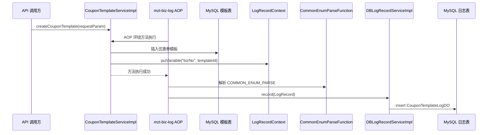

# 第 08 小节：引入日志组件优雅记录操作日志

## 新手先读

本节不是普通技术日志，而是业务操作日志。你可以把它理解成后台审计记录：哪个商家在什么时候创建或修改了哪个优惠券模板。

阅读时先区分两类日志：`log.info` 这种是程序运行日志，主要给开发排查问题；操作日志会落到业务表里，主要给运营、审计和问题追溯使用。

## 1. 本节目标

本节在创建优惠券模板的业务上引入操作日志。学习目标：

- 理解操作日志的业务价值。
- 理解 Spring AOP 和 SpEL 在操作日志中的作用。
- 掌握 mzt-biz-log 的基本接入方式。
- 看懂 `@LogRecord` 如何描述日志模板。
- 看懂自定义枚举解析函数和数据库日志落库服务。
- 会运行创建模板接口，并验证操作日志表中新增记录。

教程路径：

```text
D:\study\java\oneCoupon\第②章节：后台管理服务\《牛券oneCoupon优惠券系统设计》第08小节：引入日志组件优雅记录操作日志.html
```

对应分支：

```text
目标分支：origin/20240816_dev_operation-log_mzt-biz-log_ding.ma
前置分支：origin/20240815_dev_coupon-tablue_shardingsphere_ding.ma
```

完整 diff 附录：

```text
D:\study\java\oneCoupon\notes\diffs\08-引入日志组件优雅记录操作日志.diff
```

## 2. 教程核心内容提炼

教程主要包含：

- 系统操作日志的业务背景。
- 操作日志表设计。
- 为什么优惠券模板日志也需要分表。
- Spring AOP 和 SpEL 的基本概念。
- mzt-biz-log 操作日志框架。
- 在创建优惠券模板方法上使用 `@LogRecord`。
- 自定义枚举解析函数，把枚举数字转换成可读文本。
- 实现 `ILogRecordService`，把操作日志保存到数据库。

## 3. 分支变更总览

执行：

```bash
git diff --stat origin/20240815_dev_coupon-tablue_shardingsphere_ding.ma..origin/20240816_dev_operation-log_mzt-biz-log_ding.ma
```

结果概要：

```text
9 files changed, 487 insertions(+), 3 deletions(-)
```

主要变化：

```text
merchant-admin/pom.xml
merchant-admin/src/main/java/.../MerchantAdminApplication.java
merchant-admin/src/main/java/.../common/log/CommonEnumParseFunction.java
merchant-admin/src/main/java/.../dao/entity/CouponTemplateLogDO.java
merchant-admin/src/main/java/.../dao/mapper/CouponTemplateLogMapper.java
merchant-admin/src/main/java/.../service/basics/log/DBLogRecordServiceImpl.java
merchant-admin/src/main/java/.../service/impl/CouponTemplateServiceImpl.java
merchant-admin/src/main/resources/shardingsphere-config.yaml
merchant-admin/src/test/java/.../CouponTemplateLogSpELTests.java
```

本节核心是在不污染主流程的前提下，为 `createCouponTemplate` 增加操作日志。

## 4. 业务背景

操作日志用于记录“谁在什么时候做了什么”。

在优惠券模板场景中，典型日志包括：

```text
商家 A 创建了优惠券模板：用户下单满10减3
优惠对象：全店通用
优惠类型：满减券
库存数量：200
有效期：2026-06-09 到 2026-12-31
```

它的价值：

- 安全审计：追踪谁创建、修改、关闭了优惠券。
- 问题排查：当商家反馈配置错误时，可以回溯操作内容。
- 责任归属：多人运营后台中，明确具体操作人。
- 数据复盘：分析运营行为。

## 5. 操作日志表设计

本节选择细粒度日志表：

```text
t_coupon_template_log
```

核心字段：

| 字段 | 含义 |
| --- | --- |
| `id` | 日志 ID |
| `shop_number` | 店铺编号 |
| `coupon_template_id` | 优惠券模板 ID |
| `operator_id` | 操作人 |
| `operation_log` | 操作日志文本 |
| `original_data` | 原始数据 |
| `modified_data` | 修改后数据 |
| `create_time` | 创建时间 |

因为优惠券模板本身已经分库分表，模板日志也按 `shop_number` 分库分表。否则模板数据分散了，日志却集中在单表，日志表也会成为瓶颈。

## 6. ShardingSphere 配置新增日志表

第 08 小节在 `shardingsphere-config.yaml` 中新增：

```yaml
t_coupon_template_log:
  actualDataNodes: ds_${0..1}.t_coupon_template_log_${0..15}
  databaseStrategy:
    standard:
      shardingColumn: shop_number
      shardingAlgorithmName: coupon_template_log_database_mod
  tableStrategy:
    standard:
      shardingColumn: shop_number
      shardingAlgorithmName: coupon_template_log_table_mod
```

同时新增算法绑定：

```yaml
coupon_template_log_database_mod:
  type: CLASS_BASED
  props:
    algorithmClassName: com.nageoffer.onecoupon.merchant.admin.dao.sharding.DBHashModShardingAlgorithm
    sharding-count: 16
    strategy: standard
coupon_template_log_table_mod:
  type: CLASS_BASED
  props:
    algorithmClassName: com.nageoffer.onecoupon.merchant.admin.dao.sharding.TableHashModShardingAlgorithm
    strategy: standard
```

它复用了第 07 小节的分库和分表算法。

## 7. 引入 mzt-biz-log

### 7.1 Maven 依赖

```xml
<dependency>
    <groupId>io.github.mouzt</groupId>
    <artifactId>bizlog-sdk</artifactId>
</dependency>
```

`bizlog-sdk` 提供：

- `@LogRecord` 注解。
- 日志模板解析。
- SpEL 表达式解析。
- 自定义函数扩展。
- 日志持久化接口 `ILogRecordService`。

### 7.2 启用操作日志

启动类新增：

```java
@SpringBootApplication
@EnableLogRecord(tenant = "MerchantAdmin")
@MapperScan("com.nageoffer.onecoupon.merchant.admin.dao.mapper")
public class MerchantAdminApplication {
}
```

`@EnableLogRecord` 用来启用 biz-log 框架。`tenant = "MerchantAdmin"` 表示当前日志租户或业务域名称。

## 8. `@LogRecord` 记录创建模板日志

核心文件：

```text
CouponTemplateServiceImpl.java
```

新增注解：

```java
@LogRecord(
        success = """
                创建优惠券：{{#requestParam.name}}， \
                优惠对象：{COMMON_ENUM_PARSE{'DiscountTargetEnum' + '_' + #requestParam.target}}， \
                优惠类型：{COMMON_ENUM_PARSE{'DiscountTypeEnum' + '_' + #requestParam.type}}， \
                库存数量：{{#requestParam.stock}}， \
                优惠商品编码：{{#requestParam.goods}}， \
                有效期开始时间：{{#requestParam.validStartTime}}， \
                有效期结束时间：{{#requestParam.validEndTime}}， \
                领取规则：{{#requestParam.receiveRule}}， \
                消耗规则：{{#requestParam.consumeRule}};
                """,
        type = "CouponTemplate",
        bizNo = "{{#bizNo}}",
        extra = "{{#requestParam.toString()}}"
)
@Override
public void createCouponTemplate(CouponTemplateSaveReqDTO requestParam) {
    ...
}
```

字段解释：

- `success`：方法成功执行后记录的日志内容模板。
- `type`：日志类型，本节固定为 `CouponTemplate`。
- `bizNo`：业务编号，这里是优惠券模板 ID。
- `extra`：额外数据，这里保存请求参数序列化结果。

## 9. 为什么要手动设置 `bizNo`

创建模板之前，模板 ID 还不存在；执行插入后，MyBatis-Plus 才能拿到回填的 ID。

因此方法内部新增：

```java
couponTemplateMapper.insert(couponTemplateDO);

LogRecordContext.putVariable("bizNo", couponTemplateDO.getId());
```

解释：

- `couponTemplateDO.getId()` 是插入数据库后生成的模板 ID。
- `LogRecordContext.putVariable("bizNo", ...)` 把变量放入日志上下文。
- `@LogRecord(bizNo = "{{#bizNo}}")` 才能取到它。

## 10. 自定义枚举解析函数

日志中不应该记录：

```text
优惠对象：1
优惠类型：0
```

应该记录成可读文本：

```text
优惠对象：全店通用
优惠类型：立减券
```

本节新增：

```text
CommonEnumParseFunction.java
```

核心代码：

```java
@Component
public class CommonEnumParseFunction implements IParseFunction {

    @Override
    public String functionName() {
        return "COMMON_ENUM_PARSE";
    }

    @Override
    public String apply(Object value) {
        List<String> parts = StrUtil.split(value.toString(), "_");
        String enumClassName = parts.get(0);
        int enumValue = Integer.parseInt(parts.get(1));
        return findEnumValueByName(enumClassName, enumValue);
    }
}
```

日志模板中这样调用：

```text
{COMMON_ENUM_PARSE{'DiscountTargetEnum' + '_' + #requestParam.target}}
```

执行过程：

```text
'DiscountTargetEnum' + '_' + 1
  -> "DiscountTargetEnum_1"
  -> COMMON_ENUM_PARSE.apply(...)
  -> DiscountTargetEnum.findValueByType(1)
  -> "全店通用"
```

## 11. 日志落库服务

新增：

```text
DBLogRecordServiceImpl.java
```

它实现 biz-log 的 `ILogRecordService`：

```java
@Slf4j
@Service
@RequiredArgsConstructor
public class DBLogRecordServiceImpl implements ILogRecordService {

    private final CouponTemplateLogMapper couponTemplateLogMapper;

    @Override
    public void record(LogRecord logRecord) {
        try {
            switch (logRecord.getType()) {
                case "CouponTemplate": {
                    CouponTemplateLogDO couponTemplateLogDO = CouponTemplateLogDO.builder()
                            .couponTemplateId(logRecord.getBizNo())
                            .shopNumber(UserContext.getShopNumber())
                            .operatorId(UserContext.getUserId())
                            .operationLog(logRecord.getAction())
                            .originalData(Optional.ofNullable(LogRecordContext.getVariable("originalData")).map(Object::toString).orElse(null))
                            .modifiedData(StrUtil.isBlank(logRecord.getExtra()) ? null : logRecord.getExtra())
                            .build();
                    couponTemplateLogMapper.insert(couponTemplateLogDO);
                }
            }
        } catch (Exception ex) {
            log.error("记录[{}]操作日志失败", logRecord.getType(), ex);
        }
    }
}
```

解释：

- biz-log 解析完 `@LogRecord` 后，会调用 `ILogRecordService#record`。
- 项目把 `LogRecord` 转成 `CouponTemplateLogDO`。
- 再通过 MyBatis-Plus 写入 `t_coupon_template_log` 逻辑表。
- ShardingSphere 根据 `shop_number` 路由到真实日志表。

注意：这里 catch 了异常并打印日志，避免“日志记录失败”影响主业务创建优惠券模板。

## 12. 执行流程



## 13. Spring Boot / 框架语法补充

### 13.1 Spring AOP

AOP 是面向切面编程。它适合把日志、事务、权限、监控这类横切逻辑从业务代码里抽离出来。

普通写法：

```java
public void createCouponTemplate(...) {
    // 业务前日志
    doCreate();
    // 业务后日志
}
```

AOP 写法：

```java
@LogRecord(...)
public void createCouponTemplate(...) {
    doCreate();
}
```

业务方法只关心业务，日志框架通过代理在方法前后插入逻辑。

### 13.2 `@EnableLogRecord`

```java
@EnableLogRecord(tenant = "MerchantAdmin")
```

作用：启用 mzt-biz-log 的自动配置和 AOP 能力。

如果没有这个注解，`@LogRecord` 可能不会生效。

### 13.3 `@LogRecord`

`@LogRecord` 是方法级注解，声明这个方法成功或失败时如何记录日志。

最小示例：

```java
@LogRecord(
        success = "创建用户：{{#userName}}",
        type = "User",
        bizNo = "{{#userId}}"
)
public void createUser(Long userId, String userName) {
}
```

方法执行成功后，日志框架会把 `#userName`、`#userId` 替换成真实参数值。

### 13.4 SpEL

SpEL 是 Spring Expression Language，Spring 表达式语言。

常见写法：

```text
{{#requestParam.name}}
```

含义：取方法参数 `requestParam` 的 `name` 属性。

Java 等价理解：

```java
requestParam.getName()
```

### 13.5 Java 文本块 `"""..."""`

第 08 小节使用 Java 17 文本块：

```java
success = """
        创建优惠券：{{#requestParam.name}}，
        库存数量：{{#requestParam.stock}};
        """
```

这是 Java 15 以后支持的多行字符串写法，适合写长文本模板。

普通字符串写法会很难读：

```java
success = "创建优惠券：" + "{{#requestParam.name}}" + "，库存数量：" + "{{#requestParam.stock}}";
```

### 13.6 `ILogRecordService`

`ILogRecordService` 是 biz-log 留给业务方的持久化接口。

框架负责解析日志，业务方负责保存日志。

```java
public interface ILogRecordService {
    void record(LogRecord logRecord);
}
```

项目实现 `DBLogRecordServiceImpl` 后，日志框架会调用它。

### 13.7 `@Slf4j`

```java
@Slf4j
public class DBLogRecordServiceImpl {
}
```

Lombok 会自动生成：

```java
private static final Logger log = LoggerFactory.getLogger(DBLogRecordServiceImpl.class);
```

所以代码中可以直接写：

```java
log.error("记录操作日志失败", ex);
```

### 13.8 Builder 模式

`CouponTemplateLogDO` 使用：

```java
@Builder
public class CouponTemplateLogDO {
}
```

创建对象时可以写：

```java
CouponTemplateLogDO logDO = CouponTemplateLogDO.builder()
        .couponTemplateId("10001")
        .shopNumber(1810714735922956666L)
        .operationLog("创建优惠券")
        .build();
```

相比一堆 setter，Builder 更适合字段较多的对象。

## 14. 如何运行与测试本节功能

### 14.1 建议使用独立 worktree

```powershell
cd D:\study\java\oneCoupon\code\onecoupon
git worktree add D:\study\java\oneCoupon\worktrees\onecoupon-08 origin/20240816_dev_operation-log_mzt-biz-log_ding.ma
cd D:\study\java\oneCoupon\worktrees\onecoupon-08
```

### 14.2 准备 MySQL 表

沿用第 07 小节两个库：

```sql
CREATE DATABASE IF NOT EXISTS one_coupon_rebuild_0;
CREATE DATABASE IF NOT EXISTS one_coupon_rebuild_1;
```

除了 `t_coupon_template_0` 到 `t_coupon_template_15`，还要在两个库中创建：

```text
t_coupon_template_log_0
t_coupon_template_log_1
...
t_coupon_template_log_15
```

建表 SQL 以教程第 08 小节为准，两个库都要建完整。

### 14.3 检查 ShardingSphere 日志表配置

确认 `shardingsphere-config.yaml` 包含：

```yaml
t_coupon_template_log:
  actualDataNodes: ds_${0..1}.t_coupon_template_log_${0..15}
```

并且日志表的分片键也是：

```yaml
shardingColumn: shop_number
```

### 14.4 编译和启动

```powershell
.\mvnw.cmd -pl merchant-admin -am package -DskipTests
.\mvnw.cmd -pl merchant-admin spring-boot:run
```

启动后访问：

```text
http://127.0.0.1:10010/doc.html
```

### 14.5 调用创建模板接口

使用第 06 小节同样的创建模板请求。

成功后会发生两件事：

1. `t_coupon_template_*` 新增优惠券模板。
2. `t_coupon_template_log_*` 新增操作日志。

### 14.6 验证模板表

```sql
SELECT id, shop_number, name
FROM one_coupon_rebuild_0.t_coupon_template_0
LIMIT 5;
```

实际库表以控制台 ShardingSphere Actual SQL 为准。

### 14.7 验证日志表

在两个库的日志表中查找：

```sql
SELECT id, shop_number, coupon_template_id, operator_id, operation_log, modified_data, create_time
FROM one_coupon_rebuild_0.t_coupon_template_log_0
ORDER BY id DESC
LIMIT 5;
```

如果不知道具体落在哪张表，可以先看控制台 `Actual SQL`，或者临时遍历查询 `t_coupon_template_log_0` 到 `t_coupon_template_log_15`。

重点看：

- `coupon_template_id` 是否是刚创建的模板 ID。
- `operator_id` 是否来自 `UserContext`。
- `operation_log` 是否包含“创建优惠券”。
- 枚举值是否被解析成可读描述。
- `modified_data` 是否是请求参数 JSON。

### 14.8 测试日志失败是否影响主流程

可以临时让日志表不存在，然后调用创建模板接口。理论上：

- 模板创建仍应成功。
- 控制台会打印记录操作日志失败。

这是因为 `DBLogRecordServiceImpl#record` 捕获了异常，没有把日志异常继续抛出。

注意：这个测试会制造错误环境，做完后要恢复日志表。

### 14.9 常见问题排查

- 创建模板成功但没有日志：检查 `@EnableLogRecord` 是否存在。
- 日志表不存在：执行第 08 小节日志表建表 SQL。
- 日志插入失败：检查 ShardingSphere 中 `t_coupon_template_log` 真实节点配置。
- 枚举没有转成中文：检查 `CommonEnumParseFunction#functionName` 是否是 `COMMON_ENUM_PARSE`。
- `bizNo` 为空：检查是否在 `insert` 后执行了 `LogRecordContext.putVariable("bizNo", couponTemplateDO.getId())`。

## 15. 本节代码阅读顺序

```text
merchant-admin/pom.xml
  -> MerchantAdminApplication.java
  -> CouponTemplateServiceImpl.java
  -> CommonEnumParseFunction.java
  -> CouponTemplateLogDO.java
  -> CouponTemplateLogMapper.java
  -> DBLogRecordServiceImpl.java
  -> shardingsphere-config.yaml
  -> CouponTemplateLogSpELTests.java
```

## 16. 常见问题与面试点

- 操作日志和普通业务日志有什么区别？
- 为什么操作日志适合用 AOP 做？
- SpEL 在 `@LogRecord` 中解决什么问题？
- 为什么创建模板后要手动设置 `bizNo`？
- `ILogRecordService` 的职责是什么？
- 为什么日志记录失败不应该影响主业务？
- 操作日志表为什么也要分库分表？
- 自定义解析函数 `COMMON_ENUM_PARSE` 的价值是什么？

## 17. 学习检查清单

- 能说清楚 `@LogRecord` 的 `success`、`type`、`bizNo`、`extra` 分别是什么。
- 能解释 `LogRecordContext.putVariable` 的作用。
- 能理解 `CommonEnumParseFunction` 如何把枚举数字转成文本。
- 能启动服务并通过创建模板接口生成操作日志。
- 能在真实日志分片表中查到新增日志记录。
