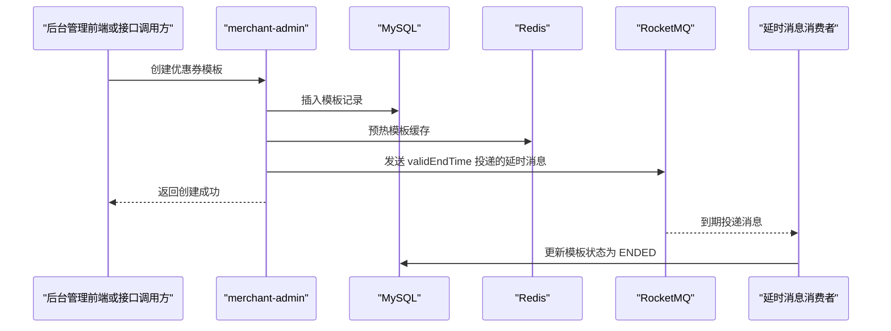

# 第 11 小节：RocketMQ 5.x 延时消息修改优惠券结束状态

## 新手先读

本节第一次正式使用 RocketMQ。你可以先把消息队列理解成“服务之间的异步通知箱”：生产者把消息投进去，消费者稍后取出来处理。

延时消息的重点是“未来某个时间再消费”。创建优惠券模板时，系统提前投递一条到期关闭消息，等模板结束时间到了，消费者再把模板状态改成结束。

## 1. 本节目标

本节给优惠券模板创建流程补充“到期自动结束”的能力。学习目标：

- 理解为什么优惠券模板不能只靠人工结束。
- 理解 RocketMQ 延时消息适合处理“未来某个时间点触发”的任务。
- 看懂 Spring Boot 项目中如何引入 RocketMQ Starter。
- 看懂生产者如何发送指定投递时间的消息。
- 看懂消费者如何监听消息并修改模板状态。
- 理解 `@RocketMQMessageListener`、`RocketMQTemplate`、`MessageBuilder`、`ConfigurableEnvironment` 等非基础 Java 语法。
- 会启动 RocketMQ、本地服务，并验证模板到期后状态是否自动变成结束。

教程路径：

```text
D:\study\java\oneCoupon\第②章节：后台管理服务\《牛券oneCoupon优惠券系统设计》第11小节：RocketMQ5.x延时消息修改优惠券结束状态.html
```

对应分支：

```text
目标分支：origin/20240821_dev_coupon-template-close_rocketmq5_ding.ma
前置分支：origin/20240818_dev_other-coupon-template_feature_ding.ma
```

完整 diff 附录：

```text
D:\study\java\oneCoupon\notes\diffs\11-RocketMQ延时消息修改优惠券结束状态.diff
```

## 2. 教程核心内容提炼

上一节已经支持手动结束优惠券模板，但真实业务里模板都有有效期。到了有效期结束时间后，如果后台状态仍然是“进行中”，后续查询、发放、领取链路就可能出现语义不一致。

本节的解决方式是：

- 创建优惠券模板时，读取模板的 `validEndTime`。
- 以 `validEndTime` 作为 RocketMQ 延时消息投递时间。
- 消息体中保存 `couponTemplateId` 和 `shopNumber`。
- 消费者收到消息后，根据商家编号和模板 ID 更新模板状态为 `ENDED`。

这个设计的重点不是“消息一定刚好在毫秒级准时触发”，而是通过消息队列把“创建模板”和“未来关闭模板”解耦。

## 3. 分支变更总览

```text
4 files changed, 138 insertions(+)
```

主要变化：

```text
merchant-admin/pom.xml
merchant-admin/src/main/java/.../mq/consumer/CouponTemplateDelayExecuteStatusConsumer.java
merchant-admin/src/main/java/.../service/impl/CouponTemplateServiceImpl.java
merchant-admin/src/main/resources/application.yaml
```

核心变化：

- `pom.xml` 引入 RocketMQ Spring Boot Starter。
- `application.yaml` 增加 RocketMQ NameServer 和生产者配置。
- 创建模板成功后发送延时消息。
- 新增消费者监听延时消息并修改模板状态。

## 4. 为什么使用延时消息

如果不使用延时消息，常见方案有三类：

| 方案 | 做法 | 问题 |
| --- | --- | --- |
| 查询时判断 | 每次查模板时判断是否过期 | 状态落库不及时，多个业务入口都要重复判断 |
| 定时任务扫描 | 每隔一段时间扫描过期模板 | 扫描范围大，延迟取决于调度频率 |
| 延时消息 | 创建模板时发送未来投递消息 | 每个模板天然对应一条关闭消息，业务更直接 |

本节选择延时消息，是因为优惠券模板创建时已经知道结束时间，适合在创建时安排一个“未来要执行的动作”。

## 5. 依赖与配置

`merchant-admin/pom.xml` 增加 RocketMQ 依赖：

```xml
<dependency>
    <groupId>org.apache.rocketmq</groupId>
    <artifactId>rocketmq-spring-boot-starter</artifactId>
</dependency>
```

`merchant-admin/src/main/resources/application.yaml` 增加配置：

```yaml
rocketmq:
  name-server: 127.0.0.1:9876
  producer:
    group: oneCoupon_merchant-admin${unique-name:}-service_common-message-execute_pg
    send-message-timeout: 2000
    retry-times-when-send-failed: 1
    retry-times-when-send-async-failed: 1
```

配置解释：

- `rocketmq.name-server`：RocketMQ NameServer 地址，客户端通过它发现 Broker。
- `rocketmq.producer.group`：生产者分组，同一类生产者建议使用同一个分组名。
- `${unique-name:}`：Spring 占位符，表示读取配置项 `unique-name`，如果没有配置则使用空字符串。
- `send-message-timeout`：发送消息超时时间，单位毫秒。
- `retry-times-when-send-failed`：同步发送失败后的重试次数。

## 6. 创建模板时发送延时消息

本节在 `CouponTemplateServiceImpl` 中注入两个对象：

```java
private final RocketMQTemplate rocketMQTemplate;
private final ConfigurableEnvironment configurableEnvironment;
```

完整发送逻辑：

```java
String couponTemplateDelayCloseTopic = "one-coupon_merchant-admin-service_coupon-template-delay_topic${unique-name:}";
couponTemplateDelayCloseTopic = configurableEnvironment.resolvePlaceholders(couponTemplateDelayCloseTopic);

JSONObject messageBody = new JSONObject();
messageBody.put("couponTemplateId", couponTemplateDO.getId());
messageBody.put("shopNumber", couponTemplateDO.getShopNumber());

Long deliverTimeStamp = couponTemplateDO.getValidEndTime().getTime();
String messageKeys = couponTemplateDO.getShopNumber() + "_" + couponTemplateDO.getId();

Message<JSONObject> message = MessageBuilder
        .withPayload(messageBody)
        .setHeader(MessageConst.PROPERTY_KEYS, messageKeys)
        .build();

SendResult sendResult = rocketMQTemplate.syncSendDeliverTimeMills(
        couponTemplateDelayCloseTopic,
        message,
        deliverTimeStamp
);
```

逐行解释：

- `couponTemplateDelayCloseTopic` 是 Topic 名称，Topic 可以理解为消息分类。
- `resolvePlaceholders` 会把字符串中的 `${unique-name:}` 替换成真实配置值。
- `JSONObject` 是消息体，本节只需要模板 ID 和商家编号。
- `deliverTimeStamp` 是消息投递时间戳，来源于模板结束时间。
- `messageKeys` 是消息 Key，便于 RocketMQ 控制台或日志排查。
- `MessageBuilder.withPayload(messageBody)` 创建 Spring 消息对象。
- `setHeader(MessageConst.PROPERTY_KEYS, messageKeys)` 给消息设置 RocketMQ Keys。
- `syncSendDeliverTimeMills` 表示同步发送一条在指定毫秒时间戳投递的消息。

简单类比：

```java
LocalDateTime validEndTime = LocalDateTime.of(2026, 6, 9, 10, 30);

// 普通方法调用是“现在立刻做”
closeCouponTemplate(templateId);

// 延时消息是“到 10:30 再通知消费者做”
sendDelayMessage(templateId, validEndTime);
```

## 7. 消费者监听延时消息

新增消费者类 `CouponTemplateDelayExecuteStatusConsumer`：

```java
@Component
@RequiredArgsConstructor
@RocketMQMessageListener(
        topic = "one-coupon_merchant-admin-service_coupon-template-delay_topic${unique-name:}",
        consumerGroup = "one-coupon_merchant-admin-service_coupon-template-delay-status_cg${unique-name:}"
)
@Slf4j(topic = "CouponTemplateDelayExecuteStatusConsumer")
public class CouponTemplateDelayExecuteStatusConsumer implements RocketMQListener<JSONObject> {

    private final CouponTemplateService couponTemplateService;

    @Override
    public void onMessage(JSONObject message) {
        log.info("[消费者] 优惠券模板定时执行状态变更 - 执行消费逻辑，消息体：{}", message.toString());

        LambdaUpdateWrapper<CouponTemplateDO> updateWrapper = Wrappers.lambdaUpdate(CouponTemplateDO.class)
                .eq(CouponTemplateDO::getShopNumber, message.getLong("shopNumber"))
                .eq(CouponTemplateDO::getId, message.getLong("couponTemplateId"))
                .set(CouponTemplateDO::getStatus, CouponTemplateStatusEnum.ENDED.getStatus());

        couponTemplateService.update(updateWrapper);
    }
}
```

处理流程：

1. RocketMQ 到达投递时间后，把消息推给消费者。
2. `onMessage` 方法收到 `JSONObject` 消息体。
3. 根据 `shopNumber` 和 `couponTemplateId` 精确定位模板。
4. 把模板状态更新为 `CouponTemplateStatusEnum.ENDED`。

这里必须带上 `shopNumber`，因为项目使用商家维度的数据隔离。只靠模板 ID 容易弱化业务边界，也不利于后续排查。

## 8. 本节完整业务流程



## 9. Spring Boot 与框架语法补充

### 9.1 `@Component`

`@Component` 告诉 Spring：“这个类交给 Spring 容器管理”。

普通 Java 写法：

```java
CouponTemplateDelayExecuteStatusConsumer consumer = new CouponTemplateDelayExecuteStatusConsumer(service);
```

Spring 写法：

```java
@Component
public class CouponTemplateDelayExecuteStatusConsumer {
}
```

只要类在 Spring Boot 扫描路径下，Spring 就会自动创建对象，并在需要时注入依赖。

### 9.2 `@RequiredArgsConstructor`

这是 Lombok 注解，会为 `final` 字段生成构造方法。

源码中写：

```java
@RequiredArgsConstructor
public class ExampleService {
    private final RocketMQTemplate rocketMQTemplate;
}
```

编译后等价于：

```java
public class ExampleService {
    private final RocketMQTemplate rocketMQTemplate;

    public ExampleService(RocketMQTemplate rocketMQTemplate) {
        this.rocketMQTemplate = rocketMQTemplate;
    }
}
```

Spring 会通过这个构造方法完成依赖注入。

### 9.3 `@RocketMQMessageListener`

这个注解把一个类注册成 RocketMQ 消费者。

```java
@RocketMQMessageListener(
        topic = "coupon-topic",
        consumerGroup = "coupon-consumer-group"
)
public class CouponConsumer implements RocketMQListener<String> {
    @Override
    public void onMessage(String message) {
        System.out.println(message);
    }
}
```

核心参数：

- `topic`：监听哪个消息主题。
- `consumerGroup`：消费者分组。多个实例使用同一个消费者组时，一条消息通常只会被组内一个实例消费。

### 9.4 `RocketMQListener<T>`

`RocketMQListener<JSONObject>` 是泛型接口。`T` 表示消息体类型。

```java
public class CouponConsumer implements RocketMQListener<JSONObject> {
    @Override
    public void onMessage(JSONObject message) {
        Long id = message.getLong("couponTemplateId");
        System.out.println(id);
    }
}
```

当 RocketMQ 收到消息后，框架会自动把消息反序列化成 `JSONObject`，再调用 `onMessage`。

### 9.5 `ConfigurableEnvironment`

`ConfigurableEnvironment` 是 Spring 环境配置对象，可以读取或解析配置。

```java
String value = configurableEnvironment.resolvePlaceholders("service${unique-name:}");
```

如果配置文件里有：

```yaml
unique-name: -dev
```

解析结果是：

```text
service-dev
```

如果没有配置，`${unique-name:}` 的默认值为空字符串，解析结果是：

```text
service
```

### 9.6 `MessageBuilder`

`MessageBuilder` 用来构建 Spring 消息对象。

```java
Message<String> message = MessageBuilder
        .withPayload("hello")
        .setHeader("traceId", "abc123")
        .build();
```

消息由两部分组成：

- `payload`：真正的业务数据。
- `header`：消息元数据，比如 Key、Tag、TraceId。

### 9.7 `LambdaUpdateWrapper`

`LambdaUpdateWrapper` 是 MyBatis-Plus 的更新条件构造器。

```java
LambdaUpdateWrapper<CouponTemplateDO> updateWrapper = Wrappers.lambdaUpdate(CouponTemplateDO.class)
        .eq(CouponTemplateDO::getId, 1001L)
        .set(CouponTemplateDO::getStatus, 1);
```

等价 SQL 思路：

```sql
UPDATE t_coupon_template
SET status = 1
WHERE id = 1001;
```

使用 `CouponTemplateDO::getId` 的好处是字段重命名时更容易被 IDE 和编译器发现问题。

## 10. 如何运行与测试本节功能

### 10.1 环境准备

需要启动：

- MySQL。
- Redis。
- RocketMQ NameServer，默认端口 `9876`。
- RocketMQ Broker。
- `merchant-admin` 服务。

不要直接在当前工作区切换分支，因为当前项目里已有未提交改动。建议新建独立 worktree：

```powershell
cd D:\study\java\oneCoupon\code\onecoupon
git worktree add D:\study\java\oneCoupon\worktrees\chapter-02-11 origin/20240821_dev_coupon-template-close_rocketmq5_ding.ma
```

### 10.2 检查配置

确认 `application.yaml` 中 RocketMQ 地址正确：

```yaml
rocketmq:
  name-server: 127.0.0.1:9876
```

如果本机 RocketMQ 不在 `127.0.0.1:9876`，需要改成真实地址。

### 10.3 启动服务

在独立 worktree 中运行：

```powershell
cd D:\study\java\oneCoupon\worktrees\chapter-02-11
mvn -pl merchant-admin -am spring-boot:run
```

如果 Maven profile 或 JDK 版本与本机不同，以项目教程中的启动方式为准。

### 10.4 创建一个短有效期模板

调用创建优惠券模板接口，重点把 `validEndTime` 设置成当前时间之后几分钟。

示例请求结构：

```json
{
  "name": "RocketMQ延时关闭测试券",
  "source": 0,
  "target": 0,
  "goods": "",
  "type": 0,
  "validStartTime": "2026-06-09 10:00:00",
  "validEndTime": "2026-06-09 10:05:00",
  "stock": 100,
  "receiveRule": "{}",
  "consumeRule": "{}"
}
```

具体字段以第 06 小节创建模板 DTO 为准。

### 10.5 验证结果

创建成功后检查三件事：

1. 服务日志中能看到 RocketMQ 发送结果。
2. 到达 `validEndTime` 后，服务日志中能看到消费者消费日志。
3. 数据库中该模板的 `status` 变成结束状态。

SQL 示例：

```sql
SELECT id, shop_number, name, status, valid_end_time
FROM t_coupon_template
WHERE id = 你的模板ID;
```

### 10.6 常见问题

| 现象 | 可能原因 | 处理方式 |
| --- | --- | --- |
| 服务启动失败 | RocketMQ NameServer 地址不通 | 检查 `rocketmq.name-server` |
| 消息发不出去 | Broker 未启动或 Topic 自动创建受限 | 启动 Broker，或提前创建 Topic |
| 到期后没有消费 | 消费者组或 Topic 不一致 | 对比生产者 Topic 和消费者 Topic |
| 消费后状态没变 | `shopNumber` 或 `couponTemplateId` 不匹配 | 查看消息体和数据库记录 |
| 本地多实例冲突 | 没配置 `unique-name` | 给不同实例配置不同 `unique-name` |

## 11. 阅读代码顺序建议

建议按这个顺序读：

1. `application.yaml`：先看 RocketMQ 连接配置。
2. `pom.xml`：确认项目如何引入 RocketMQ。
3. `CouponTemplateServiceImpl#createCouponTemplate`：看消息在哪里发送。
4. `CouponTemplateDelayExecuteStatusConsumer`：看消息在哪里消费。
5. `CouponTemplateStatusEnum`：确认结束状态值。

## 12. 面试与复盘问题

- 为什么创建模板时发送延时消息，而不是定时扫描数据库？
- 延时消息是否能保证绝对准时？如果不能，业务如何接受？
- 消费者重复消费时，本节代码是否会产生严重问题？
- 为什么消息体里需要 `shopNumber`？
- 如果模板被人工提前结束，到期消息再次把状态设置为结束是否有问题？

## 13. 本节检查清单

- 能说清楚延时消息解决的业务问题。
- 能找到发送延时消息的代码位置。
- 能解释 `syncSendDeliverTimeMills` 的三个核心参数。
- 能解释消费者注解中的 `topic` 和 `consumerGroup`。
- 能在本地启动 RocketMQ 并观察模板到期状态变化。
- 能通过 diff 附录查看本节所有代码改动。
