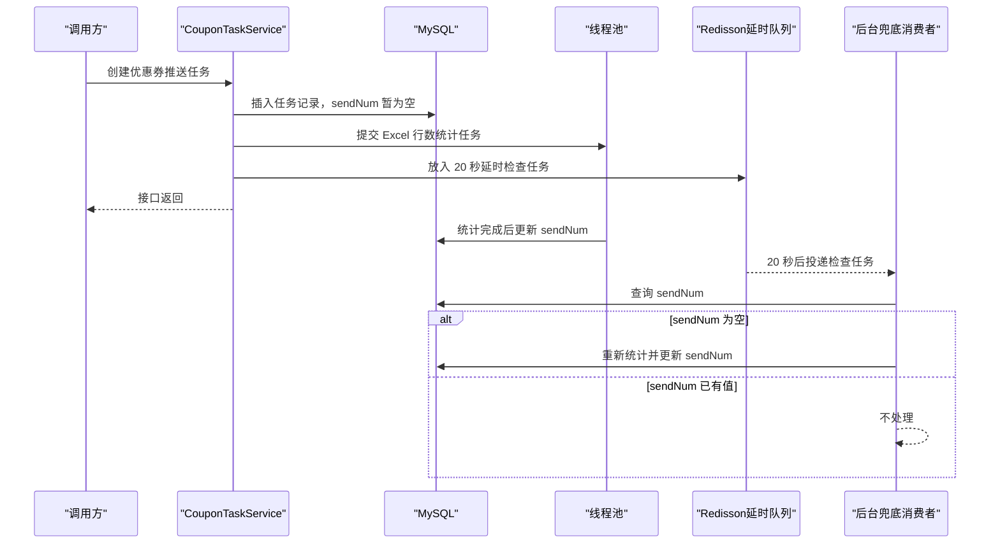

# 第 13 小节：通过线程池和延时队列优化接口响应时间

## 新手先读

本节讨论性能优化，但不要把“异步”理解成万能提速。它主要解决的是接口不要一直等慢操作完成，比如 Excel 行数统计可以放到后台线程处理。

线程池负责让后台任务有控制地执行，延时队列负责兜底重试。阅读时先看“同步做会卡在哪里”，再看“异步后主线程提前返回了什么”。

## 1. 本节目标

本节优化第 12 小节“创建优惠券推送任务”的接口响应时间。学习目标：

- 理解为什么 Excel 行数统计会拖慢接口响应。
- 理解线程池如何把耗时任务异步化。
- 理解 Redisson `RDelayedQueue` 如何做兜底延时任务。
- 看懂 `CommandLineRunner` 如何在 Spring Boot 启动后启动后台消费者。
- 理解 `@Transactional`、`ExecutorService`、`ThreadPoolExecutor`、`SynchronousQueue`、`RBlockingDeque` 等非基础 Java 或框架语法。
- 会运行接口，并验证任务先创建、`sendNum` 后刷新。

教程路径：

```text
D:\study\java\oneCoupon\第②章节：后台管理服务\《牛券oneCoupon优惠券系统设计》第13小节：通过线程池和延时队列优化接口响应时间.html
```

对应分支：

```text
目标分支：origin/20240823_optimize_create-coupon-task_threadpool-delayqueue_ding.ma
前置分支：origin/20240822_dev_create-coupon-task_easyexcel_ding.ma
```

完整 diff 附录：

```text
D:\study\java\oneCoupon\notes\diffs\13-通过线程池和延时队列优化接口响应时间.diff
```

## 2. 教程核心内容提炼

第 12 小节创建任务时，会在接口主线程中使用 EasyExcel 统计文件行数。教程中提到，百万级 Excel 统计大约需要数秒。如果接口同步等待统计完成，用户会明显感到慢。

本节改成：

1. 先插入优惠券推送任务记录。
2. 让接口尽快返回。
3. 把 Excel 行数统计提交给线程池异步执行。
4. 统计完成后更新任务表 `sendNum`。
5. 同时把任务信息放入 Redis 延时队列，20 秒后检查 `sendNum` 是否已经刷新。
6. 如果线程池任务因为应用异常等原因没有完成，延时队列消费者兜底再次统计。

这是一种“主流程提速 + 兜底补偿”的设计。

## 3. 分支变更总览

```text
1 file changed, 93 insertions(+), 6 deletions(-)
```

修改文件：

```text
merchant-admin/src/main/java/com/nageoffer/onecoupon/merchant/admin/service/impl/CouponTaskServiceImpl.java
```

核心变化：

- 新增 `RedissonClient` 依赖。
- 新增线程池。
- 创建任务方法增加事务。
- Excel 行数统计从同步改为异步。
- 新增 Redis 延时队列兜底。
- 新增内部类 `RefreshCouponTaskDelayQueueRunner` 作为延时队列消费者。

## 4. 优化前的问题

第 12 小节核心流程是：

```java
RowCountListener listener = new RowCountListener();
EasyExcel.read(requestParam.getFileAddress(), listener).sheet().doRead();
int totalRows = listener.getRowCount();
couponTaskDO.setSendNum(totalRows);
couponTaskMapper.insert(couponTaskDO);
```

这段代码的问题是：接口必须等 Excel 读完才能插入任务并返回。

如果文件很小，问题不明显。如果文件有 100 万行，就会出现：

- 接口响应时间变长。
- 用户重复点击的概率增加。
- Tomcat 工作线程被占用更久。
- 后续如果增加行级校验，耗时会进一步增加。

本节的思路是：`sendNum` 不是创建任务成功的必要前置条件，可以先创建任务，再异步补全发送数量。

## 5. 线程池定义

新增线程池：

```java
private final ExecutorService executorService = new ThreadPoolExecutor(
        Runtime.getRuntime().availableProcessors(),
        Runtime.getRuntime().availableProcessors() << 1,
        60,
        TimeUnit.SECONDS,
        new SynchronousQueue<>(),
        new ThreadPoolExecutor.DiscardPolicy()
);
```

参数解释：

| 参数 | 本节值 | 含义 |
| --- | --- | --- |
| `corePoolSize` | CPU 核数 | 核心线程数 |
| `maximumPoolSize` | CPU 核数乘 2 | 最大线程数 |
| `keepAliveTime` | 60 秒 | 非核心线程空闲多久后回收 |
| `unit` | 秒 | 时间单位 |
| `workQueue` | `SynchronousQueue` | 不存储任务，直接移交给线程 |
| `handler` | `DiscardPolicy` | 线程池满时直接丢弃任务 |

源码注释解释了为什么可以使用丢弃策略：发送任务时如果发现发送数量为空，会重新统计。也就是说，这里的线程池异步刷新不是唯一保障，后面还有延时队列兜底。

## 6. 创建任务主流程改造

本节给创建任务方法增加事务：

```java
@Transactional(rollbackFor = Exception.class)
@Override
public void createCouponTask(CouponTaskCreateReqDTO requestParam) {
    CouponTemplateQueryRespDTO couponTemplate = couponTemplateService.findCouponTemplateById(
            String.valueOf(requestParam.getCouponTemplateId())
    );

    if (couponTemplate == null) {
        throw new ClientException("优惠券模板不存在");
    }

    CouponTaskDO couponTaskDO = BeanUtil.copyProperties(requestParam, CouponTaskDO.class);
    couponTaskDO.setBatchId(IdUtil.getSnowflakeNextId());
    couponTaskDO.setOperatorId(Long.parseLong(UserContext.getUserId()));
    couponTaskDO.setShopNumber(UserContext.getShopNumber());
    couponTaskDO.setStatus(
            Objects.equals(requestParam.getSendType(), CouponTaskSendTypeEnum.IMMEDIATE.getType())
                    ? CouponTaskStatusEnum.IN_PROGRESS.getStatus()
                    : CouponTaskStatusEnum.PENDING.getStatus()
    );

    couponTaskMapper.insert(couponTaskDO);

    JSONObject delayJsonObject = JSONObject
            .of("fileAddress", requestParam.getFileAddress(), "couponTaskId", couponTaskDO.getId());
    executorService.execute(() -> refreshCouponTaskSendNum(delayJsonObject));

    RBlockingDeque<Object> blockingDeque = redissonClient.getBlockingDeque("COUPON_TASK_SEND_NUM_DELAY_QUEUE");
    RDelayedQueue<Object> delayedQueue = redissonClient.getDelayedQueue(blockingDeque);
    delayedQueue.offer(delayJsonObject, 20, TimeUnit.SECONDS);
}
```

关键变化：

- `couponTaskMapper.insert(couponTaskDO)` 提前执行。
- `sendNum` 不再阻塞主流程。
- `delayJsonObject` 保存后续统计所需的文件地址和任务 ID。
- `executorService.execute` 提交异步任务。
- `delayedQueue.offer` 提交 20 秒后的兜底检查。

## 7. 异步刷新发送数量

新增私有方法：

```java
private void refreshCouponTaskSendNum(JSONObject delayJsonObject) {
    RowCountListener listener = new RowCountListener();
    EasyExcel.read(delayJsonObject.getString("fileAddress"), listener).sheet().doRead();
    int totalRows = listener.getRowCount();

    CouponTaskDO updateCouponTaskDO = CouponTaskDO.builder()
            .id(delayJsonObject.getLong("couponTaskId"))
            .sendNum(totalRows)
            .build();
    couponTaskMapper.updateById(updateCouponTaskDO);
}
```

这个方法只做一件事：根据文件路径统计 Excel 行数，然后根据任务 ID 更新 `sendNum`。

为什么只构造 `id` 和 `sendNum`？

因为这里只想局部更新发送数量，不想改动任务其他字段。MyBatis-Plus 的 `updateById` 会根据实体主键更新非空字段。

## 8. Redisson 延时队列兜底

创建任务时写入延时队列：

```java
RBlockingDeque<Object> blockingDeque = redissonClient.getBlockingDeque("COUPON_TASK_SEND_NUM_DELAY_QUEUE");
RDelayedQueue<Object> delayedQueue = redissonClient.getDelayedQueue(blockingDeque);
delayedQueue.offer(delayJsonObject, 20, TimeUnit.SECONDS);
```

理解这两个对象：

- `RDelayedQueue`：负责“延迟多久后再投递”。
- `RBlockingDeque`：负责“到期后让消费者阻塞获取”。

简单类比：

```java
// 现在放进去
delayedQueue.offer(task, 20, TimeUnit.SECONDS);

// 20 秒后才能从 blockingDeque.take() 取出来
Object task = blockingDeque.take();
```

这里的 20 秒不是业务强一致保证，而是经验值：正常情况下，线程池统计应在 20 秒内完成。如果 20 秒后还没完成，就触发兜底检查。

## 9. Spring Boot 启动后台消费者

新增内部类：

```java
@Service
@RequiredArgsConstructor
class RefreshCouponTaskDelayQueueRunner implements CommandLineRunner {

    private final CouponTaskMapper couponTaskMapper;
    private final RedissonClient redissonClient;

    @Override
    public void run(String... args) throws Exception {
        Executors.newSingleThreadExecutor(
                        runnable -> {
                            Thread thread = new Thread(runnable);
                            thread.setName("delay_coupon-task_send-num_consumer");
                            thread.setDaemon(Boolean.TRUE);
                            return thread;
                        })
                .execute(() -> {
                    RBlockingDeque<JSONObject> blockingDeque = redissonClient.getBlockingDeque("COUPON_TASK_SEND_NUM_DELAY_QUEUE");
                    for (; ; ) {
                        try {
                            JSONObject delayJsonObject = blockingDeque.take();
                            if (delayJsonObject != null) {
                                CouponTaskDO couponTaskDO = couponTaskMapper.selectById(delayJsonObject.getLong("couponTaskId"));
                                if (couponTaskDO.getSendNum() == null) {
                                    refreshCouponTaskSendNum(delayJsonObject);
                                }
                            }
                        } catch (Throwable ignored) {
                        }
                    }
                });
    }
}
```

处理流程：

1. Spring Boot 启动完成后调用 `run`。
2. 创建单线程后台消费者。
3. 后台线程不断执行 `blockingDeque.take()`。
4. 没有到期任务时线程阻塞，不会空转。
5. 有任务到期后查询数据库。
6. 如果 `sendNum` 已有值，说明线程池已经处理完成。
7. 如果 `sendNum` 为空，则执行兜底统计。

## 10. 本节完整流程



## 11. Spring Boot 与框架语法补充

### 11.1 `@Transactional(rollbackFor = Exception.class)`

`@Transactional` 表示方法内数据库操作放在同一个事务中。

```java
@Transactional(rollbackFor = Exception.class)
public void createOrder() {
    orderMapper.insert(order);
    orderItemMapper.insert(item);
}
```

如果方法抛出异常，两次插入都会回滚。

`rollbackFor = Exception.class` 表示遇到受检异常也回滚。Spring 默认主要对运行时异常回滚，这里写得更明确。

### 11.2 `ExecutorService`

`ExecutorService` 是 Java 线程池接口。

```java
ExecutorService executorService = Executors.newFixedThreadPool(4);
executorService.execute(() -> {
    System.out.println("异步执行");
});
```

`execute` 提交的任务会在线程池线程中运行，调用方不需要等待任务完成。

### 11.3 `ThreadPoolExecutor`

`ThreadPoolExecutor` 是线程池的具体实现，可以精细控制线程数量、队列和拒绝策略。

```java
ThreadPoolExecutor executor = new ThreadPoolExecutor(
        2,
        4,
        60,
        TimeUnit.SECONDS,
        new ArrayBlockingQueue<>(100),
        new ThreadPoolExecutor.AbortPolicy()
);
```

生产项目中不建议随意使用 `Executors.newCachedThreadPool()`，因为隐藏参数可能导致线程数不可控。

### 11.4 `SynchronousQueue`

`SynchronousQueue` 是一种不存储元素的队列。

```java
BlockingQueue<Runnable> queue = new SynchronousQueue<>();
```

它的特点是：生产者放任务时，必须有消费者线程接收。在线程池里使用它，通常意味着任务不会排队堆积，而是尽快交给线程执行；如果线程也不够，就触发拒绝策略。

### 11.5 `ThreadPoolExecutor.DiscardPolicy`

`DiscardPolicy` 表示线程池无法接收新任务时，直接丢弃任务，不抛异常。

```java
new ThreadPoolExecutor.DiscardPolicy()
```

这个策略风险很高，只适合有补偿机制的场景。本节有 Redis 延时队列兜底，所以可以接受统计任务被丢弃。

### 11.6 `RedissonClient`

`RedissonClient` 是 Redisson 客户端入口。它把 Redis 封装成 Java 分布式对象。

```java
RBlockingDeque<String> deque = redissonClient.getBlockingDeque("demo_queue");
deque.put("task");
String task = deque.take();
```

项目中第 09 小节用 Redisson 做分布式锁，本节用它做延时队列。

### 11.7 `CommandLineRunner`

`CommandLineRunner` 是 Spring Boot 启动回调接口。

```java
@Component
public class DemoRunner implements CommandLineRunner {
    @Override
    public void run(String... args) {
        System.out.println("应用启动后执行");
    }
}
```

适合启动后台任务、预热缓存、注册监听器等。

### 11.8 `for (; ; )`

这是 Java 无限循环写法。

```java
for (; ; ) {
    System.out.println("一直执行");
}
```

等价于：

```java
while (true) {
    System.out.println("一直执行");
}
```

本节后台消费者需要一直监听队列，所以使用无限循环。

## 12. 如何运行与测试本节功能

### 12.1 使用独立 worktree

```powershell
cd D:\study\java\oneCoupon\code\onecoupon
git worktree add D:\study\java\oneCoupon\worktrees\chapter-02-13 origin/20240823_optimize_create-coupon-task_threadpool-delayqueue_ding.ma
```

### 12.2 启动依赖

需要启动：

- MySQL。
- Redis。
- RocketMQ。
- `merchant-admin` 服务。

### 12.3 准备 Excel

可以复用第 12 小节的测试 Excel。为了更明显看到异步刷新效果，建议准备行数稍多的文件。

### 12.4 启动服务

```powershell
cd D:\study\java\oneCoupon\worktrees\chapter-02-13
mvn -pl merchant-admin -am spring-boot:run
```

启动后观察日志，确认后台消费者线程没有启动异常。

### 12.5 调用创建任务接口

```text
POST /api/merchant-admin/coupon-task/create
```

请求体示例：

```json
{
  "couponTemplateId": 1812345678901234560,
  "taskName": "第13小节异步统计测试",
  "fileAddress": "D:\\study\\java\\oneCoupon\\data\\coupon-task-test.xlsx",
  "sendType": 0,
  "sendTime": null,
  "notifyType": 0
}
```

### 12.6 验证异步刷新

接口返回后立即查询：

```sql
SELECT id, task_name, send_num, status
FROM t_coupon_task
ORDER BY id DESC
LIMIT 1;
```

你可能看到 `send_num` 暂时为空。

等待几秒后再次查询：

```sql
SELECT id, task_name, send_num, status
FROM t_coupon_task
ORDER BY id DESC
LIMIT 1;
```

如果线程池任务正常完成，`send_num` 会被更新为 Excel 行数。

### 12.7 验证延时队列兜底

可以通过断点或临时让线程池任务不执行来观察兜底逻辑。正常学习阶段不建议修改代码破坏流程，只需要理解：

- 20 秒后延时队列消费者会检查任务。
- 如果 `send_num` 已经有值，不再处理。
- 如果 `send_num` 仍为空，重新统计并更新。

### 12.8 常见问题

| 现象 | 可能原因 | 处理方式 |
| --- | --- | --- |
| `send_num` 一直为空 | Excel 路径错误或线程池任务异常 | 查看服务日志和文件路径 |
| 延时队列不生效 | Redis 未启动或 Redisson 配置错误 | 检查 Redis 连接 |
| 应用启动卡住 | 后台线程不是守护线程或逻辑异常 | 检查 Runner 线程创建逻辑 |
| 接口仍然很慢 | 其他前置逻辑耗时 | 打日志定位耗时点 |

## 13. 阅读代码顺序建议

1. 对比第 12 小节 `createCouponTask` 的同步统计代码。
2. 阅读本节新增线程池定义。
3. 阅读 `createCouponTask` 中插入任务、提交异步任务、写延时队列的顺序。
4. 阅读 `refreshCouponTaskSendNum`。
5. 阅读 `RefreshCouponTaskDelayQueueRunner`。

## 14. 面试与复盘问题

- 为什么 `sendNum` 可以异步刷新？
- 线程池任务被丢弃后，系统靠什么兜底？
- 使用 `DiscardPolicy` 有什么风险？
- 为什么后台消费者使用 `blockingDeque.take()`，而不是循环查询数据库？
- 这个方案在多实例部署时会不会有重复兜底执行？是否可接受？

## 15. 本节检查清单

- 能说清楚接口响应时间优化点。
- 能解释线程池参数含义。
- 能解释 Redisson 延时队列和阻塞队列的关系。
- 能解释 `CommandLineRunner` 的启动时机。
- 能通过数据库观察 `sendNum` 从空到有值。
- 能通过 diff 附录查看本节所有代码改动。
