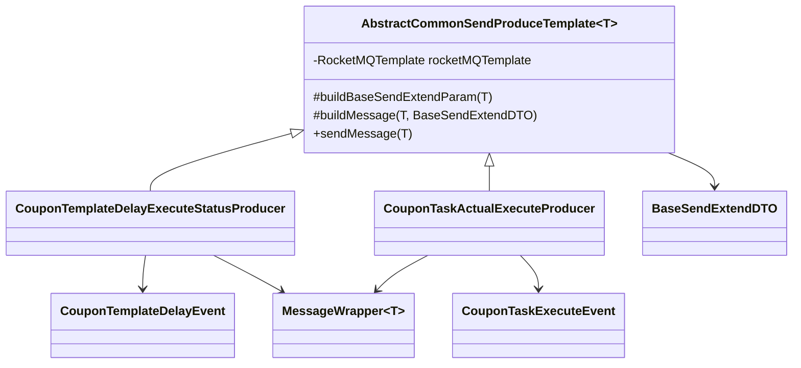

# 第 14 小节：基于模板方法模式重构消息队列发送功能

## 新手先读

本节是一次代码结构优化，不是新增复杂业务。模板方法模式可以先理解成“父类规定固定流程，子类只填变化步骤”。

阅读时先找重复代码：不同 MQ 生产者都要构建消息、设置 key、发送、处理结果。模板方法就是把这些重复步骤收拢起来，避免每个生产者都手写一遍。

## 1. 本节目标

本节重构 RocketMQ 消息发送代码，并在创建优惠券推送任务后发送“任务执行消息”。学习目标：

- 理解为什么消息发送逻辑需要抽象。
- 理解模板方法模式的结构和适用场景。
- 看懂 `AbstractCommonSendProduceTemplate<T>` 如何统一发送流程。
- 看懂普通消息和延时消息如何共用同一套模板。
- 理解 `BaseSendExtendDTO`、`MessageWrapper<T>`、事件对象、生产者对象之间的关系。
- 理解 Spring 构造器注入、泛型抽象类、`protected abstract`、Builder 模式等非基础语法。
- 会运行创建模板和创建任务接口，验证两类消息发送。

教程路径：

```text
D:\study\java\oneCoupon\第②章节：后台管理服务\《牛券oneCoupon优惠券系统设计》第14小节：基于模板方法模式重构消息队列发送功能.html
```

对应分支：

```text
目标分支：origin/20240824_dev_coupon-task-execute_template-method_ding.ma
前置分支：origin/20240823_optimize_create-coupon-task_threadpool-delayqueue_ding.ma
```

完整 diff 附录：

```text
D:\study\java\oneCoupon\notes\diffs\14-基于模板方法模式重构消息队列发送功能.diff
```

## 2. 教程核心内容提炼

第 11 小节在 `CouponTemplateServiceImpl` 中直接写 RocketMQ 发送代码。这样能跑通，但随着消息类型增加，会出现重复逻辑：

- 解析 Topic 占位符。
- 构建消息体。
- 设置 Keys 和 Tags。
- 判断普通消息还是延时消息。
- 发送成功日志。
- 发送失败日志。

本节引入模板方法模式，把公共发送流程放进抽象父类，不同业务消息只负责补充自己的差异参数。

同时，本节在创建优惠券推送任务后，如果任务是立即发送，会发送“优惠券推送执行”消息，供后续真正发券链路消费。

## 3. 分支变更总览

```text
10 files changed, 618 insertions(+), 45 deletions(-)
```

主要变化：

```text
merchant-admin/src/main/java/.../mq/base/BaseSendExtendDTO.java
merchant-admin/src/main/java/.../mq/base/MessageWrapper.java
merchant-admin/src/main/java/.../mq/consumer/CouponTemplateDelayExecuteStatusConsumer.java
merchant-admin/src/main/java/.../mq/event/CouponTaskExecuteEvent.java
merchant-admin/src/main/java/.../mq/event/CouponTemplateDelayEvent.java
merchant-admin/src/main/java/.../mq/producer/AbstractCommonSendProduceTemplate.java
merchant-admin/src/main/java/.../mq/producer/CouponTaskActualExecuteProducer.java
merchant-admin/src/main/java/.../mq/producer/CouponTemplateDelayExecuteStatusProducer.java
merchant-admin/src/main/java/.../service/impl/CouponTaskServiceImpl.java
merchant-admin/src/main/java/.../service/impl/CouponTemplateServiceImpl.java
```

核心变化：

- 新增消息发送抽象模板。
- 新增消息基础参数对象。
- 新增统一消息包装器。
- 新增两个业务事件对象。
- 新增两个具体生产者。
- 模板关闭延时消息改用生产者发送。
- 立即发送任务创建后发送任务执行消息。
- 消费者从消费 `JSONObject` 改为消费 `MessageWrapper<CouponTemplateDelayEvent>`。

## 4. 为什么需要模板方法模式

没有抽象前，发送一类消息需要写一遍：

```java
String topic = environment.resolvePlaceholders("topic${unique-name:}");
Message<?> message = MessageBuilder.withPayload(payload).build();
SendResult sendResult = rocketMQTemplate.syncSend(topic, message, 2000L);
log.info("发送结果：{}", sendResult);
```

再新增延时消息，又要写一遍：

```java
String topic = environment.resolvePlaceholders("delay-topic${unique-name:}");
Message<?> message = MessageBuilder.withPayload(payload).build();
SendResult sendResult = rocketMQTemplate.syncSendDeliverTimeMills(topic, message, delayTime);
log.info("发送结果：{}", sendResult);
```

重复点很多。模板方法模式的做法是：

- 父类固定“发送消息的步骤”。
- 子类只实现“本业务消息的参数怎么构建”。

简单示例：

```java
public abstract class AbstractExporter {

    public final void export() {
        loadData();
        writeFile();
        uploadFile();
    }

    protected abstract void loadData();

    protected abstract void writeFile();

    protected void uploadFile() {
        System.out.println("上传文件");
    }
}
```

`export` 是固定流程，`loadData` 和 `writeFile` 由不同子类实现。

## 5. 消息基础参数对象

新增 `BaseSendExtendDTO`：

```java
@Data
@NoArgsConstructor
@AllArgsConstructor
@Builder
public final class BaseSendExtendDTO {

    private String eventName;

    private String topic;

    private String tag;

    private String keys;

    private Long sentTimeout;

    private Long delayTime;
}
```

字段含义：

| 字段 | 含义 |
| --- | --- |
| `eventName` | 事件名称，用于日志 |
| `topic` | RocketMQ Topic |
| `tag` | RocketMQ Tag，可选 |
| `keys` | 消息业务 Key，便于追踪 |
| `sentTimeout` | 普通消息发送超时时间 |
| `delayTime` | 延时消息投递时间戳 |

这个对象不是业务消息本身，而是“发送这条消息所需的扩展参数”。

## 6. 统一消息包装器

新增 `MessageWrapper<T>`：

```java
@Data
@Builder
@NoArgsConstructor(force = true)
@AllArgsConstructor
@RequiredArgsConstructor
public final class MessageWrapper<T> implements Serializable {

    private static final long serialVersionUID = 1L;

    @NonNull
    private String keys;

    @NonNull
    private T message;

    private Long timestamp = System.currentTimeMillis();
}
```

包装后的消息结构是：

```json
{
  "keys": "1812345678901234560",
  "message": {
    "couponTaskId": 1812345678901234560
  },
  "timestamp": 1780980000000
}
```

这样做的好处：

- 所有消息都有统一外层结构。
- 消息 Key 和消息体一起传递。
- 消费端可以统一读取 `messageWrapper.getMessage()`。
- 后续增加 traceId、发送时间等字段更方便。

## 7. 事件对象

新增 `CouponTaskExecuteEvent`：

```java
@Data
@Builder
@NoArgsConstructor
@AllArgsConstructor
public class CouponTaskExecuteEvent {

    private Long couponTaskId;
}
```

它表示“执行某个优惠券推送任务”。

新增 `CouponTemplateDelayEvent`：

```java
@Data
@Builder
@NoArgsConstructor
@AllArgsConstructor
public class CouponTemplateDelayEvent {

    private Long shopNumber;

    private Long couponTemplateId;

    private Long delayTime;
}
```

它表示“在指定时间关闭某个优惠券模板”。

事件对象只保存业务需要的信息，不关心 Topic、Keys、超时时间等发送细节。

## 8. 抽象发送模板

新增 `AbstractCommonSendProduceTemplate<T>`：

```java
@RequiredArgsConstructor
@Slf4j(topic = "CommonSendProduceTemplate")
public abstract class AbstractCommonSendProduceTemplate<T> {

    private final RocketMQTemplate rocketMQTemplate;

    protected abstract BaseSendExtendDTO buildBaseSendExtendParam(T messageSendEvent);

    protected abstract Message<?> buildMessage(T messageSendEvent, BaseSendExtendDTO requestParam);

    public SendResult sendMessage(T messageSendEvent) {
        BaseSendExtendDTO baseSendExtendDTO = buildBaseSendExtendParam(messageSendEvent);
        SendResult sendResult;
        try {
            StringBuilder destinationBuilder = StrUtil.builder().append(baseSendExtendDTO.getTopic());
            if (StrUtil.isNotBlank(baseSendExtendDTO.getTag())) {
                destinationBuilder.append(":").append(baseSendExtendDTO.getTag());
            }

            if (baseSendExtendDTO.getDelayTime() != null) {
                sendResult = rocketMQTemplate.syncSendDeliverTimeMills(
                        destinationBuilder.toString(),
                        buildMessage(messageSendEvent, baseSendExtendDTO),
                        baseSendExtendDTO.getDelayTime()
                );
            } else {
                sendResult = rocketMQTemplate.syncSend(
                        destinationBuilder.toString(),
                        buildMessage(messageSendEvent, baseSendExtendDTO),
                        baseSendExtendDTO.getSentTimeout()
                );
            }

            log.info("[生产者] {} - 发送结果：{}，消息ID：{}，消息Keys：{}",
                    baseSendExtendDTO.getEventName(),
                    sendResult.getSendStatus(),
                    sendResult.getMsgId(),
                    baseSendExtendDTO.getKeys());
        } catch (Throwable ex) {
            log.error("[生产者] {} - 消息发送失败，消息体：{}",
                    baseSendExtendDTO.getEventName(),
                    JSON.toJSONString(messageSendEvent),
                    ex);
            throw ex;
        }

        return sendResult;
    }
}
```

模板固定了发送步骤：

1. 调用子类方法构建发送参数。
2. 拼接 `topic:tag`。
3. 判断是否有 `delayTime`。
4. 有延时则发送延时消息。
5. 无延时则发送普通消息。
6. 统一记录成功日志。
7. 统一记录失败日志并抛出异常。

## 9. 模板关闭延时消息生产者

新增 `CouponTemplateDelayExecuteStatusProducer`：

```java
@Component
public class CouponTemplateDelayExecuteStatusProducer extends AbstractCommonSendProduceTemplate<CouponTemplateDelayEvent> {

    private final ConfigurableEnvironment environment;

    public CouponTemplateDelayExecuteStatusProducer(@Autowired RocketMQTemplate rocketMQTemplate, @Autowired ConfigurableEnvironment environment) {
        super(rocketMQTemplate);
        this.environment = environment;
    }

    @Override
    protected BaseSendExtendDTO buildBaseSendExtendParam(CouponTemplateDelayEvent messageSendEvent) {
        return BaseSendExtendDTO.builder()
                .eventName("优惠券模板关闭定时执行")
                .keys(String.valueOf(messageSendEvent.getCouponTemplateId()))
                .topic(environment.resolvePlaceholders("one-coupon_merchant-admin-service_coupon-template-delay_topic${unique-name:}"))
                .delayTime(messageSendEvent.getDelayTime())
                .build();
    }

    @Override
    protected Message<?> buildMessage(CouponTemplateDelayEvent messageSendEvent, BaseSendExtendDTO requestParam) {
        String keys = StrUtil.isEmpty(requestParam.getKeys()) ? UUID.randomUUID().toString() : requestParam.getKeys();
        return MessageBuilder
                .withPayload(new MessageWrapper(keys, messageSendEvent))
                .setHeader(MessageConst.PROPERTY_KEYS, keys)
                .setHeader(MessageConst.PROPERTY_TAGS, requestParam.getTag())
                .build();
    }
}
```

这个生产者的特点：

- 事件类型是 `CouponTemplateDelayEvent`。
- Topic 仍然是模板延时关闭 Topic。
- `delayTime` 来自模板有效期结束时间。
- 消息体被包装成 `MessageWrapper<CouponTemplateDelayEvent>`。

## 10. 任务执行消息生产者

新增 `CouponTaskActualExecuteProducer`：

```java
@Slf4j
@Component
public class CouponTaskActualExecuteProducer extends AbstractCommonSendProduceTemplate<CouponTaskExecuteEvent> {

    private final ConfigurableEnvironment environment;

    public CouponTaskActualExecuteProducer(@Autowired RocketMQTemplate rocketMQTemplate, @Autowired ConfigurableEnvironment environment) {
        super(rocketMQTemplate);
        this.environment = environment;
    }

    @Override
    protected BaseSendExtendDTO buildBaseSendExtendParam(CouponTaskExecuteEvent messageSendEvent) {
        return BaseSendExtendDTO.builder()
                .eventName("优惠券推送执行")
                .keys(String.valueOf(messageSendEvent.getCouponTaskId()))
                .topic(environment.resolvePlaceholders("one-coupon_distribution-service_coupon-task-execute_topic${unique-name:}"))
                .sentTimeout(2000L)
                .build();
    }

    @Override
    protected Message<?> buildMessage(CouponTaskExecuteEvent messageSendEvent, BaseSendExtendDTO requestParam) {
        String keys = StrUtil.isEmpty(requestParam.getKeys()) ? UUID.randomUUID().toString() : requestParam.getKeys();
        return MessageBuilder
                .withPayload(new MessageWrapper(keys, messageSendEvent))
                .setHeader(MessageConst.PROPERTY_KEYS, keys)
                .setHeader(MessageConst.PROPERTY_TAGS, requestParam.getTag())
                .build();
    }
}
```

这个生产者的特点：

- 事件类型是 `CouponTaskExecuteEvent`。
- Topic 指向 `distribution-service` 的任务执行 Topic。
- 没有 `delayTime`，所以走普通同步发送。
- 超时时间是 `2000L`。

## 11. Service 使用生产者

`CouponTemplateServiceImpl` 不再直接操作 `RocketMQTemplate`，而是组装事件并调用生产者：

```java
CouponTemplateDelayEvent templateDelayEvent = CouponTemplateDelayEvent.builder()
        .shopNumber(UserContext.getShopNumber())
        .couponTemplateId(couponTemplateDO.getId())
        .delayTime(couponTemplateDO.getValidEndTime().getTime())
        .build();
couponTemplateDelayExecuteStatusProducer.sendMessage(templateDelayEvent);
```

`CouponTaskServiceImpl` 在立即发送任务创建后发送任务执行消息：

```java
if (Objects.equals(requestParam.getSendType(), CouponTaskSendTypeEnum.IMMEDIATE.getType())) {
    CouponTaskExecuteEvent couponTaskExecuteEvent = CouponTaskExecuteEvent.builder()
            .couponTaskId(couponTaskDO.getId())
            .build();
    couponTaskActualExecuteProducer.sendMessage(couponTaskExecuteEvent);
}
```

这样 Service 层只表达业务意图：

- “模板到期后关闭”。
- “立即执行这个推送任务”。

真正的消息发送细节交给 Producer。

## 12. 消费者适配消息包装器

消费者由消费 `JSONObject` 改为消费包装后的事件对象：

```java
@RocketMQMessageListener(
        topic = "one-coupon_merchant-admin-service_coupon-template-delay_topic${unique-name:}",
        consumerGroup = "one-coupon_merchant-admin-service_coupon-template-delay-status_cg${unique-name:}"
)
@Slf4j(topic = "CouponTemplateDelayExecuteStatusConsumer")
public class CouponTemplateDelayExecuteStatusConsumer implements RocketMQListener<MessageWrapper<CouponTemplateDelayEvent>> {

    private final CouponTemplateService couponTemplateService;

    @Override
    public void onMessage(MessageWrapper<CouponTemplateDelayEvent> messageWrapper) {
        log.info("[消费者] 优惠券模板定时执行@变更模板表状态 - 执行消费逻辑，消息体：{}", JSON.toJSONString(messageWrapper));

        CouponTemplateDelayEvent message = messageWrapper.getMessage();
        LambdaUpdateWrapper<CouponTemplateDO> updateWrapper = Wrappers.lambdaUpdate(CouponTemplateDO.class)
                .eq(CouponTemplateDO::getShopNumber, message.getShopNumber())
                .eq(CouponTemplateDO::getId, message.getCouponTemplateId())
                .set(CouponTemplateDO::getStatus, CouponTemplateStatusEnum.ENDED.getStatus());
        couponTemplateService.update(updateWrapper);
    }
}
```

消费者更清晰了：

- `messageWrapper` 是统一消息外壳。
- `messageWrapper.getMessage()` 才是真正业务事件。
- 业务事件有明确字段，不再依赖字符串 Key 从 `JSONObject` 取值。

## 13. 本节完整结构



## 14. Spring Boot 与框架语法补充

### 14.1 泛型抽象类

```java
public abstract class AbstractCommonSendProduceTemplate<T> {
    public SendResult sendMessage(T messageSendEvent) {
        return null;
    }
}
```

`T` 表示由子类决定消息事件类型。

子类写：

```java
public class CouponTaskActualExecuteProducer
        extends AbstractCommonSendProduceTemplate<CouponTaskExecuteEvent> {
}
```

此时 `sendMessage` 的参数类型就是 `CouponTaskExecuteEvent`。

### 14.2 `protected abstract`

```java
protected abstract Message<?> buildMessage(T messageSendEvent, BaseSendExtendDTO requestParam);
```

含义：

- `protected`：只有本类、子类、同包类可以访问。
- `abstract`：父类只定义方法，不实现，子类必须实现。

这正是模板方法模式常见写法。

### 14.3 `final class`

```java
public final class BaseSendExtendDTO {
}
```

`final class` 表示这个类不能被继承。对于纯数据对象，如果不希望别人继承后改变语义，可以加 `final`。

### 14.4 Builder 模式

Lombok 的 `@Builder` 会生成链式构建 API。

```java
BaseSendExtendDTO dto = BaseSendExtendDTO.builder()
        .eventName("优惠券推送执行")
        .topic("coupon-topic")
        .keys("1001")
        .sentTimeout(2000L)
        .build();
```

相比多参数构造方法，Builder 更适合字段较多且部分字段可选的对象。

### 14.5 构造器中使用 `@Autowired`

```java
public CouponTaskActualExecuteProducer(@Autowired RocketMQTemplate rocketMQTemplate,
                                       @Autowired ConfigurableEnvironment environment) {
    super(rocketMQTemplate);
    this.environment = environment;
}
```

这里使用构造器注入：

- `rocketMQTemplate` 传给父类。
- `environment` 留在子类解析 Topic。

在只有一个构造方法时，Spring 通常可以省略 `@Autowired`，但显式写出也能表达注入意图。

### 14.6 `Message<?>`

`Message<?>` 中的 `?` 是通配符，表示“某种具体类型的 Message，但当前不关心是哪种”。

```java
Message<?> message = MessageBuilder.withPayload("hello").build();
```

如果方法只负责发送消息，不需要操作具体 payload 类型，使用 `?` 可以增强通用性。

### 14.7 `topic:tag`

RocketMQ Spring 中常用 `topic:tag` 作为发送目的地。

```java
String destination = "coupon-topic:task-execute";
rocketMQTemplate.syncSend(destination, message, 2000L);
```

本节父类中：

```java
StringBuilder destinationBuilder = StrUtil.builder().append(baseSendExtendDTO.getTopic());
if (StrUtil.isNotBlank(baseSendExtendDTO.getTag())) {
    destinationBuilder.append(":").append(baseSendExtendDTO.getTag());
}
```

如果没有 Tag，就只发送到 Topic。

## 15. 如何运行与测试本节功能

### 15.1 使用独立 worktree

```powershell
cd D:\study\java\oneCoupon\code\onecoupon
git worktree add D:\study\java\oneCoupon\worktrees\chapter-02-14 origin/20240824_dev_coupon-task-execute_template-method_ding.ma
```

### 15.2 启动依赖

需要启动：

- MySQL。
- Redis。
- RocketMQ NameServer。
- RocketMQ Broker。
- `merchant-admin` 服务。

### 15.3 启动服务

```powershell
cd D:\study\java\oneCoupon\worktrees\chapter-02-14
mvn -pl merchant-admin -am spring-boot:run
```

### 15.4 测试模板延时关闭消息

调用创建优惠券模板接口，设置一个较近的 `validEndTime`。

验证点：

- 日志出现 `[生产者] 优惠券模板关闭定时执行`。
- 到期后消费者日志出现模板状态变更消息。
- 数据库中模板状态变成已结束。

### 15.5 测试任务执行消息

调用创建优惠券推送任务接口，并设置：

```json
{
  "sendType": 0
}
```

验证点：

- 任务记录插入成功。
- 线程池异步刷新 `sendNum`。
- 日志出现 `[生产者] 优惠券推送执行`。
- RocketMQ 中能看到发往 `one-coupon_distribution-service_coupon-task-execute_topic` 的消息。

注意：本节主要发送任务执行消息，真正消费并执行批量发券通常在后续章节或 `distribution-service` 中实现。

### 15.6 常见问题

| 现象 | 可能原因 | 处理方式 |
| --- | --- | --- |
| 发送任务执行消息失败 | Topic 不存在或 Broker 配置限制 | 创建 Topic 或调整 Broker 自动创建配置 |
| 消费者反序列化失败 | 消息类型与消费者泛型不一致 | 检查 `MessageWrapper<CouponTemplateDelayEvent>` |
| 延时关闭消息不消费 | Topic 或 ConsumerGroup 不一致 | 对比生产者和消费者配置 |
| 创建任务后没有任务执行消息 | `sendType` 不是立即发送 | 确认请求参数 |

## 16. 阅读代码顺序建议

1. `BaseSendExtendDTO`：理解发送参数。
2. `MessageWrapper`：理解统一消息体。
3. `AbstractCommonSendProduceTemplate`：理解模板方法。
4. `CouponTemplateDelayExecuteStatusProducer`：看延时消息子类。
5. `CouponTaskActualExecuteProducer`：看普通消息子类。
6. `CouponTemplateServiceImpl`：看创建模板如何调用生产者。
7. `CouponTaskServiceImpl`：看立即发送任务如何调用生产者。
8. `CouponTemplateDelayExecuteStatusConsumer`：看消费者如何读取包装消息。

## 17. 面试与复盘问题

- 什么是模板方法模式？本节哪些代码体现了固定流程和可变步骤？
- 为什么不继续在 Service 里直接写 `RocketMQTemplate`？
- `MessageWrapper<T>` 解决了什么问题？
- 普通消息和延时消息在父类中如何区分？
- 如果后续新增短信通知消息，需要新增哪些类？
- 消费者从 `JSONObject` 改为强类型事件对象有什么好处？

## 18. 本节检查清单

- 能画出消息发送模板的类关系。
- 能解释 `BaseSendExtendDTO` 每个字段的用途。
- 能解释 `MessageWrapper<T>` 的结构。
- 能看懂两个具体生产者的差异。
- 能运行创建模板和创建任务接口，并观察对应生产者日志。
- 能通过 diff 附录查看本节所有代码改动。
