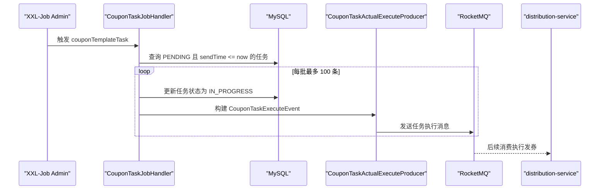

# 第 15 小节：开发 XXL-Job 定时任务执行分发数据

## 新手先读

本节把“已经创建的分发任务”真正调度起来。你可以把 XXL-Job 理解成一个带管理后台的定时任务系统，它会按配置时间触发项目里的某个方法。

新手先分清两件事：XXL-Job 负责按时触发任务，RocketMQ 负责把任务执行过程异步分发给消费者。两者不是替代关系，而是在批量发券链路里负责不同阶段。

## 1. 本节目标

本节补齐“定时发送优惠券推送任务”的调度入口。学习目标：

- 理解立即发送和定时发送任务的差异。
- 理解为什么需要 XXL-Job 调度平台。
- 看懂 XXL-Job 执行器如何接入 Spring Boot。
- 看懂 `@XxlJob` 定时任务处理器如何扫描待执行任务。
- 理解分页扫描、状态推进、消息投递之间的关系。
- 理解 `@ConditionalOnProperty`、`@Value`、`@Bean`、`IJobHandler`、`LambdaQueryWrapper` 等非基础语法。
- 会启动 XXL-Job Admin 和 `merchant-admin`，手动触发任务并验证消息发送。

教程路径：

```text
D:\study\java\oneCoupon\第②章节：后台管理服务\《牛券oneCoupon优惠券系统设计》第15小节：开发XXL-Job定时任务执行分发数据.html
```

对应分支：

```text
目标分支：origin/20240825_dev_coupon-task-timing_xxl-job_ding.ma
前置分支：origin/20240824_dev_coupon-task-execute_template-method_ding.ma
```

完整 diff 附录：

```text
D:\study\java\oneCoupon\notes\diffs\15-开发XXL-Job定时任务执行分发数据.diff
```

## 2. 教程核心内容提炼

第 14 小节已经支持立即发送任务：创建任务时，如果 `sendType` 是立即发送，直接发 RocketMQ 消息。

但定时发送任务不能在创建时立刻执行。它需要：

1. 创建任务时状态为 `PENDING`。
2. 到达 `sendTime` 后，由定时任务扫描出来。
3. 把任务状态改为 `IN_PROGRESS`。
4. 发送 RocketMQ 任务执行消息。
5. 后续由分发服务真正消费并执行发券。

本节使用 XXL-Job 作为调度平台，负责周期性触发扫描逻辑。

## 3. 分支变更总览

```text
4 files changed, 229 insertions(+)
```

主要变化：

```text
merchant-admin/pom.xml
merchant-admin/src/main/java/.../config/XXLJobConfiguration.java
merchant-admin/src/main/java/.../job/CouponTaskJobHandler.java
merchant-admin/src/main/resources/application.yaml
```

核心变化：

- 引入 XXL-Job 依赖。
- 增加 XXL-Job 执行器配置。
- 新增 `CouponTaskJobHandler` 定时任务处理器。
- 配置执行器名称、Admin 地址、端口、日志目录等。

## 4. 为什么需要 XXL-Job

如果只用 Spring 自带 `@Scheduled`，也能做简单定时扫描：

```java
@Scheduled(cron = "0/5 * * * * ?")
public void scanTask() {
    System.out.println("扫描任务");
}
```

但生产环境通常还需要：

- 页面化管理定时任务。
- 手动触发一次任务。
- 查看调度日志。
- 控制任务启停。
- 多执行器注册。
- 失败重试和告警。

XXL-Job 提供了独立 Admin 控制台，适合项目中这种“业务服务执行任务，调度平台负责触发”的场景。

## 5. XXL-Job 配置类

新增 `XXLJobConfiguration`：

```java
@Configuration
@ConditionalOnProperty(prefix = "xxl-job", name = "enabled", havingValue = "true", matchIfMissing = true)
public class XXLJobConfiguration {

    @Value("${xxl-job.admin.addresses:}")
    private String adminAddresses;

    @Value("${xxl-job.access-token:}")
    private String accessToken;

    @Value("${xxl-job.executor.application-name}")
    private String applicationName;

    @Value("${xxl-job.executor.ip}")
    private String ip;

    @Value("${xxl-job.executor.port}")
    private int port;

    @Value("${xxl-job.executor.log-path:}")
    private String logPath;

    @Value("${xxl-job.executor.log-retention-days}")
    private int logRetentionDays;

    @Bean
    public XxlJobSpringExecutor xxlJobExecutor() {
        XxlJobSpringExecutor xxlJobSpringExecutor = new XxlJobSpringExecutor();
        xxlJobSpringExecutor.setAdminAddresses(adminAddresses);
        xxlJobSpringExecutor.setAppname(applicationName);
        xxlJobSpringExecutor.setIp(ip);
        xxlJobSpringExecutor.setPort(port);
        xxlJobSpringExecutor.setAccessToken(StrUtil.isNotEmpty(accessToken) ? accessToken : null);
        xxlJobSpringExecutor.setLogPath(StrUtil.isNotEmpty(logPath) ? logPath : Paths.get("").toAbsolutePath().getParent() + "/tmp");
        xxlJobSpringExecutor.setLogRetentionDays(logRetentionDays);
        return xxlJobSpringExecutor;
    }
}
```

这个配置类负责把当前 `merchant-admin` 注册成 XXL-Job 执行器。

字段解释：

| 字段 | 作用 |
| --- | --- |
| `adminAddresses` | XXL-Job Admin 控制台地址 |
| `accessToken` | 调度中心和执行器之间的访问令牌 |
| `applicationName` | 执行器名称 |
| `ip` | 执行器暴露给调度中心的 IP |
| `port` | 执行器端口 |
| `logPath` | 任务日志目录 |
| `logRetentionDays` | 日志保留天数 |

## 6. application.yaml 配置

本节新增配置：

```yaml
xxl-job:
  enabled: false
  access-token: default_token
  admin:
    addresses: http://localhost:8088/xxl-job-admin
  executor:
    application-name: one-coupon-merchant-admin
    ip: 127.0.0.1
    log-retention-days: 30
```

说明：

- `enabled: false` 表示默认不启用 XXL-Job。学习本节时需要改为 `true` 或通过启动参数覆盖。
- `admin.addresses` 要和本地 XXL-Job Admin 地址一致。
- `executor.application-name` 要和 XXL-Job Admin 中配置的执行器 AppName 一致。
- `access-token` 要和 Admin 端配置保持一致。

如果本地只是看代码，不启用 XXL-Job，可以保持 `enabled: false`。

## 7. 定时任务处理器

新增 `CouponTaskJobHandler`：

```java
@Component
@RequiredArgsConstructor
public class CouponTaskJobHandler extends IJobHandler {

    private final CouponTaskMapper couponTaskMapper;
    private final CouponTaskActualExecuteProducer couponTaskActualExecuteProducer;

    private static final int MAX_LIMIT = 100;

    @XxlJob(value = "couponTemplateTask")
    public void execute() throws Exception {
        long initId = 0;
        Date now = new Date();

        while (true) {
            List<CouponTaskDO> couponTaskDOList = fetchPendingTasks(initId, now);

            if (CollUtil.isEmpty(couponTaskDOList)) {
                break;
            }

            for (CouponTaskDO each : couponTaskDOList) {
                distributeCoupon(each);
            }

            if (couponTaskDOList.size() < MAX_LIMIT) {
                break;
            }

            initId = couponTaskDOList.stream()
                    .mapToLong(CouponTaskDO::getId)
                    .max()
                    .orElse(initId);
        }
    }
}
```

核心思路：

- 每次最多查 100 条。
- 只查待执行且已到发送时间的任务。
- 一批处理完后，如果查满 100 条，继续查下一批。
- 用 `initId` 作为游标，避免重复扫描已经处理过的记录。

## 8. 查询待执行任务

查询方法：

```java
private List<CouponTaskDO> fetchPendingTasks(long initId, Date now) {
    LambdaQueryWrapper<CouponTaskDO> queryWrapper = Wrappers.lambdaQuery(CouponTaskDO.class)
            .eq(CouponTaskDO::getStatus, CouponTaskStatusEnum.PENDING.getStatus())
            .le(CouponTaskDO::getSendTime, now)
            .gt(CouponTaskDO::getId, initId)
            .last("LIMIT " + MAX_LIMIT);
    return couponTaskMapper.selectList(queryWrapper);
}
```

等价 SQL 思路：

```sql
SELECT *
FROM t_coupon_task
WHERE status = 待执行
  AND send_time <= 当前时间
  AND id > initId
LIMIT 100;
```

条件解释：

- `status = PENDING`：只处理待执行任务。
- `send_time <= now`：只处理已经到发送时间的任务。
- `id > initId`：按 ID 游标向后扫描。
- `LIMIT 100`：控制单批处理量。

## 9. 分发任务

分发方法：

```java
private void distributeCoupon(CouponTaskDO couponTask) {
    CouponTaskDO couponTaskDO = CouponTaskDO.builder()
            .id(couponTask.getId())
            .status(CouponTaskStatusEnum.IN_PROGRESS.getStatus())
            .build();
    couponTaskMapper.updateById(couponTaskDO);

    CouponTaskExecuteEvent couponTaskExecuteEvent = CouponTaskExecuteEvent.builder()
            .couponTaskId(couponTask.getId())
            .build();
    couponTaskActualExecuteProducer.sendMessage(couponTaskExecuteEvent);
}
```

它做两件事：

1. 把任务状态从 `PENDING` 改为 `IN_PROGRESS`。
2. 发送 `CouponTaskExecuteEvent` 消息。

注意：本节不是直接发券，而是通过 RocketMQ 把任务交给分发服务。

## 10. 本节完整流程



## 11. Spring Boot 与框架语法补充

### 11.1 `@Configuration`

`@Configuration` 表示当前类是配置类，里面可以声明 Bean。

```java
@Configuration
public class DemoConfiguration {
    @Bean
    public DemoService demoService() {
        return new DemoService();
    }
}
```

Spring 启动时会执行 `demoService()`，并把返回对象放入容器。

### 11.2 `@ConditionalOnProperty`

`@ConditionalOnProperty` 表示根据配置决定是否加载 Bean。

```java
@ConditionalOnProperty(prefix = "demo", name = "enabled", havingValue = "true")
public class DemoConfiguration {
}
```

只有配置满足下面条件才生效：

```yaml
demo:
  enabled: true
```

本节用它控制 XXL-Job 是否启用。

### 11.3 `@Value`

`@Value` 把配置文件中的值注入字段。

```java
@Value("${server.port}")
private int port;
```

如果配置中有：

```yaml
server:
  port: 8080
```

`port` 的值就是 `8080`。

### 11.4 `@Bean`

`@Bean` 标注在方法上，方法返回值会注册到 Spring 容器。

```java
@Bean
public RestTemplate restTemplate() {
    return new RestTemplate();
}
```

后续其他类可以通过构造器注入 `RestTemplate`。

### 11.5 `@XxlJob`

`@XxlJob` 把方法注册为 XXL-Job 任务处理器。

```java
@XxlJob("demoJob")
public void execute() {
    System.out.println("执行任务");
}
```

在 XXL-Job Admin 中配置 JobHandler 为 `demoJob`，调度时就会调用该方法。

### 11.6 `IJobHandler`

`IJobHandler` 是 XXL-Job 的任务处理器基类。本节类继承它，同时方法上使用 `@XxlJob`。

```java
public class DemoJobHandler extends IJobHandler {
    @Override
    public void execute() throws Exception {
    }
}
```

项目中实际使用的是注解方法，更方便与 Spring Bean 结合。

### 11.7 游标分页

本节使用 `id > initId LIMIT 100`，属于游标分页。

```sql
SELECT *
FROM t_coupon_task
WHERE id > 1000
LIMIT 100;
```

相比 `LIMIT offset, size`，游标分页在大表上通常更稳定，因为它不需要跳过大量行。

## 12. 如何运行与测试本节功能

### 12.1 使用独立 worktree

```powershell
cd D:\study\java\oneCoupon\code\onecoupon
git worktree add D:\study\java\oneCoupon\worktrees\chapter-02-15 origin/20240825_dev_coupon-task-timing_xxl-job_ding.ma
```

### 12.2 启动依赖

需要启动：

- MySQL。
- Redis。
- RocketMQ。
- XXL-Job Admin，默认示例地址是 `http://localhost:8088/xxl-job-admin`。
- `merchant-admin`。

### 12.3 启用 XXL-Job

如果配置中是：

```yaml
xxl-job:
  enabled: false
```

学习本节时需要改为：

```yaml
xxl-job:
  enabled: true
```

也可以通过启动参数覆盖，具体以你的运行方式为准。

### 12.4 启动服务

```powershell
cd D:\study\java\oneCoupon\worktrees\chapter-02-15
mvn -pl merchant-admin -am spring-boot:run
```

### 12.5 在 XXL-Job Admin 配置任务

关键配置：

- 执行器 AppName：`one-coupon-merchant-admin`。
- JobHandler：`couponTemplateTask`。
- 调度类型：可以先选手动触发，方便验证。
- AccessToken：与 `application.yaml` 一致。

### 12.6 准备定时任务数据

创建一条优惠券推送任务，设置：

```json
{
  "sendType": 1,
  "sendTime": "2026-06-09 10:00:00"
}
```

确保 `sendTime` 小于等于当前时间，状态为 `PENDING`。

### 12.7 手动触发并验证

触发 XXL-Job 后查询：

```sql
SELECT id, task_name, send_time, status
FROM t_coupon_task
ORDER BY id DESC
LIMIT 5;
```

验证点：

- 到期任务状态变成 `IN_PROGRESS`。
- 服务日志出现任务执行消息发送日志。
- RocketMQ 中出现 `CouponTaskExecuteEvent` 消息。

### 12.8 常见问题

| 现象 | 可能原因 | 处理方式 |
| --- | --- | --- |
| 执行器未注册 | `xxl-job.enabled` 没打开或 Admin 地址错误 | 检查配置和网络 |
| 手动触发失败 | JobHandler 名称不一致 | 确认填写 `couponTemplateTask` |
| 扫描不到任务 | `sendTime` 还没到或状态不是 `PENDING` | 检查数据库 |
| 消息发送失败 | RocketMQ Topic 或 Broker 异常 | 检查 RocketMQ |

## 13. 阅读代码顺序建议

1. `application.yaml`：先看 XXL-Job 配置。
2. `XXLJobConfiguration`：看执行器如何注册。
3. `CouponTaskJobHandler#execute`：看调度入口。
4. `fetchPendingTasks`：看扫描条件。
5. `distributeCoupon`：看状态推进和消息发送。
6. `CouponTaskActualExecuteProducer`：回顾第 14 小节的消息模板。

## 14. 面试与复盘问题

- 为什么定时任务要先落库，而不是只依赖内存定时器？
- 为什么每批只查 100 条？
- `id > initId` 和 `LIMIT offset, size` 有什么区别？
- 调度任务执行一半失败会发生什么？
- 多个执行器同时执行同一个任务时，如何避免重复发送？

## 15. 本节检查清单

- 能解释 XXL-Job Admin 和执行器的关系。
- 能配置并启动 `merchant-admin` 执行器。
- 能在 Admin 中配置 `couponTemplateTask`。
- 能手动触发定时任务。
- 能验证任务状态变化和 RocketMQ 消息发送。
- 能通过 diff 附录查看本节所有代码改动。
