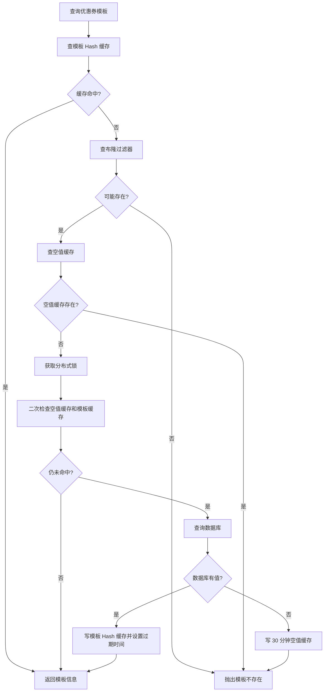

# 第 17 小节：用户查询优惠券之缓存穿透

## 新手先读

缓存穿透和上一节的缓存击穿不是一回事。击穿是“热点真实数据的缓存失效”，穿透是“请求的数据本来就不存在”，比如有人一直查不存在的优惠券模板 ID。

本节先记住组合方案：布隆过滤器挡住明显不存在的数据，空值缓存挡住短时间重复查询，分布式锁避免同一个不存在 key 被并发打到数据库。

## 1. 本节目标

本节在第 16 小节缓存击穿方案基础上，继续处理缓存穿透。学习目标：

- 理解缓存穿透是什么。
- 理解布隆过滤器为什么能挡住大量不存在 ID 的请求。
- 理解空值缓存为什么仍然需要。
- 看懂 `RBloomFilterConfiguration` 如何创建布隆过滤器 Bean。
- 看懂后台创建模板时如何把模板 ID 写入布隆过滤器。
- 看懂引擎查询模板时如何组合“布隆过滤器 + 空值缓存 + 分布式锁 + Redis Hash”。
- 理解 `RBloomFilter`、误判率、预期插入量、空值缓存 TTL 等非基础概念。
- 会运行服务并验证不存在模板 ID 不再直接打到数据库。

教程路径：

```text
D:\study\java\oneCoupon\第③章节：分发&引擎服务\《牛券oneCoupon优惠券系统设计》第17小节：用户查询优惠券之缓存穿透.html
```

对应分支：

```text
目标分支：origin/20240827_dev_coupon-template-querypv-v2_cache_ding.ma
前置分支：origin/20240826_dev_coupon-template-query_cache_ding.ma
```

完整 diff 附录：

```text
D:\study\java\oneCoupon\notes\diffs\17-用户查询优惠券之缓存穿透.diff
```

## 2. 教程核心内容提炼

第 16 小节解决的是缓存击穿：热点 Key 过期后，大量请求同时查询数据库。

本节解决的是缓存穿透：请求查询一个根本不存在的数据，Redis 没有，数据库也没有。如果有人持续请求大量不存在的模板 ID，每次都会绕过缓存打到数据库。

本节组合两种方案：

- 布隆过滤器：快速判断模板 ID 是否可能存在。如果布隆过滤器判定不存在，直接返回。
- 空值缓存：如果布隆过滤器误判为可能存在，但数据库查不到，就写一个短 TTL 的空值 Key，避免同一个不存在 ID 反复打库。

最终查询链路变成：

1. 查 Redis 模板 Hash。
2. 命中则返回。
3. 未命中则查布隆过滤器。
4. 布隆过滤器判定不存在，直接抛异常。
5. 布隆过滤器判定可能存在，查空值缓存。
6. 空值缓存存在，直接抛异常。
7. 获取分布式锁。
8. 锁内二次检查空值缓存和模板缓存。
9. 仍未命中则查数据库。
10. 数据库为空，写 30 分钟空值缓存。
11. 数据库有值，写模板 Hash 缓存。

## 3. 分支变更总览

```text
5 files changed, 243 insertions(+)
```

主要变化：

```text
engine/src/main/java/.../common/constant/EngineRedisConstant.java
engine/src/main/java/.../config/RBloomFilterConfiguration.java
engine/src/main/java/.../service/impl/CouponTemplateServiceImpl.java
merchant-admin/src/main/java/.../config/RBloomFilterConfiguration.java
merchant-admin/src/main/java/.../service/impl/CouponTemplateServiceImpl.java
```

核心变化：

- `engine` 和 `merchant-admin` 都新增布隆过滤器配置。
- `merchant-admin` 创建优惠券模板成功后，把模板 ID 加入布隆过滤器。
- `engine` 查询模板时，先用布隆过滤器拦截明显不存在的模板 ID。
- 新增空值缓存 Key。
- 保留第 16 小节的缓存击穿双重判定锁逻辑。

## 4. 缓存穿透是什么

缓存穿透的典型请求：

```text
GET /api/engine/coupon-template/query?shopNumber=1810714735922956666&couponTemplateId=-1
GET /api/engine/coupon-template/query?shopNumber=1810714735922956666&couponTemplateId=999999999999999999
```

这些 ID 在 Redis 中不存在，在数据库中也不存在。如果没有保护，每次请求都会：

```text
Redis 未命中 -> 查询数据库 -> 数据库也没有 -> 返回不存在
```

大量这种请求会造成数据库压力，甚至被恶意利用。

## 5. 布隆过滤器配置

`engine` 服务新增配置：

```java
@Configuration
public class RBloomFilterConfiguration {

    @Bean
    public RBloomFilter<String> couponTemplateQueryBloomFilter(RedissonClient redissonClient) {
        RBloomFilter<String> bloomFilter = redissonClient.getBloomFilter("couponTemplateQueryBloomFilter");
        bloomFilter.tryInit(640L, 0.001);
        return bloomFilter;
    }
}
```

`merchant-admin` 服务也新增同名配置：

```java
@Configuration
public class RBloomFilterConfiguration {

    @Bean
    public RBloomFilter<String> couponTemplateQueryBloomFilter(RedissonClient redissonClient) {
        RBloomFilter<String> bloomFilter = redissonClient.getBloomFilter("couponTemplateQueryBloomFilter");
        bloomFilter.tryInit(640L, 0.001);
        return bloomFilter;
    }
}
```

为什么两个服务都要配置同一个布隆过滤器？

- `merchant-admin` 负责创建模板，需要写入布隆过滤器。
- `engine` 负责查询模板，需要读取布隆过滤器。
- 两个服务使用同一个 Redis 中的 `couponTemplateQueryBloomFilter`。

参数解释：

- `640L`：预期插入数量。
- `0.001`：误判率，大约千分之一。

## 6. 创建模板时写入布隆过滤器

`merchant-admin` 的 `CouponTemplateServiceImpl` 新增依赖：

```java
private final RBloomFilter<String> couponTemplateQueryBloomFilter;
```

创建模板成功后写入：

```java
couponTemplateQueryBloomFilter.add(String.valueOf(couponTemplateDO.getId()));
```

这个动作非常关键。布隆过滤器不是自动知道数据库里有哪些模板 ID，必须在创建数据时同步写入。

如果历史数据已经存在，但布隆过滤器是新建的，需要做一次历史数据初始化。否则旧模板会被布隆过滤器误判为不存在。

## 7. 空值缓存 Key

`EngineRedisConstant` 新增：

```java
public static final String COUPON_TEMPLATE_IS_NULL_KEY = "one-coupon_engine:template_is_null:%s";
```

示例：

```text
one-coupon_engine:template_is_null:999999999999999999
```

它的含义是：这个模板 ID 已经查过数据库，确认不存在或已过期。

空值缓存不是永久缓存。本节设置 30 分钟：

```java
stringRedisTemplate.opsForValue().set(couponTemplateIsNullCacheKey, "", 30, TimeUnit.MINUTES);
```

短 TTL 的原因：

- 避免不存在 ID 的请求反复打库。
- 又不至于长期污染 Redis。
- 如果未来数据补录，也能在 TTL 后恢复查询。

## 8. 查询模板完整逻辑

本节 `findCouponTemplate` 在第 16 小节基础上扩展：

```java
@Override
public CouponTemplateQueryRespDTO findCouponTemplate(CouponTemplateQueryReqDTO requestParam) {
    String couponTemplateCacheKey = String.format(EngineRedisConstant.COUPON_TEMPLATE_KEY, requestParam.getCouponTemplateId());
    Map<Object, Object> couponTemplateCacheMap = stringRedisTemplate.opsForHash().entries(couponTemplateCacheKey);

    if (MapUtil.isEmpty(couponTemplateCacheMap)) {
        if (!couponTemplateQueryBloomFilter.contains(requestParam.getCouponTemplateId())) {
            throw new ClientException("优惠券模板不存在");
        }

        String couponTemplateIsNullCacheKey = String.format(EngineRedisConstant.COUPON_TEMPLATE_IS_NULL_KEY, requestParam.getCouponTemplateId());
        Boolean hasKeyFlag = stringRedisTemplate.hasKey(couponTemplateIsNullCacheKey);
        if (hasKeyFlag) {
            throw new ClientException("优惠券模板不存在");
        }

        RLock lock = redissonClient.getLock(String.format(EngineRedisConstant.LOCK_COUPON_TEMPLATE_KEY, requestParam.getCouponTemplateId()));
        lock.lock();

        try {
            hasKeyFlag = stringRedisTemplate.hasKey(couponTemplateIsNullCacheKey);
            if (hasKeyFlag) {
                throw new ClientException("优惠券模板不存在");
            }

            couponTemplateCacheMap = stringRedisTemplate.opsForHash().entries(couponTemplateCacheKey);
            if (MapUtil.isEmpty(couponTemplateCacheMap)) {
                LambdaQueryWrapper<CouponTemplateDO> queryWrapper = Wrappers.lambdaQuery(CouponTemplateDO.class)
                        .eq(CouponTemplateDO::getShopNumber, Long.parseLong(requestParam.getShopNumber()))
                        .eq(CouponTemplateDO::getId, Long.parseLong(requestParam.getCouponTemplateId()))
                        .eq(CouponTemplateDO::getStatus, CouponTemplateStatusEnum.ACTIVE.getStatus());
                CouponTemplateDO couponTemplateDO = couponTemplateMapper.selectOne(queryWrapper);

                if (couponTemplateDO == null) {
                    stringRedisTemplate.opsForValue().set(couponTemplateIsNullCacheKey, "", 30, TimeUnit.MINUTES);
                    throw new ClientException("优惠券模板不存在或已过期");
                }

                CouponTemplateQueryRespDTO actualRespDTO = BeanUtil.toBean(couponTemplateDO, CouponTemplateQueryRespDTO.class);
                Map<String, Object> cacheTargetMap = BeanUtil.beanToMap(actualRespDTO, false, true);
                Map<String, String> actualCacheTargetMap = cacheTargetMap.entrySet().stream()
                        .collect(Collectors.toMap(
                                Map.Entry::getKey,
                                entry -> entry.getValue() != null ? entry.getValue().toString() : ""
                        ));

                String luaScript = "redis.call('HMSET', KEYS[1], unpack(ARGV, 1, #ARGV - 1)) " +
                        "redis.call('EXPIREAT', KEYS[1], ARGV[#ARGV])";

                List<String> keys = Collections.singletonList(couponTemplateCacheKey);
                List<String> args = new ArrayList<>(actualCacheTargetMap.size() * 2 + 1);
                actualCacheTargetMap.forEach((key, value) -> {
                    args.add(key);
                    args.add(value);
                });

                args.add(String.valueOf(couponTemplateDO.getValidEndTime().getTime() / 1000));

                stringRedisTemplate.execute(
                        new DefaultRedisScript<>(luaScript, Long.class),
                        keys,
                        args.toArray()
                );
                couponTemplateCacheMap = cacheTargetMap.entrySet()
                        .stream()
                        .collect(Collectors.toMap(Map.Entry::getKey, Map.Entry::getValue));
            }
        } finally {
            lock.unlock();
        }
    }

    return BeanUtil.mapToBean(couponTemplateCacheMap, CouponTemplateQueryRespDTO.class, false, CopyOptions.create());
}
```

## 9. 为什么需要布隆过滤器和空值缓存一起用

布隆过滤器的特点：

- 如果它说“不存在”，那一定不存在。
- 如果它说“可能存在”，不一定真的存在。

这种“不一定真的存在”就是误判。比如某个不存在 ID 被布隆过滤器判断为“可能存在”，请求仍然会进入数据库查询。

空值缓存负责处理这类情况：

1. 第一次误判后查询数据库。
2. 数据库确认没有。
3. 写入空值缓存。
4. 后续同一个 ID 请求直接命中空值缓存，不再打库。

组合效果：

| 场景 | 处理方式 |
| --- | --- |
| 布隆过滤器判定不存在 | 直接拦截 |
| 布隆过滤器误判，数据库也没有 | 写空值缓存 |
| 真实存在的模板 | 查库后写模板 Hash 缓存 |
| 热点模板缓存过期 | 分布式锁防击穿 |

## 10. 本节完整流程



## 11. Spring Boot 与框架语法补充

### 11.1 `RBloomFilter`

`RBloomFilter` 是 Redisson 提供的布隆过滤器对象。

```java
RBloomFilter<String> bloomFilter = redissonClient.getBloomFilter("demoBloomFilter");
bloomFilter.tryInit(10000L, 0.01);
bloomFilter.add("1001");
boolean exists = bloomFilter.contains("1001");
```

它底层使用 Redis 存储位图和元数据，因此多个服务实例可以共享。

### 11.2 `tryInit`

```java
bloomFilter.tryInit(640L, 0.001);
```

含义：

- 预计插入 640 个元素。
- 误判率 0.001。

`tryInit` 只有在布隆过滤器还没初始化时才会初始化，已经存在时不会重复覆盖。

### 11.3 布隆过滤器误判

布隆过滤器没有“误删”问题，但有“误判存在”问题。

```java
if (!bloomFilter.contains(id)) {
    throw new ClientException("一定不存在");
}

// 走到这里，只能说明“可能存在”
```

所以它适合放在数据库前面做第一层拦截，但不能作为最终数据来源。

### 11.4 `opsForValue().set`

写字符串类型缓存：

```java
stringRedisTemplate.opsForValue().set("template:null:1001", "", 30, TimeUnit.MINUTES);
```

参数含义：

- Key：`template:null:1001`。
- Value：空字符串。
- TTL：30。
- 时间单位：分钟。

### 11.5 `Boolean hasKeyFlag`

`hasKey` 返回 `Boolean`，不是基本类型 `boolean`。

```java
Boolean exists = stringRedisTemplate.hasKey("demo");
if (Boolean.TRUE.equals(exists)) {
    System.out.println("Key 存在");
}
```

项目代码中直接 `if (hasKeyFlag)`，实际开发中更推荐 `Boolean.TRUE.equals(hasKeyFlag)`，可以避免空指针风险。

## 12. 如何运行与测试本节功能

### 12.1 使用独立 worktree

```powershell
cd D:\study\java\oneCoupon\code\onecoupon
git worktree add D:\study\java\oneCoupon\worktrees\chapter-03-17 origin/20240827_dev_coupon-template-querypv-v2_cache_ding.ma
```

### 12.2 启动依赖

需要启动：

- MySQL。
- Redis。
- `merchant-admin`。
- `engine`。

### 12.3 启动服务

```powershell
cd D:\study\java\oneCoupon\worktrees\chapter-03-17
mvn -pl merchant-admin -am spring-boot:run
```

另开终端：

```powershell
cd D:\study\java\oneCoupon\worktrees\chapter-03-17
mvn -pl engine -am spring-boot:run
```

### 12.4 创建模板并验证布隆过滤器写入

通过 `merchant-admin` 创建一个优惠券模板。创建成功后代码会执行：

```java
couponTemplateQueryBloomFilter.add(String.valueOf(couponTemplateDO.getId()));
```

可以通过调用 `engine` 查询接口验证这个模板 ID 能通过布隆过滤器。

### 12.5 查询不存在的模板 ID

请求：

```text
GET /api/engine/coupon-template/query?shopNumber=1810714735922956666&couponTemplateId=999999999999999999
```

预期：

- 如果布隆过滤器判定不存在，直接返回“优惠券模板不存在”。
- 数据库不会被查询。

### 12.6 验证空值缓存

如果某个 ID 被布隆过滤器误判为可能存在，数据库查不到，会写入：

```text
one-coupon_engine:template_is_null:模板ID
```

可以在 Redis 中检查：

```redis
GET one-coupon_engine:template_is_null:模板ID
TTL one-coupon_engine:template_is_null:模板ID
```

### 12.7 常见问题

| 现象 | 可能原因 | 处理方式 |
| --- | --- | --- |
| 新创建模板仍被判定不存在 | `merchant-admin` 和 `engine` 使用的 Redis 不一致 | 检查 Redis 配置 |
| 历史模板查不到 | 历史 ID 未初始化进布隆过滤器 | 编写初始化任务导入历史模板 ID |
| 空值缓存过多 | 被大量随机 ID 请求 | 结合网关限流和参数校验 |
| 误判后仍查库 | 布隆过滤器天然可能误判 | 空值缓存会降低同 ID 重复打库 |

## 13. 阅读代码顺序建议

1. `RBloomFilterConfiguration`：看布隆过滤器如何创建。
2. `merchant-admin` 的 `CouponTemplateServiceImpl#createCouponTemplate`：看模板 ID 如何写入过滤器。
3. `EngineRedisConstant`：看空值缓存 Key。
4. `engine` 的 `CouponTemplateServiceImpl#findCouponTemplate`：看完整查询链路。
5. 第 16 小节文档：回顾缓存击穿方案。

## 14. 面试与复盘问题

- 缓存穿透和缓存击穿有什么区别？
- 布隆过滤器为什么不能删除元素？
- 为什么布隆过滤器说不存在就可以直接拦截？
- 为什么仍然需要空值缓存？
- 历史数据如何初始化到布隆过滤器？
- 如果布隆过滤器误判率设置太高，会发生什么？

## 15. 本节检查清单

- 能解释缓存穿透的风险。
- 能解释布隆过滤器的“可能存在”和“一定不存在”。
- 能说明空值缓存的作用。
- 能运行创建模板和查询模板接口。
- 能用不存在 ID 验证数据库压力被拦截。
- 能通过 diff 附录查看本节所有代码改动。
