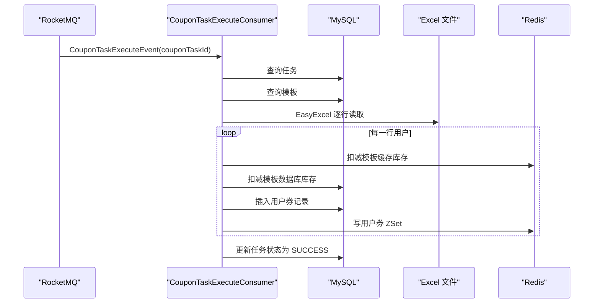

# 第 19 小节：开发用户优惠券分发功能（一）

## 新手先读

本节从“创建分发任务”进入“真正给用户发券”。你可以把它理解成：消费者拿到批量发券任务后，读取 Excel 里的用户数据，然后逐个生成用户优惠券。

第一次阅读时先抓住三类数据：Excel 中的用户行、数据库里的用户优惠券记录、Redis 里的用户券缓存。后面的监听器和消息消费逻辑，都是围绕这三类数据流转。

## 1. 本节目标

本节开始实现 `distribution` 分发服务，消费后台管理服务发出的“优惠券推送任务执行消息”，并按 Excel 用户列表执行发券。学习目标：

- 理解 `distribution` 服务在整体架构中的职责。
- 看懂 RocketMQ 消费者如何接收 `CouponTaskExecuteEvent`。
- 理解分发任务执行前为什么要校验任务状态和模板状态。
- 掌握 EasyExcel 按行读取用户列表并处理发券逻辑。
- 理解 Redis 预扣库存、数据库扣库存、用户领券记录、用户券列表缓存之间的关系。
- 理解 `@RocketMQMessageListener`、`AnalysisEventListener<T>`、`@ExcelProperty`、`SqlHelper.retBool` 等非基础语法。
- 会启动后台管理服务和分发服务，创建任务并观察分发执行。

教程路径：

```text
D:\study\java\oneCoupon\第③章节：分发&引擎服务\《牛券oneCoupon优惠券系统设计》第19小节：开发用户优惠券分发功能（一）.html
```

对应分支：

```text
目标分支：origin/20240829_dev_coupon-distribute-v1_easyexcel-cache_ding.ma
前置分支：origin/20240827_dev_coupon-template-querypv-v2_cache_ding.ma
```

完整 diff 附录：

```text
D:\study\java\oneCoupon\notes\diffs\19-开发用户优惠券分发功能一.diff
```

## 2. 教程核心内容提炼

前面章节已经完成了：

- 商家创建优惠券模板。
- 创建批量分发任务。
- 立即发送或定时发送任务执行消息。

本节新增 `distribution` 服务，让任务真正开始执行：

1. 监听 `one-coupon_distribution-service_coupon-task-execute_topic`。
2. 根据消息中的 `couponTaskId` 查询任务。
3. 校验任务状态必须是 `IN_PROGRESS`。
4. 查询优惠券模板并校验模板状态必须是 `ACTIVE`。
5. 使用 EasyExcel 读取任务文件。
6. 每读取一行，扣减库存并给用户插入领券记录。
7. 写入用户优惠券 Redis ZSet。
8. 全部读取完成后，把任务状态改为成功。

这是分发链路的第一版，逻辑直观，但后续还会继续优化批量性能和失败处理。

## 3. 分支变更总览

```text
26 files changed, 1931 insertions(+), 2 deletions(-)
```

主要变化：

```text
distribution/pom.xml
distribution/src/main/java/.../DistributionApplication.java
distribution/src/main/java/.../mq/consumer/CouponTaskExecuteConsumer.java
distribution/src/main/java/.../service/handler/excel/CouponTaskExcelObject.java
distribution/src/main/java/.../service/handler/excel/ReadExcelDistributionListener.java
distribution/src/main/java/.../dao/entity/UserCouponDO.java
distribution/src/main/java/.../dao/mapper/UserCouponMapper.java
distribution/src/main/resources/shardingsphere-config.yaml
distribution/src/main/resources/application.yaml
```

本节基本把 `distribution` 服务的骨架搭起来，包括：

- 数据库配置。
- 分库分表配置。
- MQ 消费者。
- 用户优惠券实体和 Mapper。
- Excel 读取对象。
- 分发执行监听器。

## 4. distribution 服务职责

`distribution` 服务负责把“任务”变成“用户券”。

与其他服务的关系：

| 服务 | 职责 |
| --- | --- |
| `merchant-admin` | 创建模板、创建分发任务、发送任务执行消息 |
| `distribution` | 消费任务执行消息，读取 Excel，批量给用户发券 |
| `engine` | 用户侧查询、领取、核销等高频接口 |

本节中 `distribution` 的输入是：

```text
CouponTaskExecuteEvent(couponTaskId)
```

输出是：

- `t_user_coupon` 用户券记录。
- 用户优惠券列表 Redis 缓存。
- 任务完成状态。

## 5. 消费任务执行消息

核心消费者 `CouponTaskExecuteConsumer`：

```java
@Component
@RequiredArgsConstructor
@RocketMQMessageListener(
        topic = "one-coupon_distribution-service_coupon-task-execute_topic${unique-name:}",
        consumerGroup = "one-coupon_distribution-service_coupon-task-execute_cg${unique-name:}"
)
@Slf4j(topic = "CouponTaskExecuteConsumer")
public class CouponTaskExecuteConsumer implements RocketMQListener<MessageWrapper<CouponTaskExecuteEvent>> {

    private final CouponTaskMapper couponTaskMapper;
    private final CouponTemplateMapper couponTemplateMapper;
    private final StringRedisTemplate stringRedisTemplate;
    private final UserCouponMapper userCouponMapper;

    @Override
    public void onMessage(MessageWrapper<CouponTaskExecuteEvent> messageWrapper) {
        log.info("[消费者] 优惠券推送任务正式执行 - 执行消费逻辑，消息体：{}", JSON.toJSONString(messageWrapper));

        var couponTaskId = messageWrapper.getMessage().getCouponTaskId();
        var couponTaskDO = couponTaskMapper.selectById(couponTaskId);
        if (ObjectUtil.notEqual(couponTaskDO.getStatus(), CouponTaskStatusEnum.IN_PROGRESS.getStatus())) {
            log.warn("[消费者] 优惠券推送任务正式执行 - 推送任务记录状态异常：{}，已终止推送", couponTaskDO.getStatus());
            return;
        }

        var queryWrapper = Wrappers.lambdaQuery(CouponTemplateDO.class)
                .eq(CouponTemplateDO::getId, couponTaskDO.getCouponTemplateId())
                .eq(CouponTemplateDO::getShopNumber, couponTaskDO.getShopNumber());
        var couponTemplateDO = couponTemplateMapper.selectOne(queryWrapper);
        var status = couponTemplateDO.getStatus();
        if (ObjectUtil.notEqual(status, CouponTemplateStatusEnum.ACTIVE.getStatus())) {
            log.error("[消费者] 优惠券推送任务正式执行 - 优惠券ID：{}，优惠券模板状态：{}", couponTaskDO.getCouponTemplateId(), status);
            return;
        }

        var readExcelDistributionListener = new ReadExcelDistributionListener(
                couponTaskId,
                couponTemplateDO,
                stringRedisTemplate,
                couponTemplateMapper,
                userCouponMapper,
                couponTaskMapper
        );
        EasyExcel.read(couponTaskDO.getFileAddress(), CouponTaskExcelObject.class, readExcelDistributionListener).sheet().doRead();
    }
}
```

关键点：

- 消息不是直接包含所有用户，只包含任务 ID。
- 真正用户列表来自任务表中的 Excel 文件地址。
- 消费前校验任务状态，避免取消或异常状态任务继续执行。
- 消费前校验模板状态，避免结束或失效模板继续发券。

## 6. Excel 行对象

`CouponTaskExcelObject`：

```java
@Data
public class CouponTaskExcelObject {

    @ExcelProperty("用户ID")
    private String userId;

    @ExcelProperty("手机号")
    private String phone;

    @ExcelProperty("邮箱")
    private String mail;
}
```

`@ExcelProperty("用户ID")` 表示 Excel 表头“用户ID”这一列映射到 `userId` 字段。

示例 Excel：

| 用户ID | 手机号 | 邮箱 |
| --- | --- | --- |
| 10001 | 13800000001 | a@test.com |
| 10002 | 13800000002 | b@test.com |

EasyExcel 每读到一行，就会构造一个 `CouponTaskExcelObject` 对象并回调监听器。

## 7. Excel 监听器分发逻辑

`ReadExcelDistributionListener` 继承：

```java
public class ReadExcelDistributionListener extends AnalysisEventListener<CouponTaskExcelObject> {
}
```

每一行执行 `invoke`：

```java
@Override
public void invoke(CouponTaskExcelObject data, AnalysisContext context) {
    String couponTemplateKey = String.format(EngineRedisConstant.COUPON_TEMPLATE_KEY, couponTemplateDO.getId());
    Long stock = stringRedisTemplate.opsForHash().increment(couponTemplateKey, "stock", -1);
    if (stock < 0) {
        return;
    }

    int decrementResult = couponTemplateMapper.decrementCouponTemplateStock(couponTemplateDO.getShopNumber(), couponTemplateDO.getId(), 1);
    if (!SqlHelper.retBool(decrementResult)) {
        return;
    }

    Date now = new Date();
    DateTime validEndTime = DateUtil.offsetHour(now, JSON.parseObject(couponTemplateDO.getConsumeRule()).getInteger("validityPeriod"));
    UserCouponDO userCouponDO = UserCouponDO.builder()
            .couponTemplateId(couponTemplateDO.getId())
            .userId(Long.parseLong(data.getUserId()))
            .receiveTime(now)
            .receiveCount(1)
            .validStartTime(now)
            .validEndTime(validEndTime)
            .source(CouponSourceEnum.PLATFORM.getType())
            .status(CouponStatusEnum.EFFECTIVE.getType())
            .createTime(new Date())
            .updateTime(new Date())
            .delFlag(0)
            .build();
    try {
        userCouponMapper.insert(userCouponDO);
    } catch (BatchExecutorException bee) {
        return;
    }

    String userCouponListCacheKey = String.format(EngineRedisConstant.USER_COUPON_TEMPLATE_LIST_KEY, data.getUserId());
    String userCouponItemCacheKey = StrUtil.builder()
            .append(couponTemplateDO.getId())
            .append("_")
            .append(userCouponDO.getId())
            .toString();
    stringRedisTemplate.opsForZSet().add(userCouponListCacheKey, userCouponItemCacheKey, now.getTime());
}
```

处理顺序：

1. Redis 模板库存 `stock - 1`。
2. 数据库模板库存 `stock - 1`。
3. 创建用户券记录。
4. 写入用户券 Redis ZSet。

## 8. 用户券缓存结构

用户券列表使用 ZSet：

```java
stringRedisTemplate.opsForZSet().add(userCouponListCacheKey, userCouponItemCacheKey, now.getTime());
```

Key 类似：

```text
one-coupon_engine:user-coupon-list:10001
```

Value 类似：

```text
1810966706881941507_1812345678901234560
```

Score 是领取时间：

```text
now.getTime()
```

ZSet 的好处是可以按领取时间排序，后续用户查询优惠券列表时更方便。

## 9. 任务完成状态

Excel 全部解析完成后：

```java
@Override
public void doAfterAllAnalysed(AnalysisContext analysisContext) {
    CouponTaskDO couponTaskDO = CouponTaskDO.builder()
            .id(couponTaskId)
            .status(CouponTaskStatusEnum.SUCCESS.getStatus())
            .completionTime(new Date())
            .build();
    couponTaskMapper.updateById(couponTaskDO);
}
```

`doAfterAllAnalysed` 是 EasyExcel 的结束回调。这里把任务状态更新为成功，并记录完成时间。

## 10. 本节完整流程



## 11. Spring Boot 与框架语法补充

### 11.1 `var`

Java 10 引入局部变量类型推断：

```java
var couponTaskId = messageWrapper.getMessage().getCouponTaskId();
```

等价于：

```java
Long couponTaskId = messageWrapper.getMessage().getCouponTaskId();
```

`var` 只能用于局部变量，不能用于字段和方法参数。

### 11.2 `@ExcelProperty`

```java
@ExcelProperty("用户ID")
private String userId;
```

表示 Excel 的“用户ID”列映射到 Java 字段 `userId`。

如果表头不一致，字段可能读不到值。

### 11.3 `AnalysisEventListener<T>`

```java
public class DemoListener extends AnalysisEventListener<UserRow> {
    @Override
    public void invoke(UserRow data, AnalysisContext context) {
        System.out.println(data);
    }
}
```

EasyExcel 逐行读取，每一行都会调用 `invoke`，读完后调用 `doAfterAllAnalysed`。

### 11.4 `opsForHash().increment`

Redis Hash 字段自增或自减：

```java
Long stock = stringRedisTemplate.opsForHash().increment("template:1", "stock", -1);
```

相当于：

```redis
HINCRBY template:1 stock -1
```

### 11.5 `SqlHelper.retBool`

MyBatis-Plus 工具方法，用来判断更新行数是否表示成功：

```java
int result = mapper.updateById(entity);
if (SqlHelper.retBool(result)) {
    System.out.println("更新成功");
}
```

通常 `result > 0` 表示至少影响一行。

## 12. 如何运行与测试本节功能

### 12.1 使用独立 worktree

```powershell
cd D:\study\java\oneCoupon\code\onecoupon
git worktree add D:\study\java\oneCoupon\worktrees\chapter-03-19 origin/20240829_dev_coupon-distribute-v1_easyexcel-cache_ding.ma
```

### 12.2 启动依赖

需要启动：

- MySQL。
- Redis。
- RocketMQ。
- `merchant-admin`。
- `distribution`。

### 12.3 启动服务

```powershell
cd D:\study\java\oneCoupon\worktrees\chapter-03-19
mvn -pl merchant-admin -am spring-boot:run
```

另开终端：

```powershell
cd D:\study\java\oneCoupon\worktrees\chapter-03-19
mvn -pl distribution -am spring-boot:run
```

### 12.4 准备数据

1. 创建一个有效优惠券模板。
2. 确认模板 Redis 缓存中有 `stock` 字段。
3. 准备包含“用户ID、手机号、邮箱”的 Excel。
4. 创建优惠券推送任务，使用该 Excel 文件路径。
5. 选择立即发送，或通过 XXL-Job 触发定时任务。

### 12.5 验证分发结果

检查用户券表：

```sql
SELECT id, user_id, coupon_template_id, status, receive_time
FROM t_user_coupon
ORDER BY id DESC
LIMIT 10;
```

检查任务状态：

```sql
SELECT id, status, completion_time
FROM t_coupon_task
ORDER BY id DESC
LIMIT 5;
```

检查 Redis：

```redis
HGET one-coupon_engine:template:模板ID stock
ZRANGE one-coupon_engine:user-coupon-list:用户ID 0 -1 WITHSCORES
```

### 12.6 常见问题

| 现象 | 可能原因 | 处理方式 |
| --- | --- | --- |
| 消费者不触发 | Topic 或 consumerGroup 不匹配 | 对比第 14、19 小节 Topic |
| Excel 读不到用户 ID | 表头不是“用户ID” | 修改 Excel 表头 |
| 发券后缓存没有用户券 | Redis Key 或写入逻辑异常 | 检查用户 ID 和 ZSet |
| 库存为负 | 第一版逻辑没有充分回滚 | 第 20 小节会继续优化 |

## 13. 阅读代码顺序建议

1. `distribution/pom.xml`：看分发服务依赖。
2. `CouponTaskExecuteConsumer`：看任务消息入口。
3. `CouponTaskExcelObject`：看 Excel 行结构。
4. `ReadExcelDistributionListener`：看逐行发券逻辑。
5. `UserCouponDO` 和 `UserCouponMapper`：看用户券如何落库。
6. `shardingsphere-config.yaml`：看分库分表规则。

## 14. 面试与复盘问题

- 为什么 MQ 消息只传任务 ID，而不是传全部用户数据？
- 为什么执行任务前要校验任务状态？
- Redis 扣库存和数据库扣库存都需要吗？
- 第一版逐行入库有什么性能问题？
- 用户重复领取时，本节如何处理？

## 15. 本节检查清单

- 能说清楚 `distribution` 服务职责。
- 能找到任务执行消费者。
- 能解释 EasyExcel 每行读取流程。
- 能解释用户券表和用户券 ZSet 的关系。
- 能运行一次任务并看到用户券记录。
- 能通过 diff 附录查看本节所有代码改动。
