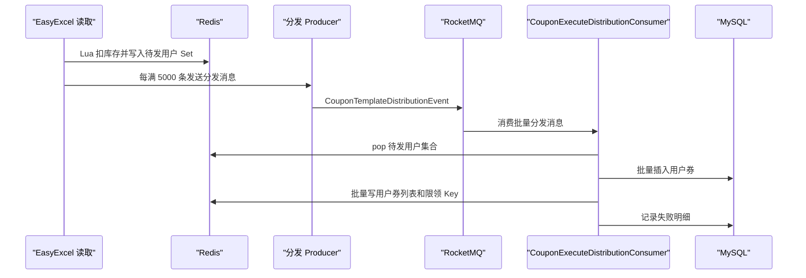

# 第 20 小节：开发用户优惠券分发功能（二）

## 新手先读

本节是在上一节基础上继续优化批量发券。最难的地方是 Redis Lua、位运算返回值、两段式消费者，这些都不是为了炫技，而是为了在高并发和大批量场景下更快、更稳地扣库存和记录发券结果。

阅读时先把流程拆成两段：第一段解析 Excel 并做 Redis 预校验，第二段真正批量写用户券和失败记录。理解这两段职责后，再看 Lua 和位运算会轻松很多。

## 1. 本节目标

本节在第 19 小节第一版分发基础上做性能和可靠性优化。学习目标：

- 理解为什么逐行扣库存、逐行入库性能不足。
- 理解 Lua 脚本如何把库存扣减和用户集合写入做成原子操作。
- 理解为什么使用 Redis Set 暂存待入库用户。
- 看懂 5000 条一批的分段分发设计。
- 看懂失败记录表 `t_coupon_task_fail` 的作用。
- 理解库存不足、用户重复领取时如何记录失败原因。
- 理解 `@Lazy` 自注入、事务传播、Redis Lua、位运算组合返回值、EasyExcel 写失败文件等非基础概念。
- 会运行批量分发任务，并验证成功用户券、失败记录和失败 Excel。

教程路径：

```text
D:\study\java\oneCoupon\第③章节：分发&引擎服务\《牛券oneCoupon优惠券系统设计》第20小节：开发用户优惠券分发功能（二）.html
```

对应分支：

```text
目标分支：origin/20240831_dev_coupon-distribute-v2_easyexcel-cache_ding.ma
前置分支：origin/20240829_dev_coupon-distribute-v1_easyexcel-cache_ding.ma
```

完整 diff 附录：

```text
D:\study\java\oneCoupon\notes\diffs\20-开发用户优惠券分发功能二.diff
```

## 2. 教程核心内容提炼

第 19 小节每读一行 Excel 就立即：

- 扣 Redis 库存。
- 扣数据库库存。
- 插入用户券。
- 写用户券缓存。

这种做法简单，但面对几十万、上百万用户时性能不足，也很难处理失败明细。

本节改成两段式：

1. Excel 读取阶段：用 Lua 原子扣 Redis 库存，并把用户 ID 和行号写入 Redis Set。
2. 分发入库阶段：每累计 5000 个用户，发送 MQ 消息，由另一个消费者批量插入用户券、写缓存、记录失败。

这样把“读 Excel”和“批量落库”解耦，也为失败记录和进度恢复打基础。

## 3. 分支变更总览

```text
18 files changed, 1300 insertions(+), 67 deletions(-)
```

主要变化：

```text
distribution/src/main/java/.../common/constant/DistributionRedisConstant.java
distribution/src/main/java/.../dao/entity/CouponTaskFailDO.java
distribution/src/main/java/.../dao/mapper/CouponTaskFailMapper.java
distribution/src/main/java/.../mq/consumer/CouponExecuteDistributionConsumer.java
distribution/src/main/java/.../mq/event/CouponTemplateDistributionEvent.java
distribution/src/main/java/.../mq/producer/CouponExecuteDistributionProducer.java
distribution/src/main/java/.../service/handler/excel/ReadExcelDistributionListener.java
distribution/src/main/java/.../service/handler/excel/UserCouponTaskFailExcelObject.java
distribution/src/main/java/.../toolkit/StockDecrementReturnCombinedUtil.java
distribution/src/main/resources/lua/batch_user_coupon_list.lua
distribution/src/main/resources/lua/stock_decrement_and_batch_save_user_record.lua
```

核心变化：

- 新增分发执行消息。
- 新增分发执行消费者。
- Excel 监听器不再直接插入用户券，而是写 Redis Set 并分批发消息。
- 新增 Lua 脚本保证扣库存和写 Set 的原子性。
- 新增失败记录表实体和 Mapper。
- 新增失败 Excel 写出逻辑。

## 4. 两段式分发设计



核心思想：

- Excel 读取阶段尽量轻。
- 批量落库阶段按 5000 条一批处理。
- Redis Set 暂存中间状态。
- 失败明细单独记录。

## 5. Redis 常量

新增 `DistributionRedisConstant`，用于分发过程中的临时 Key。

常见 Key 语义：

| Key | 用途 |
| --- | --- |
| 任务执行进度 Key | 记录 Excel 已处理到第几行 |
| 批量用户 Set Key | 暂存待入库的用户 ID 和 Excel 行号 |

本节强调 Redis 不只是缓存，也承担了分发过程中的临时工作区。

## 6. Lua：扣库存并写用户集合

`stock_decrement_and_batch_save_user_record.lua`：

```lua
local SECOND_FIELD_BITS = 13

local function combineFields(firstField, secondField)
    local firstFieldValue = firstField and 1 or 0
    return (firstFieldValue * 2 ^ SECOND_FIELD_BITS) + secondField
end

local key = KEYS[1]
local userSetKey = KEYS[2]
local userIdAndRowNum = ARGV[1]

local stock = tonumber(redis.call('HGET', key, 'stock'))

if stock == nil or stock <= 0 then
    return combineFields(false, redis.call('SCARD', userSetKey))
end

redis.call('HINCRBY', key, 'stock', -1)
redis.call('SADD', userSetKey, userIdAndRowNum)

local userSetLength = redis.call('SCARD', userSetKey)

return combineFields(true, userSetLength)
```

这个脚本做了三件事：

1. 读取模板库存。
2. 库存足够则扣减库存。
3. 把用户信息加入 Redis Set。

为什么用 Lua？

因为“判断库存、扣库存、写 Set”必须尽量原子。如果用三条 Java Redis 命令，中间任何一步失败都可能造成状态不一致。

## 7. 位运算组合返回值

Lua 返回一个整数，里面同时包含两个信息：

- 是否扣库存成功。
- 当前 Set 中有多少用户。

Java 工具类 `StockDecrementReturnCombinedUtil`：

```java
public class StockDecrementReturnCombinedUtil {

    private static final int SECOND_FIELD_BITS = 13;

    public static int combineFields(boolean decrementFlag, int userRecord) {
        return (decrementFlag ? 1 : 0) << SECOND_FIELD_BITS | userRecord;
    }

    public static boolean extractFirstField(long combined) {
        return (combined >> SECOND_FIELD_BITS) != 0;
    }

    public static int extractSecondField(int combined) {
        return combined & ((1 << SECOND_FIELD_BITS) - 1);
    }
}
```

为什么是 13 位？

因为一批最多 5000 条，`2^12 = 4096` 不够，`2^13 = 8192` 足够表示 5000。

## 8. Excel 监听器改造

第 20 小节的 `ReadExcelDistributionListener#invoke` 不再直接插入用户券，而是：

```java
Long combinedFiled = stringRedisTemplate.execute(
        buildLuaScript,
        ListUtil.of(couponTemplateKey, batchUserSetKey),
        JSON.toJSONString(userRowNumMap)
);

boolean firstField = StockDecrementReturnCombinedUtil.extractFirstField(combinedFiled);
if (!firstField) {
    stringRedisTemplate.opsForValue().set(templateTaskExecuteProgressKey, String.valueOf(rowCount));
    ++rowCount;

    Map<Object, Object> objectMap = MapUtil.builder()
            .put("rowNum", rowCount)
            .put("cause", "优惠券模板无库存")
            .build();
    CouponTaskFailDO couponTaskFailDO = CouponTaskFailDO.builder()
            .batchId(couponTaskDO.getBatchId())
            .jsonObject(JSON.toJSONString(objectMap, SerializerFeature.WriteMapNullValue))
            .build();
    couponTaskFailMapper.insert(couponTaskFailDO);
    return;
}

int batchUserSetSize = StockDecrementReturnCombinedUtil.extractSecondField(combinedFiled.intValue());

if (batchUserSetSize < BATCH_USER_COUPON_SIZE) {
    stringRedisTemplate.opsForValue().set(templateTaskExecuteProgressKey, String.valueOf(rowCount));
    ++rowCount;
    return;
}

CouponTemplateDistributionEvent event = CouponTemplateDistributionEvent.builder()
        .couponTaskId(couponTaskId)
        .shopNumber(couponTaskDO.getShopNumber())
        .couponTemplateId(couponTemplateDO.getId())
        .validEndTime(couponTemplateDO.getValidEndTime())
        .couponTaskBatchId(couponTaskDO.getBatchId())
        .couponTemplateConsumeRule(couponTemplateDO.getConsumeRule())
        .batchUserSetSize(batchUserSetSize)
        .distributionEndFlag(Boolean.FALSE)
        .build();
couponExecuteDistributionProducer.sendMessage(event);
```

流程：

- 先判断是否已经处理过当前行，支持异常恢复。
- 执行 Lua 预扣库存并写 Redis Set。
- 如果库存不足，记录失败原因。
- 如果 Set 未满 5000，只记录进度。
- 如果 Set 满 5000，发送分发执行消息。

## 9. Excel 读取完成标识

`doAfterAllAnalysed`：

```java
@Override
public void doAfterAllAnalysed(AnalysisContext context) {
    CouponTemplateDistributionEvent couponTemplateExecuteEvent = CouponTemplateDistributionEvent.builder()
            .distributionEndFlag(Boolean.TRUE)
            .shopNumber(couponTaskDO.getShopNumber())
            .couponTemplateId(couponTemplateDO.getId())
            .validEndTime(couponTemplateDO.getValidEndTime())
            .couponTemplateConsumeRule(couponTemplateDO.getConsumeRule())
            .couponTaskBatchId(couponTaskDO.getBatchId())
            .couponTaskId(couponTaskDO.getId())
            .build();
    couponExecuteDistributionProducer.sendMessage(couponTemplateExecuteEvent);
}
```

即使最后一批不足 5000 条，也必须发送结束消息。否则 Redis Set 中剩余用户永远不会被消费入库。

## 10. 分发执行消费者

新增 `CouponExecuteDistributionConsumer`，监听：

```java
@RocketMQMessageListener(
        topic = "one-coupon_distribution-service_coupon-execute-distribution_topic${unique-name:}",
        consumerGroup = "one-coupon_distribution-service_coupon-execute-distribution_cg${unique-name:}"
)
public class CouponExecuteDistributionConsumer implements RocketMQListener<MessageWrapper<CouponTemplateDistributionEvent>> {
}
```

它的职责：

- 收到批量分发事件。
- 从 Redis Set 中取出待发用户。
- 扣减数据库库存。
- 批量插入用户券。
- 批量写用户券缓存。
- 处理用户重复领取。
- 在任务结束时写失败 Excel 并更新任务状态。

## 11. 批量写用户券缓存 Lua

`batch_user_coupon_list.lua`：

```lua
local userIds = cjson.decode(ARGV[1])
local couponIds = cjson.decode(ARGV[2])
local userIdPrefix = KEYS[1]
local limitKeyPrefix = KEYS[2]
local couponTemplateId = KEYS[3]
local currentTime = tonumber(ARGV[3])
local couponTemplateValidEndTime = tonumber(ARGV[4])

for i, userId in ipairs(userIds) do
    local key = userIdPrefix .. userId
    local couponId = couponIds[i]
    if couponId then
        redis.call('ZADD', key, currentTime, couponId)

        local limitKey = limitKeyPrefix .. userId .. '_' ..  couponTemplateId
        redis.call('INCR', limitKey)
        redis.call('EXPIRE', limitKey, couponTemplateValidEndTime)
    end
end
```

它批量写：

- 用户优惠券 ZSet。
- 用户对某模板的领取次数限制 Key。

限领 Key 后续可以用于用户主动领券场景的前置校验。

## 12. 失败记录和失败 Excel

新增 `CouponTaskFailDO`，用于保存失败原因。

典型失败：

- 优惠券模板库存不足。
- 用户已领取该优惠券。

任务结束时，如果存在失败记录，会生成失败 Excel：

```java
String failFileAddress = excelPath + "/用户分发记录失败Excel-" + event.getCouponTaskBatchId() + ".xlsx";

try (ExcelWriter excelWriter = EasyExcel.write(failFileAddress, UserCouponTaskFailExcelObject.class).build()) {
    WriteSheet writeSheet = EasyExcel.writerSheet("用户分发失败Sheet").build();
    while (true) {
        List<CouponTaskFailDO> failList = listUserCouponTaskFail(event.getCouponTaskBatchId(), initId);
        if (CollUtil.isEmpty(failList)) {
            break;
        }
        List<UserCouponTaskFailExcelObject> excelDataList = failList.stream()
                .map(each -> JSONObject.parseObject(each.getJsonObject(), UserCouponTaskFailExcelObject.class))
                .toList();
        excelWriter.write(excelDataList, writeSheet);
    }
}
```

这样运营人员可以下载失败文件，知道哪些行失败以及失败原因。

## 13. Spring Boot 与框架语法补充

### 13.1 `@Lazy` 自注入

```java
@Lazy
@Autowired
private CouponExecuteDistributionConsumer couponExecuteDistributionConsumer;
```

这是为了解决同类内部调用事务方法可能不走代理的问题。通过注入 Spring 代理对象，再调用：

```java
couponExecuteDistributionConsumer.hasUserReceivedCoupon(...)
```

比直接调用 `this.hasUserReceivedCoupon(...)` 更容易让事务注解生效。

### 13.2 `@Transactional(propagation = Propagation.NOT_SUPPORTED)`

```java
@Transactional(propagation = Propagation.NOT_SUPPORTED, readOnly = true)
public Boolean hasUserReceivedCoupon(Long couponTemplateId, Long userId) {
}
```

表示这个查询方法不需要事务。如果外层有事务，也先挂起。

### 13.3 `ClassPathResource`

```java
new ClassPathResource("lua/batch_user_coupon_list.lua")
```

表示从 `src/main/resources` 下加载脚本文件。

### 13.4 Hutool `Singleton`

```java
DefaultRedisScript<Void> script = Singleton.get(path, () -> {
    DefaultRedisScript<Void> redisScript = new DefaultRedisScript<>();
    redisScript.setScriptSource(new ResourceScriptSource(new ClassPathResource(path)));
    return redisScript;
});
```

作用是脚本对象只构建一次，后续复用，避免每次消息都重新加载 Lua 文件。

### 13.5 Redis Set `SADD`、`SCARD`、`SPOP`

本节 Redis Set 用于暂存用户：

```redis
SADD task:user:set '{"userId":"10001","rowNum":2}'
SCARD task:user:set
SPOP task:user:set 5000
```

Set 的特点是无序且去重，适合作为批处理临时集合。

## 14. 如何运行与测试本节功能

### 14.1 使用独立 worktree

```powershell
cd D:\study\java\oneCoupon\code\onecoupon
git worktree add D:\study\java\oneCoupon\worktrees\chapter-03-20 origin/20240831_dev_coupon-distribute-v2_easyexcel-cache_ding.ma
```

### 14.2 启动依赖

需要启动：

- MySQL。
- Redis。
- RocketMQ。
- `merchant-admin`。
- `distribution`。

### 14.3 启动服务

```powershell
cd D:\study\java\oneCoupon\worktrees\chapter-03-20
mvn -pl merchant-admin -am spring-boot:run
```

另开终端：

```powershell
cd D:\study\java\oneCoupon\worktrees\chapter-03-20
mvn -pl distribution -am spring-boot:run
```

### 14.4 准备测试任务

建议准备三类数据：

- 正常用户：应该成功发券。
- 重复用户：应该记录“用户已领取该优惠券”。
- 超过库存的用户：应该记录“优惠券模板无库存”或库存不足。

### 14.5 验证 Redis 中间状态

查看任务进度 Key：

```redis
GET 分发任务进度Key
```

查看批量用户 Set：

```redis
SCARD 批量用户SetKey
```

查看模板库存：

```redis
HGET one-coupon_engine:template:模板ID stock
```

### 14.6 验证数据库

用户券：

```sql
SELECT user_id, coupon_template_id, status, row_num
FROM t_user_coupon
WHERE coupon_template_id = 模板ID
LIMIT 20;
```

失败记录：

```sql
SELECT batch_id, json_object
FROM t_coupon_task_fail
WHERE batch_id = 任务批次号
LIMIT 20;
```

任务结果：

```sql
SELECT id, status, completion_time, fail_file_address
FROM t_coupon_task
WHERE id = 任务ID;
```

### 14.7 常见问题

| 现象 | 可能原因 | 处理方式 |
| --- | --- | --- |
| 最后一批用户没入库 | 没发送 `distributionEndFlag=true` 消息 | 检查 `doAfterAllAnalysed` |
| Redis 库存扣了但 DB 没入库 | 分发消费者异常 | 看 MQ 重试和服务日志 |
| 失败 Excel 为空 | 没有失败记录 | 查询 `t_coupon_task_fail` |
| 用户重复领取未记录 | 唯一索引或异常判断不生效 | 检查用户券唯一约束 |

## 15. 阅读代码顺序建议

1. `DistributionRedisConstant`：看中间态 Key。
2. `stock_decrement_and_batch_save_user_record.lua`：看 Redis 原子预扣。
3. `StockDecrementReturnCombinedUtil`：看返回值解析。
4. `ReadExcelDistributionListener`：看 Excel 到 Redis Set 和 MQ 的流程。
5. `CouponTemplateDistributionEvent`：看分发事件字段。
6. `CouponExecuteDistributionConsumer`：看批量入库和失败处理。
7. `batch_user_coupon_list.lua`：看用户券缓存批量写入。

## 16. 面试与复盘问题

- 为什么不再逐行插入用户券？
- Lua 在本节解决了什么一致性问题？
- Redis Set 暂存用户有什么优缺点？
- 为什么批量大小选择 5000？
- 失败记录为什么要落库并生成 Excel？
- `@Lazy` 自注入解决了什么问题？

## 17. 本节检查清单

- 能解释两段式分发流程。
- 能看懂两个 Lua 脚本的作用。
- 能解释位运算组合返回值。
- 能触发批量分发并看到用户券记录。
- 能制造失败数据并看到失败记录。
- 能通过 diff 附录查看本节所有代码改动。
