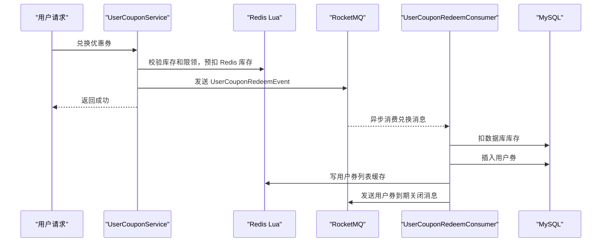

# 第 24 小节：开发兑换/秒杀优惠券功能（二）

## 新手先读

本节把上一节的同步兑换改成异步兑换。可以先理解为：接口只做前置校验和投递消息，真正写数据库、写缓存的重活交给 MQ 消费者慢慢处理。

异步化的好处是接口响应更快、抗峰值能力更强；代价是链路更长，需要处理消息幂等、最终一致性和失败补偿。阅读时一定要对照同步版看差异。

## 1. 本节目标

本节把用户兑换优惠券的数据库落库部分从接口主流程中拆出来，通过 RocketMQ 异步执行。学习目标：

- 理解同步兑换接口在高并发下的瓶颈。
- 理解“Redis 前置扣减 + MQ 异步落库”的秒杀常见架构。
- 看懂 `redeemUserCouponByMQ` 如何发送兑换消息。
- 看懂 `UserCouponRedeemConsumer` 如何消费消息并写数据库。
- 理解为什么消费者要加 `@NoMQDuplicateConsume`。
- 理解消息发送失败、消费失败、重复消费分别如何处理。
- 会运行异步兑换接口，验证接口快速返回、MQ 消费、用户券落库。

教程路径：

```text
D:\study\java\oneCoupon\第③章节：分发&引擎服务\《牛券oneCoupon优惠券系统设计》第24小节：开发兑换_秒杀优惠券功能（二）.html
```

对应分支说明：

```text
前置分支：origin/20240905_dev_coupon-distribute-v4_idempotent_ding.ma
目标分支：origin/20240908_dev_acquire-coupon_seckill_ding.ma
```

完整 diff 附录：

```text
D:\study\java\oneCoupon\notes\diffs\24-开发兑换秒杀优惠券功能二.diff
```

## 2. 教程核心内容提炼

第 23 小节同步流程中，接口需要等待：

- Redis Lua。
- MySQL 扣库存。
- MySQL 插入用户券。
- Redis 写用户券列表。
- RocketMQ 发送到期关闭消息。

高并发秒杀下，数据库写入会成为接口响应瓶颈。本节改为：

1. 接口仍然先查询模板和校验时间。
2. 接口仍然执行 Redis Lua，完成库存预扣和限领次数增加。
3. Redis Lua 成功后，接口发送 `UserCouponRedeemEvent`。
4. 接口返回成功。
5. MQ 消费者异步扣数据库库存、插入用户券、写缓存、发送到期关闭消息。

核心是把数据库写入从用户请求线程中移到 MQ 消费者中。

## 3. 分支变更总览

```text
6 files changed, 397 insertions(+), 1 deletion(-)
```

主要变化：

```text
engine/src/main/java/.../controller/UserCouponController.java
engine/src/main/java/.../mq/consumer/UserCouponRedeemConsumer.java
engine/src/main/java/.../mq/event/UserCouponRedeemEvent.java
engine/src/main/java/.../mq/producer/UserCouponRedeemProducer.java
engine/src/main/java/.../service/UserCouponService.java
engine/src/main/java/.../service/impl/UserCouponServiceImpl.java
```

核心变化：

- 新增兑换事件。
- 新增兑换消息生产者。
- 新增兑换消息消费者。
- Service 新增 `redeemUserCouponByMQ`。
- Controller 增加异步兑换入口。

## 4. 异步兑换流程



这个流程的优点：

- 用户接口更快。
- 数据库写入被 MQ 削峰。
- 消费失败可以通过 MQ 重试。

代价：

- 接口成功不代表数据库已经立即落库。
- 需要处理消息重复消费。
- 需要监控 MQ 堆积和消费失败。

## 5. 兑换事件

`UserCouponRedeemEvent`：

```java
@Data
@Builder
@NoArgsConstructor
@AllArgsConstructor
public class UserCouponRedeemEvent {

    private CouponTemplateRedeemReqDTO requestParam;

    private Integer receiveCount;

    private CouponTemplateQueryRespDTO couponTemplate;

    private String userId;
}
```

事件中保存：

- 原请求参数。
- Redis Lua 返回的领取次数。
- 查询到的模板信息。
- 当前用户 ID。

这样消费者不需要再次从请求上下文中拿用户，也不需要重复查询模板。

## 6. Service 发送兑换消息

新增 `redeemUserCouponByMQ`：

```java
@Override
public void redeemUserCouponByMQ(CouponTemplateRedeemReqDTO requestParam) {
    CouponTemplateQueryRespDTO couponTemplate = couponTemplateService.findCouponTemplate(
            BeanUtil.toBean(requestParam, CouponTemplateQueryReqDTO.class)
    );

    boolean isInTime = DateUtil.isIn(new Date(), couponTemplate.getValidStartTime(), couponTemplate.getValidEndTime());
    if (!isInTime) {
        throw new ClientException("不满足优惠券领取时间");
    }

    // 执行 Redis Lua，完成库存和限领前置校验
    Long stockDecrementLuaResult = stringRedisTemplate.execute(...);

    long firstField = StockDecrementReturnCombinedUtil.extractFirstField(stockDecrementLuaResult);
    if (RedisStockDecrementErrorEnum.isFail(firstField)) {
        throw new ServiceException(RedisStockDecrementErrorEnum.fromType(firstField));
    }

    UserCouponRedeemEvent userCouponRedeemEvent = UserCouponRedeemEvent.builder()
            .requestParam(requestParam)
            .receiveCount((int) StockDecrementReturnCombinedUtil.extractSecondField(stockDecrementLuaResult))
            .couponTemplate(couponTemplate)
            .userId(UserContext.getUserId())
            .build();
    SendResult sendResult = userCouponRedeemProducer.sendMessage(userCouponRedeemEvent);
    if (ObjectUtil.notEqual(sendResult.getSendStatus().name(), "SEND_OK")) {
        log.warn("发送优惠券兑换消息失败，消息参数：{}", JSON.toJSONString(userCouponRedeemEvent));
    }
}
```

注意：Redis Lua 成功后，如果 MQ 发送失败，本节只是记录日志。生产环境需要更完整的补偿方案，例如本地消息表、重试任务或告警人工补偿。

## 7. 兑换消息消费者

`UserCouponRedeemConsumer`：

```java
@Component
@RequiredArgsConstructor
@RocketMQMessageListener(
        topic = "one-coupon_engine-service_coupon-redeem_topic${unique-name:}",
        consumerGroup = "one-coupon_engine-service_coupon-redeem_cg${unique-name:}"
)
@Slf4j(topic = "UserCouponRedeemConsumer")
public class UserCouponRedeemConsumer implements RocketMQListener<MessageWrapper<UserCouponRedeemEvent>> {

    @NoMQDuplicateConsume(
            keyPrefix = "user-coupon-redeem:",
            key = "#messageWrapper.keys",
            keyTimeout = 600
    )
    @Transactional(rollbackFor = Exception.class)
    @Override
    public void onMessage(MessageWrapper<UserCouponRedeemEvent> messageWrapper) {
        // 扣 DB 库存
        // 插入用户券
        // 写 Redis 用户券列表
        // 发送用户券到期关闭消息
    }
}
```

关键点：

- `@RocketMQMessageListener` 负责注册消费者。
- `@NoMQDuplicateConsume` 防止重复消费。
- `@Transactional` 保证数据库扣库存和插入用户券在同一事务中。

## 8. 消费者落库流程

消费者主要代码：

```java
int decremented = couponTemplateMapper.decrementCouponTemplateStock(
        Long.parseLong(requestParam.getShopNumber()),
        Long.parseLong(requestParam.getCouponTemplateId()),
        1L
);
if (!SqlHelper.retBool(decremented)) {
    log.warn("[消费者] 用户兑换优惠券 - 扣减优惠券数据库库存失败");
    return;
}

Date now = new Date();
DateTime validEndTime = DateUtil.offsetHour(now, JSON.parseObject(couponTemplate.getConsumeRule()).getInteger("validityPeriod"));
UserCouponDO userCouponDO = UserCouponDO.builder()
        .couponTemplateId(Long.parseLong(requestParam.getCouponTemplateId()))
        .userId(Long.parseLong(userId))
        .source(requestParam.getSource())
        .receiveCount(messageWrapper.getMessage().getReceiveCount())
        .status(UserCouponStatusEnum.UNUSED.getCode())
        .receiveTime(now)
        .validStartTime(now)
        .validEndTime(validEndTime)
        .build();
userCouponMapper.insert(userCouponDO);
```

再写用户券列表缓存：

```java
String userCouponListCacheKey = String.format(EngineRedisConstant.USER_COUPON_TEMPLATE_LIST_KEY, userId);
String userCouponItemCacheKey = StrUtil.builder()
        .append(requestParam.getCouponTemplateId())
        .append("_")
        .append(userCouponDO.getId())
        .toString();
stringRedisTemplate.opsForZSet().add(userCouponListCacheKey, userCouponItemCacheKey, now.getTime());
```

最后发送到期关闭消息。

## 9. 为什么消费者必须幂等

第 24 小节比第 23 小节更依赖 MQ。MQ 可能重复投递兑换消息，如果消费者不幂等，可能出现：

- 数据库库存重复扣。
- 用户券重复插入。
- 用户券缓存重复写。
- 到期关闭消息重复发送。

所以消费者使用：

```java
@NoMQDuplicateConsume(
        keyPrefix = "user-coupon-redeem:",
        key = "#messageWrapper.keys",
        keyTimeout = 600
)
```

这里的 `messageWrapper.keys` 来自生产者构建消息时设置的业务 Key。只要同一条兑换消息的 Key 不变，就能识别重复消费。

## 10. 同步版与异步版对比

| 维度 | 同步版 | 异步版 |
| --- | --- | --- |
| 接口耗时 | 较长 | 较短 |
| 数据库压力 | 直接压在请求线程 | MQ 削峰 |
| 结果一致性 | 请求返回时基本完成 | 最终一致 |
| 复杂度 | 较低 | 较高 |
| 失败补偿 | 事务内处理 | 需要 MQ 重试和补偿 |

本节更接近秒杀系统常见设计：先用 Redis 抢资格，再异步慢慢落库。

## 11. Spring Boot 与框架语法补充

### 11.1 事件对象传递上下文

异步消息不能依赖当前 HTTP 线程的上下文。比如 `UserContext` 是 ThreadLocal，到了 MQ 消费线程就不一定存在。

所以事件里显式保存：

```java
private String userId;
```

这是异步设计的常见原则：消息中要带上消费者完成业务所需的最小上下文。

### 11.2 `@Transactional` 加在消费者上

```java
@Transactional(rollbackFor = Exception.class)
public void onMessage(...) {
}
```

如果消费者执行过程中抛异常，数据库操作会回滚，MQ 通常会触发重试。

### 11.3 最终一致性

异步版返回成功时，数据库可能还没插入用户券。

用户体验上可以：

- 前端提示“领取成功，稍后到账”。
- 查询用户券列表时允许短暂延迟。
- 用 MQ 监控保证消费堆积可控。

## 12. 如何运行与测试本节功能

### 12.1 使用独立 worktree

```powershell
cd D:\study\java\oneCoupon\code\onecoupon
git worktree add D:\study\java\oneCoupon\worktrees\chapter-03-24 origin/20240908_dev_acquire-coupon_seckill_ding.ma
```

### 12.2 启动依赖

需要启动：

- MySQL。
- Redis。
- RocketMQ。
- `engine`。

### 12.3 启动服务

```powershell
cd D:\study\java\oneCoupon\worktrees\chapter-03-24
mvn -pl engine -am spring-boot:run
```

### 12.4 调用异步兑换接口

如果 Controller 暴露了异步兑换入口，调用对应接口；如果教程中复用同一个入口，则确认 Service 调用的是 `redeemUserCouponByMQ`。

请求体示例：

```json
{
  "shopNumber": "1810714735922956666",
  "couponTemplateId": "1810966706881941507",
  "source": 0
}
```

### 12.5 验证结果

接口返回后立即观察 RocketMQ：

- 有 `one-coupon_engine-service_coupon-redeem_topic` 消息。
- 消费者日志出现 `用户兑换优惠券`。

数据库：

```sql
SELECT id, user_id, coupon_template_id, status
FROM t_user_coupon
WHERE user_id = 用户ID
ORDER BY id DESC
LIMIT 10;
```

Redis：

```redis
ZRANGE one-coupon_engine:user-coupon-list:用户ID 0 -1 WITHSCORES
GET user-coupon-redeem:消息Key
```

## 13. 常见问题

| 现象 | 可能原因 | 处理方式 |
| --- | --- | --- |
| 接口成功但查不到券 | MQ 消费有延迟或失败 | 查看消费者日志和 MQ 堆积 |
| 重复消费仍插入 | 消息 Key 不稳定 | 检查 `MessageWrapper.keys` |
| Redis 库存扣了但 MQ 发送失败 | 缺少可靠消息补偿 | 生产需加本地消息表或重试 |
| 用户券缓存没有写入 | 消费者写 Redis 失败 | 查看写后查询日志 |

## 14. 阅读代码顺序建议

1. `UserCouponRedeemEvent`：看消息携带哪些数据。
2. `UserCouponRedeemProducer`：看消息发送。
3. `UserCouponServiceImpl#redeemUserCouponByMQ`：看接口主流程。
4. `UserCouponRedeemConsumer`：看异步落库。
5. 第 22 小节：回顾 MQ 消费幂等注解。

## 15. 面试与复盘问题

- 为什么秒杀系统常用 Redis 预扣库存？
- 异步兑换为什么是最终一致？
- Redis 扣减成功但 MQ 发送失败怎么补偿？
- 消费者重复消费会造成什么问题？
- 同步版和异步版分别适合什么场景？

## 16. 本节检查清单

- 能解释异步兑换完整流程。
- 能找到兑换事件、生产者、消费者。
- 能说明消费者幂等的必要性。
- 能验证 MQ 消息和用户券落库。
- 能通过 diff 附录查看本节所有代码改动。
