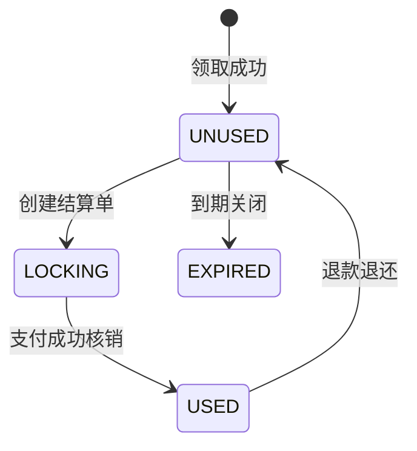

# 第 28 小节：完成锁定/核销/退还优惠券功能

## 新手先读

本节对应优惠券真正被订单使用的状态流转。你可以把“锁定”理解成下单时先占住这张券，“核销”理解成订单支付成功后确认使用，“退还”理解成订单取消或支付失败后把券还给用户。

阅读时一定要跟着状态走，不要只看单个接口。重点是同一张用户券不能同时被多个订单使用，也不能在支付失败后一直卡在锁定状态。

## 1. 本节目标

本节补齐优惠券在订单链路中的状态流转。学习目标：

- 理解用户券为什么不能在下单时直接标记为已使用。
- 理解锁定、核销、退还三个动作的业务语义。
- 看懂优惠券结算单 `t_coupon_settlement` 的作用。
- 理解 Redisson 分布式锁如何避免同一张券并发使用。
- 理解优惠券状态从未使用、锁定、已使用、退回的变化。
- 理解订单金额、优惠金额、实付金额校验。
- 会调用锁定、核销、退款接口，并验证数据库和 Redis 状态。

教程路径：

```text
D:\study\java\oneCoupon\第③章节：分发&引擎服务\《牛券oneCoupon优惠券系统设计》第28小节：完成锁定_核销_退还优惠券功能.html
```

对应代码说明：

```text
本地未找到第 28 小节独立远程分支。
相关最终代码位于 origin/main 的 engine 模块：
UserCouponController
UserCouponServiceImpl
CouponSettlementDO
CouponCreatePaymentReqDTO
CouponProcessPaymentReqDTO
CouponProcessRefundReqDTO
```

说明型 diff 附录：

```text
D:\study\java\oneCoupon\notes\diffs\28-完成锁定核销退还优惠券功能.diff
```

## 2. 教程核心内容提炼

订单使用优惠券通常不是一步完成：

1. 用户提交订单时选择优惠券。
2. 系统需要先锁定优惠券，防止同一张券被其他订单继续使用。
3. 用户支付成功后，系统核销优惠券。
4. 如果订单退款，需要退还优惠券。

因此本节新增三个接口：

- 创建优惠券结算单：锁定优惠券。
- 核销优惠券结算单：支付成功后标记已使用。
- 退款优惠券结算单：退款后把券退回可用状态。

## 3. Controller 接口

最终代码中 `UserCouponController`：

```java
@Operation(summary = "创建用户优惠券结算单", description = "用户下单时锁定使用的优惠券，一般由订单系统发起调用")
@PostMapping("/api/engine/user-coupon/create-payment-record")
public Result<Void> createPaymentRecord(@RequestBody CouponCreatePaymentReqDTO requestParam) {
    userCouponService.createPaymentRecord(requestParam);
    return Results.success();
}

@Operation(summary = "核销优惠券结算单", description = "用户支付后核销使用的优惠券，常规来说应该监听支付后的消息队列事件")
@PostMapping("/api/engine/user-coupon/process-payment")
public Result<Void> processPayment(@RequestBody CouponProcessPaymentReqDTO requestParam) {
    userCouponService.processPayment(requestParam);
    return Results.success();
}

@Operation(summary = "退款优惠券结算单", description = "用户退款成功后返回使用的优惠券，常规来说应该监听退款成功后的消息队列事件")
@PostMapping("/api/engine/user-coupon/process-refund")
public Result<Void> processRefund(@RequestBody CouponProcessRefundReqDTO requestParam) {
    userCouponService.processRefund(requestParam);
    return Results.success();
}
```

实际生产中，核销和退款更适合由订单服务或支付服务通过 MQ 触发，而不是由前端直接调用。

## 4. 优惠券结算单

`CouponSettlementDO`：

```java
@Data
@TableName("t_coupon_settlement")
@NoArgsConstructor
@AllArgsConstructor
@Builder
public class CouponSettlementDO {

    private Long id;

    private Long orderId;

    private Long userId;

    private Long couponId;

    /**
     * 结算单状态 0：锁定 1：已取消 2：已支付 3：已退款
     */
    private Integer status;

    @TableField(fill = FieldFill.INSERT)
    private Date createTime;

    @TableField(fill = FieldFill.INSERT_UPDATE)
    private Date updateTime;
}
```

结算单记录的是“某个订单使用某张用户券”的过程状态。

为什么不只改用户券状态？

- 订单链路需要记录订单 ID。
- 退款时需要知道是哪次订单使用过该券。
- 结算记录可以作为审计日志。

## 5. 创建结算单：锁定优惠券

核心流程：

```java
RLock lock = redissonClient.getLock(String.format(EngineRedisConstant.LOCK_COUPON_SETTLEMENT_KEY, requestParam.getCouponId()));
boolean tryLock = lock.tryLock();
if (!tryLock) {
    throw new ClientException("正在创建优惠券结算单，请稍候再试");
}

try {
    // 检查是否已有锁定或已支付结算单
    // 查询用户券
    // 校验用户券状态、有效期、店铺、订单金额、优惠金额
    transactionTemplate.executeWithoutResult(status -> {
        CouponSettlementDO settlement = CouponSettlementDO.builder()
                .orderId(requestParam.getOrderId())
                .couponId(requestParam.getCouponId())
                .userId(Long.parseLong(UserContext.getUserId()))
                .status(0)
                .build();
        couponSettlementMapper.insert(settlement);

        UserCouponDO updateUserCouponDO = UserCouponDO.builder()
                .status(UserCouponStatusEnum.LOCKING.getCode())
                .build();
        userCouponMapper.update(updateUserCouponDO, userCouponUpdateWrapper);
    });

    stringRedisTemplate.opsForZSet().remove(userCouponListKey, userCouponItemKey);
} finally {
    lock.unlock();
}
```

锁定阶段做了几类校验：

- 同一张券是否已有锁定或已支付结算单。
- 用户券是否属于当前用户。
- 用户券是否是未使用状态。
- 用户券是否在有效期内。
- 店铺券是否匹配店铺。
- 订单金额是否满足使用门槛。
- 前端传入的实付金额是否等于后端计算结果。

锁定成功后：

- 插入结算单，状态为锁定。
- 用户券状态改为锁定。
- 从 Redis 用户可用券列表中移除。

## 6. 核销优惠券

支付成功后：

```java
RLock lock = redissonClient.getLock(String.format(EngineRedisConstant.LOCK_COUPON_SETTLEMENT_KEY, requestParam.getCouponId()));
boolean tryLock = lock.tryLock();
if (!tryLock) {
    throw new ClientException("正在核销优惠券结算单，请稍候再试");
}

transactionTemplate.executeWithoutResult(status -> {
    LambdaUpdateWrapper<CouponSettlementDO> settlementUpdateWrapper = Wrappers.lambdaUpdate(CouponSettlementDO.class)
            .eq(CouponSettlementDO::getCouponId, requestParam.getCouponId())
            .eq(CouponSettlementDO::getUserId, Long.parseLong(UserContext.getUserId()))
            .eq(CouponSettlementDO::getStatus, 0);
    couponSettlementMapper.update(CouponSettlementDO.builder().status(2).build(), settlementUpdateWrapper);

    LambdaUpdateWrapper<UserCouponDO> userCouponUpdateWrapper = Wrappers.lambdaUpdate(UserCouponDO.class)
            .eq(UserCouponDO::getId, requestParam.getCouponId())
            .eq(UserCouponDO::getUserId, Long.parseLong(UserContext.getUserId()))
            .eq(UserCouponDO::getStatus, UserCouponStatusEnum.LOCKING.getCode());
    userCouponMapper.update(UserCouponDO.builder().status(UserCouponStatusEnum.USED.getCode()).build(), userCouponUpdateWrapper);
});
```

状态变化：

```text
结算单：锁定 -> 已支付
用户券：锁定 -> 已使用
```

这里的更新条件带旧状态，避免重复核销或状态错乱。

## 7. 退还优惠券

退款成功后：

```java
transactionTemplate.executeWithoutResult(status -> {
    LambdaUpdateWrapper<CouponSettlementDO> settlementUpdateWrapper = Wrappers.lambdaUpdate(CouponSettlementDO.class)
            .eq(CouponSettlementDO::getCouponId, requestParam.getCouponId())
            .eq(CouponSettlementDO::getUserId, Long.parseLong(UserContext.getUserId()))
            .eq(CouponSettlementDO::getStatus, 2);
    couponSettlementMapper.update(CouponSettlementDO.builder().status(3).build(), settlementUpdateWrapper);

    LambdaUpdateWrapper<UserCouponDO> userCouponUpdateWrapper = Wrappers.lambdaUpdate(UserCouponDO.class)
            .eq(UserCouponDO::getId, requestParam.getCouponId())
            .eq(UserCouponDO::getUserId, Long.parseLong(UserContext.getUserId()))
            .eq(UserCouponDO::getStatus, UserCouponStatusEnum.USED.getCode());
    userCouponMapper.update(UserCouponDO.builder().status(UserCouponStatusEnum.UNUSED.getCode()).build(), userCouponUpdateWrapper);
});
```

事务成功后，把券放回 Redis 用户可用券列表：

```java
String userCouponItemCacheKey = couponTemplateId + "_" + userCouponId;
stringRedisTemplate.opsForZSet().add(
        String.format(USER_COUPON_TEMPLATE_LIST_KEY, UserContext.getUserId()),
        userCouponItemCacheKey,
        userCouponDO.getReceiveTime().getTime()
);
```

状态变化：

```text
结算单：已支付 -> 已退款
用户券：已使用 -> 未使用
Redis：重新加入用户可用券列表
```

## 8. 状态流转总览



结算单状态：

```text
0 锁定
1 已取消
2 已支付
3 已退款
```

用户券状态以 `UserCouponStatusEnum` 为准。

## 9. Spring Boot 与框架语法补充

### 9.1 Redisson `tryLock`

```java
RLock lock = redissonClient.getLock("lock:coupon:1001");
boolean locked = lock.tryLock();
if (!locked) {
    throw new ClientException("请稍后再试");
}
try {
    doBusiness();
} finally {
    lock.unlock();
}
```

`tryLock` 不会一直等待，拿不到锁直接返回 false。

### 9.2 条件更新防并发

```java
.eq(UserCouponDO::getStatus, UserCouponStatusEnum.LOCKING.getCode())
```

只有当前状态符合预期才更新，避免重复核销、重复退款。

### 9.3 `BigDecimal.compareTo`

金额比较不要用 `equals`：

```java
if (actualPayableAmount.compareTo(requestParam.getPayableAmount()) != 0) {
    throw new ClientException("折扣后金额不一致");
}
```

`compareTo` 只比较数值大小，适合金额。

## 10. 如何运行与测试本节功能

### 10.1 使用最终代码

```powershell
cd D:\study\java\oneCoupon\code\onecoupon
git worktree add D:\study\java\oneCoupon\worktrees\chapter-03-28 origin/main
```

### 10.2 启动依赖

需要启动：

- MySQL。
- Redis。
- `engine`。

### 10.3 准备用户券

先通过兑换接口领取一张用户券，确认：

```sql
SELECT id, user_id, coupon_template_id, status
FROM t_user_coupon
WHERE user_id = 当前用户ID
ORDER BY id DESC
LIMIT 1;
```

状态应为未使用。

### 10.4 创建结算单

调用：

```text
POST /api/engine/user-coupon/create-payment-record
```

验证：

- `t_coupon_settlement` 新增锁定记录。
- `t_user_coupon.status` 变为锁定。
- Redis 用户券列表移除该券。

### 10.5 核销

调用：

```text
POST /api/engine/user-coupon/process-payment
```

验证：

- 结算单状态变为已支付。
- 用户券状态变为已使用。

### 10.6 退款退还

调用：

```text
POST /api/engine/user-coupon/process-refund
```

验证：

- 结算单状态变为已退款。
- 用户券状态变回未使用。
- Redis 用户券列表重新出现该券。

## 11. 常见问题

| 现象 | 可能原因 | 处理方式 |
| --- | --- | --- |
| 创建结算单失败 | 优惠券已锁定或已使用 | 查询结算单和用户券状态 |
| 金额不一致 | 前端金额不可信或规则计算错误 | 以后端计算为准 |
| 核销失败 | 结算单不是锁定状态 | 检查状态流转 |
| 退款后列表没有券 | Redis 回写失败 | 查询用户券表并检查缓存写入 |

## 12. 阅读代码顺序建议

1. `UserCouponController` 三个支付相关接口。
2. `CouponSettlementDO`。
3. `CouponCreatePaymentReqDTO`。
4. `UserCouponServiceImpl#createPaymentRecord`。
5. `processPayment`。
6. `processRefund`。

## 13. 面试与复盘问题

- 为什么下单时要先锁券，而不是直接使用？
- 为什么需要结算单表？
- 分布式锁和条件更新分别解决什么问题？
- 为什么退款后要把券放回 Redis 可用列表？
- 核销和退款为什么更适合通过 MQ 触发？

## 14. 本节检查清单

- 能解释锁定、核销、退还三个状态。
- 能调用三个接口并验证数据库变化。
- 能说明结算单表的价值。
- 能解释 Redisson 锁和条件更新的组合。
- 能说明本节没有独立分支，正文基于最终代码。
